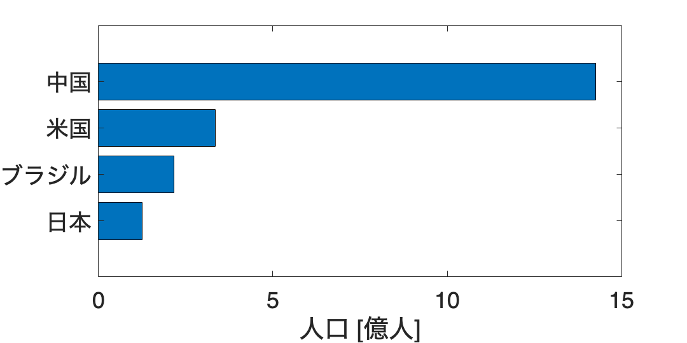

# 1.2 可視化の効果を考える
# 図 1.2.1 文字情報と視覚情報による提示の違い
```matlab

% データ
countries = {'日本', 'ブラジル', '米国', '中国'}; % 国のリスト
populations = [124620000, 215802222, 335540000, 1425849288]; % 人口のリスト

% 人口を億単位に変換
populations = populations / 100000000;

% 米国と日本だけをフィルタリングして降順に並べ替え
filterIndex = ismember(countries, {'米国', '日本'});
filteredCountries = countries(filterIndex);
filteredPopulations = populations(filterIndex);
[filteredPopulations, sortIndex] = sort(filteredPopulations, 'descend');
filteredCountries = filteredCountries(sortIndex);

% 全ての国を人口で降順に並べ替え
[sortedPopulations, sortIndex] = sort(populations, 'descend');
sortedCountries = countries(sortIndex);

% 米国と日本のみを含む棒グラフの描画
figure('Position', [100, 100, 600, 250]);
barh(filteredPopulations);
set(gca, 'YTickLabel', filteredCountries, 'YDir', 'reverse', 'FontSize', 20);
xlabel('人口 [億人]');
% saveas(gcf, '1_2_1_bar1.png'); % PNG形式で保存
```


```matlab

% 四つの国を含む棒グラフの描画
figure('Position', [100, 100, 600, 300]);
barh(sortedPopulations);
set(gca, 'YTickLabel', sortedCountries, 'YDir', 'reverse', 'FontSize', 20);
xlabel('人口 [億人]');
% saveas(gcf, '1_2_1_bar2.png'); % PNG形式で保存
```


## 図 1.2.2 ２変数データにおけるパターンの発見
```matlab
% プロットのフォントサイズを20に設定
set(0, 'DefaultAxesFontSize', 20);

% 与えられたデータ
data_x = [0.204, 1.07, -0.296, 0.57, 0.637, 0.82, 0.137, -0.046];
data_y = [0.07, 0.57, 0.936, 1.436, 0.32, 1.003, 1.186, 0.503];

% 四角形を形成する4点の座標を定義
square_points = [
    -0.296, 0.936;
    0.57, 1.436;
1.07, 0.57;
    0.204, 0.07;
    -0.296, 0.936
];

% 点をプロット
figure; % 新しい図を作成
scatter(data_x, data_y, 'filled', 'blue'); % 点を青色でプロット
hold on; % 図に追加のプロットをするためにホールドオン

% 四角形を点で結んでプロット
plot(square_points(:, 1), square_points(:, 2), 'r--', 'LineWidth', 1.5); % 四角形を赤い点線でプロット

% ラベルとタイトルを追加
xlabel(' $x$ ', 'Interpreter', 'latex'); % x軸ラベル
ylabel(' $y$ ', 'Interpreter', 'latex'); % y軸ラベル

axis('equal'); % x軸とy軸のスケールを等しく設定
hold off; % ホールドオフ

% レイアウトを整える
% MATLABではtight_layoutの直接の対応はないが、axesの位置を手動で調整することで似た効果を得られます。

% png形式で保存
saveas(gcf, '1_2_2_square_scatter.png'); % 画像を保存
```


## 図 1.2.3 重要なつながりだけ抜き出す（未完成）

Todo

```matlab
% % Read the data from CSV file
% data_df = readmatrix('data/matrix.csv');
% data_df = log1p(data_df); % Apply log1p to the data
% threshold = prctile(data_df(:), 95); % Calculate the 95th percentile
% 
% % Create a directed graph
% G = digraph();
% 
% % Add nodes to the graph
% % dictionary 型に変更（ToDo）
% prefecture_dictionary = containers.Map(...
%     {'Hokkaido', 'Aomori', 'Iwate', 'Miyagi', 'Akita', 'Yamagata', 'Fukushima', 'Ibaraki', 'Tochigi', 'Gunma', 'Saitama', 'Chiba', 'Tokyo', 'Kanagawa', 'Niigata', 'Toyama', 'Ishikawa', 'Fukui', 'Yamanashi', 'Nagano', 'Gifu', 'Shizuoka', 'Aichi', 'Mie', 'Shiga', 'Kyoto', 'Osaka', 'Hyogo', 'Nara', 'Wakayama', 'Tottori', 'Shimane', 'Okayama', 'Hiroshima', 'Yamaguchi', 'Tokushima', 'Kagawa', 'Ehime', 'Kochi', 'Fukuoka', 'Saga', 'Nagasaki', 'Kumamoto', 'Oita', 'Miyazaki', 'Kagoshima', 'Okinawa'},...
%     {'北海道', '青森', '岩手', '宮城', '秋田', '山形', '福島', '茨城', '栃木', '群馬', '埼玉', '千葉', '東京', '神奈川', '新潟', '富山', '石川', '福井', '山梨', '長野', '岐阜', '静岡', '愛知', '三重', '滋賀', '京都', '大阪', '兵庫', '奈良', '和歌山', '鳥取', '島根', '岡山', '広島', '山口', '徳島', '香川', '愛媛', '高知', '福岡', '佐賀', '長崎', '熊本', '大分', '宮崎', '鹿児島', '沖縄'});
% 
% prefectures = keys(prefecture_dictionary);
% for i = 1:length(prefectures)
%     addnode(G, prefecture_dictionary(prefectures{i}));
% end
% 
% % Add edges to the graph
% for i = 1:size(data_df, 1)
%     for j = 1:size(data_df, 2)
%         if data_df(i, j) >= threshold
%             G = addedge(G, prefecture_dictionary(prefectures{i}), prefecture_dictionary(prefectures{j}), data_df(i, j) * 0.1);
%         end
%     end
% end
% 
% % Plot the graph
% figure;
% p = plot(G, 'Layout', 'force', 'EdgeLabel', G.Edges.Weight);
% highlight(p, G.Edges.Weight > mean(G.Edges.Weight), 'EdgeColor', 'r', 'LineWidth', 1.5);
% title('Network Visualization');
% axis off;
% 
% % Save the plot as an image
% saveas(gcf, '1_2_3_network_logistics.png');
```
## 図 1.2.4 全体の関係性パターンを見つける（未完）

Todo

```matlab
% MATLAB code equivalent
% 
% % Load data
% data_df = readtable('data/matrix.csv', 'ReadRowNames', true);
% data_df = log1p(table2array(data_df)); % Apply log1p to the data
% 
% % Dictionary for prefecture names
% prefecture_dictionary = containers.Map({...
%     'Hokkaido', 'Aomori', 'Iwate', 'Miyagi', 'Akita', 'Yamagata', 'Fukushima', 'Ibaraki', 'Tochigi', 'Gunma', 'Saitama', 'Chiba', 'Tokyo', 'Kanagawa', 'Niigata', 'Toyama', 'Ishikawa', 'Fukui', 'Yamanashi', 'Nagano', 'Gifu', 'Shizuoka', 'Aichi', 'Mie', 'Shiga', 'Kyoto', 'Osaka', 'Hyogo', 'Nara', 'Wakayama', 'Tottori', 'Shimane', 'Okayama', 'Hiroshima', 'Yamaguchi', 'Tokushima', 'Kagawa', 'Ehime', 'Kochi', 'Fukuoka', 'Saga', 'Nagasaki', 'Kumamoto', 'Oita', 'Miyazaki', 'Kagoshima', 'Okinawa'},...
%     {'北海道', '青森', '岩手', '宮城', '秋田', '山形', '福島', '茨城', '栃木', '群馬', '埼玉', '千葉', '東京', '神奈川', '新潟', '富山', '石川', '福井', '山梨', '長野', '岐阜', '静岡', '愛知', '三重', '滋賀', '京都', '大阪', '兵庫', '奈良', '和歌山', '鳥取', '島根', '岡山', '広島', '山口', '徳島', '香川', '愛媛', '高知', '福岡', '佐賀', '長崎', '熊本', '大分', '宮崎', '鹿児島', '沖縄'});
% 
% % Convert row and column names using the dictionary
% rowNames = data_df.Properties.RowNames;
% colNames = data_df.Properties.VariableNames;
% for i = 1:length(rowNames)
%     rowNames{i} = prefecture_dictionary(rowNames{i});
% end
% for i = 1:length(colNames)
%     colNames{i} = prefecture_dictionary(colNames{i});
% end
% 
% % Perform hierarchical clustering
% Y = pdist(data_df, 'euclidean'); % Compute the pairwise distances
% Z = linkage(Y, 'ward'); % Create the hierarchical cluster tree
% 
% % Create a heatmap from the hierarchical clustering
% figure;
% [h, ~, ~] = dendrogram(Z, 0); % Dendrogram for reordering
% ax = gca;
% ax.TickDir = 'out';
% ax.TickLength = [0 0];
% xticks(ax, 1:length(h));
% xticklabels(ax, rowNames(h)); % Set the x-axis tick labels
% xtickangle(ax, 90); % Rotate x-axis labels
% 
% % Plot the heatmap
% heatmap(colNames(h), rowNames(h), data_df(h, h), 'Colormap', jet, 'GridVisible', 'off');
% 
% % Save the figure
% saveas(gcf, '1_2_4_clustermap_logistics.png', 'png');
```
## 図 1.2.5 様々なデータの並べ方（未完）

Todo

```matlab
% MATLAB code equivalent

% Set default font size
set(0, 'DefaultAxesFontSize', 14);

% Define the data
prefectures = ["愛知", "青森", "秋田", "石川", "茨城", "岩手", "愛媛", "大分", "大阪", "岡山", "沖縄", "香川", "鹿児島", "神奈川", "岐阜", "京都", "熊本", "群馬", "高知", "埼玉", "佐賀", "滋賀", ...
             "静岡", "島根", "千葉", "東京", "徳島", "栃木", "鳥取", "富山", "長崎", "長野", "奈良", "新潟", "兵庫", "広島", "福井", "福岡", "福島", "北海道", "三重", "宮城", "宮崎", "山形", "山口", "山梨", "和歌山"];
shipment = [568232, 31825, 31495, 42441, 307772, 56867, 49767, 41907, 432978, 108303, 5240, 48454, 44466, 368026, 190720, 110115, 66604, 186811, 20554, 579061, 95824, 136137, 240432, ...
            22613, 294455, 585563, 29545, 175277, 37778, 79298, 34208, 136407, 136385, 83590, 291430, 176715, 53484, 181309, 110027, 42324, 159106, 177842, 37888, 39663, 65910, 99220, 35777];

% Draw bar graph
figure('Position', [100, 100, 1200, 400]);
bar(shipment, 'BarWidth', 0.5);
set(gca, 'XTick', 1:numel(prefectures), 'XTickLabel', prefectures, 'XTickLabelRotation', 90);
xlim([0, numel(prefectures) + 1]);
saveas(gcf, '1_2_5_logistics_bar.png');
```


```matlab

% Draw ordered by code bar graph
% Assuming 'prefectures_ordered_by_code' and 'ordered_shipments_by_code' are defined similarly to 'prefectures' and 'shipment'
figure('Position', [100, 100, 1200, 400]);
bar(ordered_shipments_by_code, 'BarWidth', 0.5);
```

```TextOutput
関数または変数 'ordered_shipments_by_code' が認識されません。
```

```matlab
set(gca, 'XTick', 1:numel(prefectures_ordered_by_code), 'XTickLabel', prefectures_ordered_by_code, 'XTickLabelRotation', 90);
xlim([0, numel(prefectures_ordered_by_code) + 1]);
saveas(gcf, '1_2_5_logistics_bar_ordered_by_code.png');

% Draw Japan map
% For this part, you'll need to have a map of Japan with prefectures outlined and a way to map shipment values to colors.
% MATLAB does not have a direct equivalent to the japanmap library, so you would need to create this visualization manually
% or use a third-party tool or mapping toolbox if available.

% As an example, if you had a matrix 'japan_map' that represented the map, you could use the following code:
% Note: This is a placeholder and will not work without the actual map data
shipment_log = log(shipment); % Take the logarithm of the shipment data
cmap = jet; % Choose colormap
vmin = log(1000); % Set minimum for color map
vmax = log(1000000); % Set maximum for color map
norm_shipment = (shipment_log - vmin) / (vmax - vmin); % Normalize shipment data
colors = uint8(ind2rgb(floor(norm_shipment * size(cmap, 1)), cmap) * 255); % Map normalized data to colors
% japan_map would be a matrix where each element corresponds to a prefecture, and you would color each prefecture based on 'colors'
% imshow(japan_map); % Display the map image
% This is just a conceptual example and will not run as-is.

% Since creating a map visualization is complex and beyond the scope of this translation, you may need to look for a MATLAB mapping toolbox
% or other resources that can help you create a map of Japan for your data.
```
## 図 1.2.6 データの特徴の情報を含める
```matlab
% Set default font size
set(0, 'DefaultAxesFontSize', 14);

% Define the data
prefectures = {'愛知', '青森', '秋田', '石川', '茨城', '岩手', '愛媛', '大分', '大阪', '岡山', ...
               '沖縄', '香川', '鹿児島', '神奈川', '岐阜', '京都', '熊本', '群馬', '高知', '埼玉', ...
               '佐賀', '滋賀', '静岡', '島根', '千葉', '東京', '徳島', '栃木', '鳥取', '富山', ...
               '長崎', '長野', '奈良', '新潟', '兵庫', '広島', '福井', '福岡', '福島', '北海道', ...
               '三重', '宮城', '宮崎', '山形', '山口', '山梨', '和歌山'};
shipment = [568200, 31890, 31290, 42750, 307740, 56660, 49760, 41900, 432700, 108000, ...
            5260, 48460, 44426, 368000, 190700, 110135, 66606, 186800, 20500, 579061, ...
            95854, 136337, 245432, 22312, 299485, 590563, 29742, 175261, 37638, 79498, ...
            34208, 136107, 136185, 83490, 291440, 176795, 54484, 181329, 110327, 42334, ...
            159100, 177242, 37838, 39263, 65914, 99420, 35777];

% Draw bar graph
figure('Position', [100, 100, 1200, 400]);
bar(shipment, 'BarWidth', 0.5);
set(gca, 'XTick', 1:numel(prefectures), 'XTickLabel', prefectures, 'XTickLabelRotation', 90);
xlim([-0.5, numel(prefectures) + 0.5]);
saveas(gcf, '1_2_6_logistics_bar.png');
```


```matlab

% Draw sorted bar graph
[sorted_shipment, sort_index] = sort(shipment, 'descend');
sorted_prefectures = prefectures(sort_index);

figure('Position', [100, 100, 1200, 400]);
bar(sorted_shipment, 'BarWidth', 0.5);
set(gca, 'XTick', 1:numel(sorted_prefectures), 'XTickLabel', sorted_prefectures, 'XTickLabelRotation', 90);
xlim([-0.5, numel(sorted_prefectures) + 0.5]);
saveas(gcf, '1_2_6_logistics_bar_sorted.png');
```


