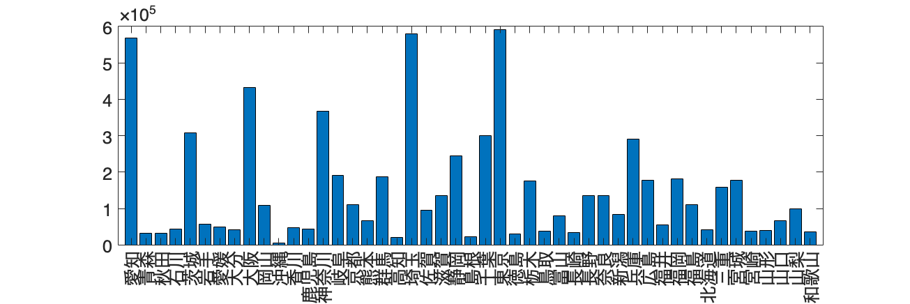

# <span style="color:rgb(213,80,0)">1.2 可視化の効果を考える</span>
## 図 1.2.1 文字情報と視覚情報による提示の違い
```matlab
% データ
countries = {'日本', 'ブラジル', '米国', '中国'}; % 国のリスト
populations = [124620000, 215802222, 335540000, 1425849288]; % 人口のリスト

% 人口を億単位に変換
populations = populations / 10^8;

% 米国と日本だけをフィルタリングして降順に並べ替え
filterIndex = ismember(countries, {'米国', '日本'});
filteredCountries = countries(filterIndex);
filteredPopulations = populations(filterIndex);
[filteredPopulations, sortIndex] = sort(filteredPopulations, 'descend');
filteredCountries = filteredCountries(sortIndex);

% 全ての国を人口で降順に並べ替え
[sortedPopulations, sortIndex] = sort(populations, 'descend');
sortedCountries = countries(sortIndex);

% 米国と日本のみを含む棒グラフの描画
figure(Position=[100, 100, 600, 250]);
barh(filteredPopulations);
set(gca, YTickLabel=filteredCountries, YDir='reverse', FontSize=20);
xlabel('人口 [億人]');
print('../figures/1_2_1_bar1','-dpng','-r300'); % dpiを指定して保存
```

<center></center>


```matlab

% 四つの国を含む棒グラフの描画
figure(Position=[100, 100, 600, 300]);
barh(sortedPopulations);
set(gca, YTickLabel=sortedCountries, YDir='reverse', FontSize=20);
xlabel('人口 [億人]');
print('../figures/1_2_1_bar2','-dpng','-r300'); % dpiを指定して保存
```

<center></center>

## 図 1.2.2 ２変数データにおけるパターンの発見
```matlab
% 与えられたデータ
data_x = [0.204, 1.07, -0.296, 0.57, 0.637, 0.82, 0.137, -0.046];
data_y = [0.07, 0.57, 0.936, 1.436, 0.32, 1.003, 1.186, 0.503];

% 四角形を形成する4点の座標を定義
square_points = [
    -0.296, 0.936;
    0.57, 1.436;
1.07, 0.57;
    0.204, 0.07;
    -0.296, 0.936
];

% 点をプロット
figure; % 新しい図を作成
scatter(data_x, data_y, filled='blue'); % 点を青色でプロット
hold on; % 図に追加のプロットをするためにホールドオン

% 四角形を点で結んでプロット
plot(square_points(:, 1), square_points(:, 2), 'r--', LineWidth = 1.5); % 四角形を赤い点線でプロット

% ラベルとタイトルを追加
xlabel(' $x$ ', Interpreter='latex'); % x軸ラベル
ylabel(' $y$ ', Interpreter='latex'); % y軸ラベル

axis('equal'); % x軸とy軸のスケールを等しく設定
hold off; % ホールドオフ

% プロットのフォントサイズを20に設定
fontsize(20,"points")

% png形式で保存
print('../figures/1_2_2_square_scatter','-dpng','-r300'); % dpiを指定して保存
```

<center></center>

## 図 1.2.3 重要なつながりだけ抜き出す（未完成）

Todo


## 図 1.2.4 全体の関係性パターンを見つける（未完成）

Todo


## 図 1.2.5 様々なデータの並べ方（未完成）

日本の地図プロットは Todo

```matlab
% データの準備
prefectures = ["愛知", "青森", "秋田", "石川", "茨城", "岩手", "愛媛", "大分", "大阪", "岡山", "沖縄", "香川", "鹿児島", "神奈川", "岐阜", "京都", "熊本", "群馬", "高知", "埼玉", "佐賀", "滋賀", ...
             "静岡", "島根", "千葉", "東京", "徳島", "栃木", "鳥取", "富山", "長崎", "長野", "奈良", "新潟", "兵庫", "広島", "福井", "福岡", "福島", "北海道", "三重", "宮城", "宮崎", "山形", "山口", "山梨", "和歌山"];
shipment = [568232, 31825, 31495, 42441, 307772, 56867, 49767, 41907, 432978, 108303, 5240, 48454, 44466, 368026, 190720, 110115, 66604, 186811, 20554, 579061, 95824, 136137, 240432, ...
            22613, 294455, 585563, 29545, 175277, 37778, 79298, 34208, 136407, 136385, 83590, 291430, 176715, 53484, 181309, 110027, 42324, 159106, 177842, 37888, 39663, 65910, 99220, 35777];

% 棒グラフを描画
figure('Position', [100, 100, 1200, 400]);
bar(prefectures, shipment);

% X軸のラベルを回転して表示
xtickangle(90)

% 文字サイズ変更
fontsize(14,'points')

% 画像を保存
print('../figures/1_2_5_logistics_bar.png','-dpng','-r300')
```

<center></center>


```matlab
% 都道府県コード順の出荷量棒グラフを描画
% データの準備
prefectures_ordered_by_code = ["北海道", "青森", "岩手", "宮城", "秋田", "山形", "福島", "茨城", "栃木", "群馬", "埼玉", "千葉", "東京", "神奈川", "新潟", "富山", "石川", "福井", "山梨", "長野", "岐阜", "静岡", "愛知", "三重", "滋賀", "京都", "大阪", "兵庫", "奈良", "和歌山", "鳥取", "島根", "岡山", "広島", "山口", "徳島", "香川", "愛媛", "高知", "福岡", "佐賀", "長崎", "熊本", "大分", "宮崎", "鹿児島", "沖縄"];
ordered_shipments_by_code = [42324, 31825, 56867, 177842, 31495, 39663, 110027, 307772, 175277, 186811, 579061, 294455, 585563, 368026, 83590, 79298, 42441, 53484, 99220, 136407, 190720, 240432, 568232, 159106, 136137, 110115, 432978, 291430, 136385, 35777, 37778, 22613, 108303, 176715, 65910, 29545, 48454, 49767, 20554, 181309, 95824, 34208, 66604, 41907, 37888, 44466, 5240];

% 棒グラフを描画
figure('Position', [100, 100, 1200, 400]);
bar(prefectures_ordered_by_code, ordered_shipments_by_code);

% X軸のラベルを回転して表示
xtickangle(90)

% 文字サイズ変更
fontsize(14,'points')

% 画像を保存
print('../figures/1_2_5_logistics_bar_ordered_by_code.png','-dpng','-r300')
```

<center></center>

## 図 1.2.6 データの特徴の情報を含める
```matlab
% データの準備
prefectures = ["愛知", "青森", "秋田", "石川", "茨城", "岩手", "愛媛", "大分", "大阪", "岡山", "沖縄", "香川", "鹿児島", "神奈川", "岐阜", "京都", "熊本", "群馬", "高知", "埼玉", "佐賀", "滋賀", "静岡", "島根", "千葉", "東京", "徳島", "栃木", "鳥取", "富山", "長崎", "長野", "奈良", "新潟", "兵庫", "広島", "福井", "福岡", "福島", "北海道", "三重", "宮城", "宮崎", "山形", "山口", "山梨", "和歌山"];
shipment = [568200, 31890, 31290, 42750, 307740, 56660, 49760, 41900, 432700, 108000, 5260, 48460, 44426, 368000, 190700, 110135, 66606, 186800, 20500, 579061, 95854, 136337, 245432, 22312, 299485, 590563, 29742, 175261, 37638, 79498, 34208, 136107, 136185, 83490, 291440, 176795, 54484, 181329, 110327, 42334, 159100, 177242, 37838, 39263, 65914, 99420, 35777];

% 棒グラフの描画
figure('Position', [100, 100, 1200, 400]);
bar(prefectures, shipment);
xtickangle(90); % X軸のラベルを回転して表示
% 文字サイズ変更
fontsize(14,'points')
print('../figures/1_2_6_logistics_bar.png','-dpng','-r300') % 画像を保存
```

<center></center>


```matlab

% 出荷量を降順にソートするためのインデックスを生成
[~, sorted_index] = sort(shipment, 'descend');  % 'descend'で降順にソート
% sorted_indexを使って都道府県と出荷量をソート
sorted_prefecture = prefectures(sorted_index);
sorted_shipment = shipment(sorted_index);

figure('Position', [100, 100, 1200, 400]);
bar(sorted_prefecture,sorted_shipment); % 棒グラフを描画
xtickangle(90); % X軸のラベルを回転して表示
% 文字サイズ変更
fontsize(14,'points')
print('../figures/1_2_6_logistics_bar_sorted.png','-dpng','-r300'); % 画像を保存
```

<center></center>

