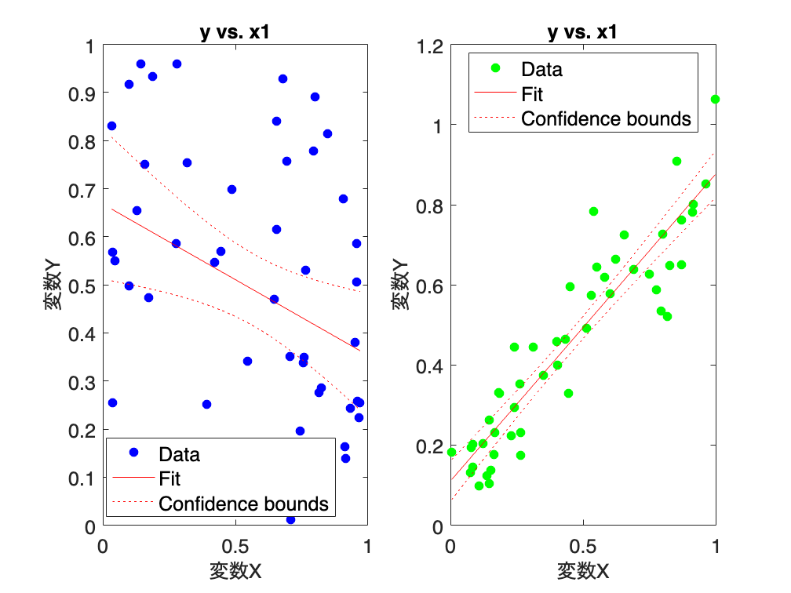
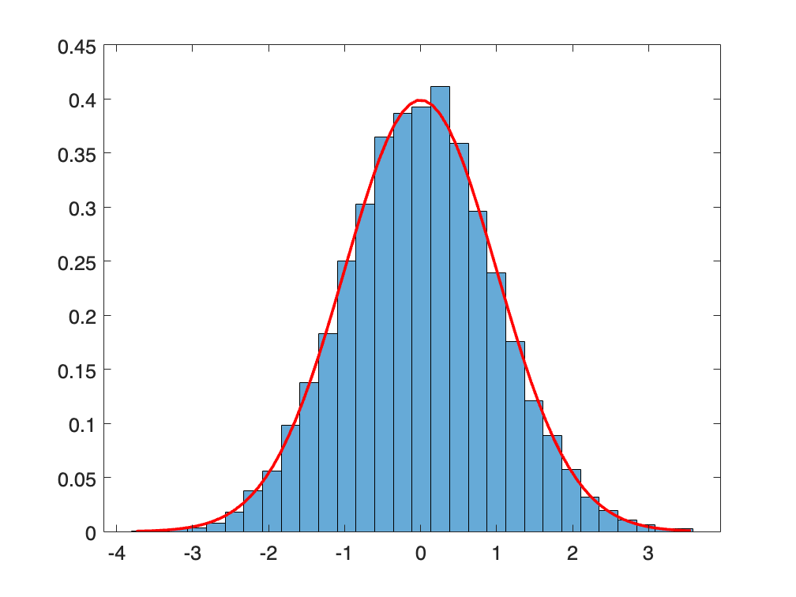
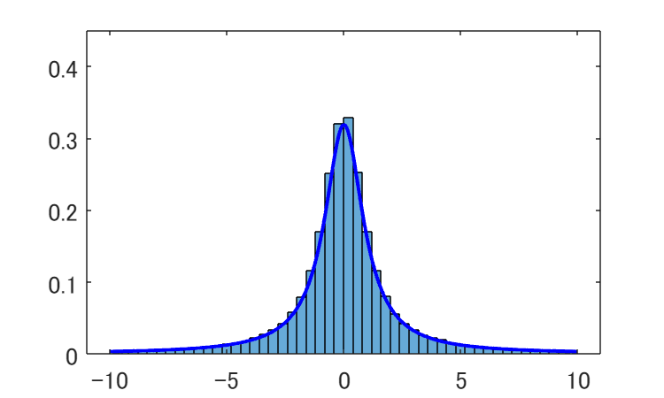
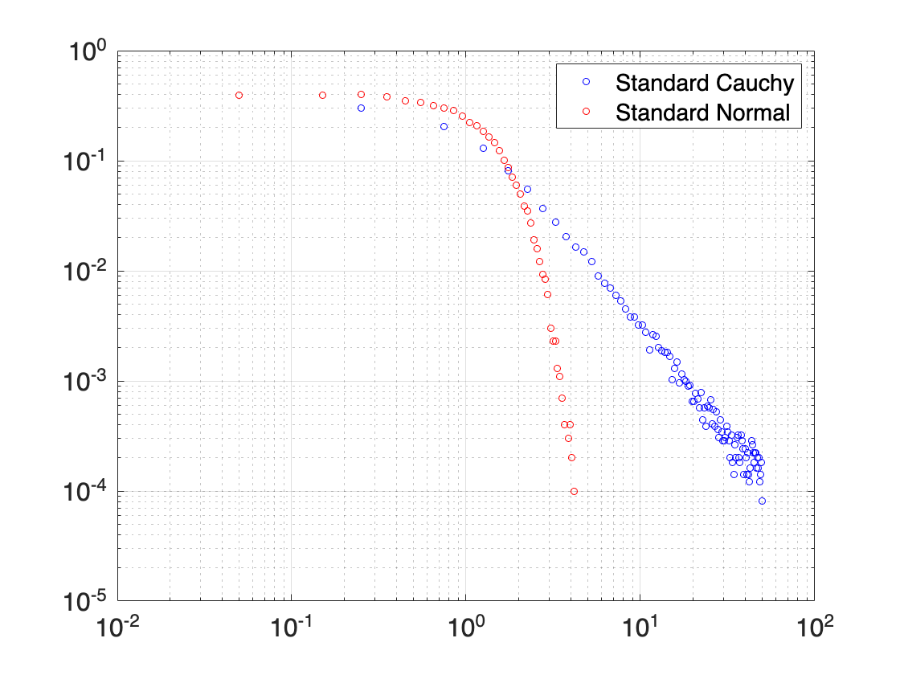
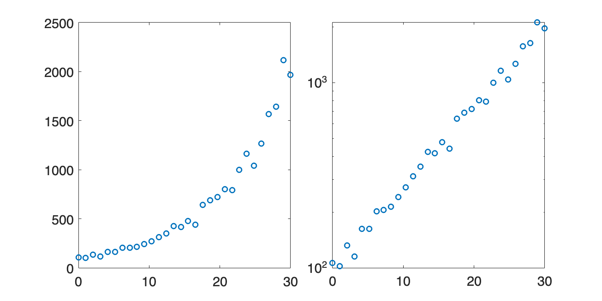

# <span style="color:rgb(213,80,0)">1.3 可視化で読み取れるロジック</span>
## 1.3.2 変数間の関係
```matlab
% 乱数のシードを設定（再現性のため）
rng('default')

% 相関のないデータを生成
x1 = rand([50,1]);
y1 = rand([50,1]);

% 相関の大きいデータを生成
x2 = rand([50,1]);
y2 = 0.8 * (x2 - 0.5) + 0.5 + 0.1 * randn([50,1]);

% グラフ描画の設定
figure
tiledlayout('horizontal');

nexttile
% サブプロット1: 相関のないデータ（色：青）
mdl = fitlm(x1,y1);
plot(mdl,Color='blue',Marker='o',MarkerFaceColor='blue')
xlabel('変数X') % x軸ラベル
ylabel('変数Y') % y軸ラベル
fontsize(14,'points')

nexttile
% サブプロット2: 相関の大きいデータ（色：緑）
mdl = fitlm(x2,y2);
plot(mdl,Color='green',Marker='o',MarkerFaceColor='green')
xlabel('変数X') % x軸ラベル
ylabel('変数Y') % y軸ラベル
fontsize(14,'points')

% レイアウトの調整と保存
print('../figures/1_3_2_correlation_scatter','-dpng','-r300');  % 画像として保存
```

<center></center>

## 1.3.4 性質の異なる分布の例
```matlab
rng('default');  % 再現性のために乱数ジェネレータの状態をリセット

% 平均0、標準偏差1の正規分布から10000個のサンプルを生成
mu = 0;  % 平均
sigma = 1;  % 標準偏差
samples = normrnd(mu, sigma, [10000, 1]);  % 正規分布から10000個のサンプルを生成

% 新しい図の作成 と ヒストグラム（頻度分布）をプロット
figure
histogram(samples, 30, 'Normalization', 'pdf');

% 正規分布の理論的な確率密度関数をプロット
x = min(samples) : 0.1 : max(samples);  % x軸の範囲を100分割したデータを生成
p = normpdf(x, mu, sigma);  % 正規分布の確率密度関数を計算
hold on
plot(x, p, 'r', 'LineWidth', 2)  % 確率密度関数をプロット
hold off
% x軸とy軸の表示設定とファイル保存
fontsize(14,'points');
print('../figures/1_3_4_normal_dist.png','-dpng','-r300');
```

<center></center>


```matlab

% 標準コーシー分布から10000個のサンプルを生成
samples = trnd(1, [100000,1]);
% ここでは外れ値を捨てて描画
samples = samples(samples > -10 & samples < 10);

% 新しい図の作成
figure
histogram(samples, 50, 'Normalization', 'pdf');  % ヒストグラムのプロット

% コーシー分布の理論的な確率密度関数をプロット
x = min(samples) : 0.1 : max(samples);  % x軸の範囲を1000分割したデータを生成
p = tpdf(x, 1);  % コーシー分布の確率密度関数を計算
hold on;
plot(x, p, 'b', 'LineWidth', 2);  % 確率密度関数をプロット
hold off;

% x軸とy軸の表示設定とファイル保存
fontsize(14,'points')
print('../figures/1_3_4_cauchy_dist.png','-dpng','-r300');
```

<center></center>


```matlab
% 標準コーシー分布から100000個のサンプルを生成
samples_cauchy = trnd(1, [100000, 1]);
samples_cauchy = samples_cauchy(samples_cauchy > -50 & samples_cauchy < 50);

% 標準正規分布から100000個のサンプルを生成
samples_normal = normrnd(0, 1, [100000, 1]);
samples_normal = samples_normal(samples_normal > -50 & samples_normal < 50);

% ヒストグラムを作成し、値と頻度を取得
[counts_cauchy, edges_cauchy] = histcounts(samples_cauchy, Normalization='pdf');
[counts_normal, edges_normal] = histcounts(samples_normal, Normalization='pdf');

% ヒストグラムのビンの中心値を計算
bins_cauchy = (edges_cauchy(1:end-1) + edges_cauchy(2:end)) / 2;
bins_normal = (edges_normal(1:end-1) + edges_normal(2:end)) / 2;

figure;
% 両対数プロットによるヒストグラムの描画
plot(bins_cauchy, counts_cauchy, 'bo', MarkerSize=4, DisplayName='Standard Cauchy');
hold on;
plot(bins_normal, counts_normal, 'ro', MarkerSize=4, DisplayName='Standard Normal');
xscale('log');
yscale('log')
fontsize(16,'points')
legend; 
grid on
print('../figures/1_3_4_tail_comparison','-dpng','-r300'); %画像として保存
```

```TextOutput
Warning: Negative data ignored
```

<center></center>

## 1.3.5 初期の感染症の拡大
```matlab
x = linspace(0, 30, 30);  % 0から2までの範囲で等間隔に100個の数を生成

% 指数関数と線形関数の値を計算
exp_y = exp(x ./ 10) * 100;  % 指数関数
exp_y = exp_y .* (1 + randn(1, 30) * 0.08);  % ランダムなノイズを付加する

% プロットの設定
figure(Position=[10 10 800 400])

tiledlayout('horizontal');
nexttile % 1行2列の左側
plot(x, exp_y, 'o', LineWidth=1.5) % 指数関数をプロット

% 片対数プロット
nexttile % 1行2列の右側
semilogy(x, exp_y, 'o', LineWidth=1.5)  % 指数関数をプロット

print('../figures/1_3_5_exponential_growth','-dpng', '-r300')  % 画像として保存
```

```TextOutput
Warning: Negative data ignored
```

<center></center>

