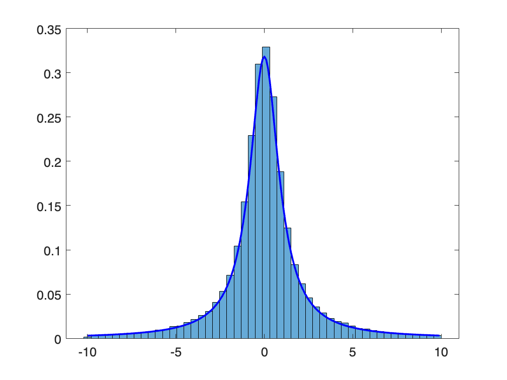

# 1.3 可視化で読み取れるロジック
## 1.3.2 変数間の関係
```matlab
% Set default font size
set(0, 'DefaultAxesFontSize', 14);

% Set random seed for reproducibility
rng(0, 'twister');

% Generate uncorrelated data
x1 = rand(50, 1);
y1 = rand(50, 1);

% Generate correlated data
x2 = rand(50, 1);
y2 = 0.8 * (x2 - 0.5) + 0.5 + 0.1 * randn(50, 1);

% Create a figure with two subplots
figure('Position', [100, 100, 1000, 500]);

% Subplot 1: Uncorrelated data (color: blue)
subplot(1, 2, 1);
scatter(x1, y1, 'blue', 'filled');
hold on;
% Fit and plot regression line
fit1 = fit(x1, y1, 'poly1');
plot(fit1, x1, y1);
xlabel('変数X', 'FontSize', 18);
ylabel('変数Y', 'FontSize', 18);
hold off;

% Subplot 2: Correlated data (color: green)
subplot(1, 2, 2);
scatter(x2, y2, 'green', 'filled');
hold on;
% Fit and plot regression line
fit2 = fit(x2, y2, 'poly1');
plot(fit2, x2, y2);
xlabel('変数X', 'FontSize', 18);
ylabel('変数Y', 'FontSize', 18);
hold off;

% Adjust layout
set(gcf, 'PaperPositionMode', 'auto');
% tight_layout(); % This is not a MATLAB function, but you can adjust subplot spacing manually

% Save figure as PNG
saveas(gcf, '1_3_2_correlation_scatter.png');
```


```matlab

% Display the figure
% MATLAB figures are displayed by default, so no need for an equivalent to plt.show()
    
```


## 1.3.4 性質の異なる分布の例
```matlab
% Call the plotting functions
% plot_norm();
% plot_cauchy();
% plot_tail_comparison();
% 
fontsize = 14;

% function plot_norm()
    % Generate samples from a normal distribution
    mu = 0; % Mean
    sigma = 1; % Standard deviation
    samples = normrnd(mu, sigma, [10000, 1]); % 10000 samples from normal distribution

    figure; % Create a new figure
    % Plot histogram (frequency distribution)
    histogram(samples, 'BinWidth', 0.3, 'Normalization', 'pdf'); % gray

    % Plot theoretical probability density function of the normal distribution
    xmin = min(samples);
    xmax = max(samples);
    x = linspace(xmin, xmax, 100); % Generate 100 linearly spaced points between xmin and xmax
    p = normpdf(x, mu, sigma); % Calculate the probability density function
    hold on; % Hold on to the current figure
    plot(x, p, 'r', 'LineWidth', 2); % Plot the probability density function
    hold off; % Release the figure

    % Set ticks and labels
    set(gca, 'FontSize', fontsize);
    ylim([0, 0.45]); % Set y-axis limits
    set(gcf, 'Position', [100, 100, 500, 300]); % Set figure size
    saveas(gcf, '1_3_4_normal_dist.png'); % Save figure as PNG
```


```matlab

% function plot_cauchy()
    % Generate samples from a standard Cauchy distribution
    samples = trnd(1, [100000, 1]);

    % Discard outliers for plotting
    samples = samples(samples > -10 & samples < 10);

    figure; % Create a new figure
    histogram(samples, 'BinWidth', 0.4, 'Normalization', 'pdf'); % 'FaceColor', 'gray'

    % Plot theoretical probability density function of the Cauchy distribution
    xmin = min(samples);
    xmax = max(samples);
    x = linspace(xmin, xmax, 1000); % Generate 1000 linearly spaced points between xmin and xmax
    p = tpdf(x, 1); % Calculate the probability density function for df=1 (standard Cauchy)
    hold on; % Hold on to the current figure
    plot(x, p, 'b', 'LineWidth', 2); % Plot the probability density function
    hold off; % Release the figure

    % Set ticks and labels
    set(gca, 'FontSize', fontsize);
    ylim([0, 0.45]); % Set y-axis limits
    set(gcf, 'Position', [100, 100, 500, 300]); % Set figure size
    saveas(gcf, '1_3_4_cauchy_dist.png'); % Save figure as PNG
```



```matlab

% function plot_tail_comparison()
    % Generate samples from a standard Cauchy distribution
    samples_cauchy = trnd(1, [100000, 1]);
    samples_cauchy = samples_cauchy(samples_cauchy > -50 & samples_cauchy < 50);

    % Generate samples from a standard normal distribution
    samples_normal = normrnd(0, 1, [100000, 1]);
    samples_normal = samples_normal(samples_normal > -50 & samples_normal < 50);

    % Create histograms and get values and frequencies
    [counts_cauchy, edges_cauchy] = histcounts(samples_cauchy, 'BinMethod', 'auto', 'Normalization', 'pdf');
    [counts_normal, edges_normal] = histcounts(samples_normal, 'BinMethod', 'auto', 'Normalization', 'pdf');

    % Calculate bin centers
    bins_cauchy = (edges_cauchy(1:end-1) + edges_cauchy(2:end)) / 2;
    bins_normal = (edges_normal(1:end-1) + edges_normal(2:end)) / 2;

    figure; % Create a new figure
    % Plot histograms using a log-log scale
    loglog(bins_cauchy, counts_cauchy, 'bo', 'MarkerSize', 4, 'DisplayName', 'Standard Cauchy');
    hold on; % Hold on to the current figure
    loglog(bins_normal, counts_normal, 'ro', 'MarkerSize', 4, 'DisplayName', 'Standard Normal');
    hold off; % Release the figure

    % Set ticks and labels
    set(gca, 'FontSize', fontsize);
    legend('show'); % Show legend
    set(gcf, 'Position', [100, 100, 500, 300]); % Set figure size
    saveas(gcf, '1_3_4_tail_comparison.png'); % Save figure as PNG
```

```TextOutput
警告: 負のデータは無視されました
```


## 1.3.5 初期の感染症の拡大
```matlab
% Set default font size
set(0, 'DefaultAxesFontSize', 14);

% Generate linearly spaced numbers
x = linspace(0, 30, 30);

% Calculate values for exponential and linear functions
exp_y = exp(x / 10) * 100; % Exponential function
exp_y = exp_y .* (1 + normrnd(0, 0.08, [1, 30])); % Add random noise

linear_y = 2 * x + 1; % Linear function

% Create a figure with specified size
figure('Position', [100, 100, 800, 400]);

% Normal plot
subplot(1, 2, 1); % Left side of a 1x2 grid
plot(x, exp_y, 'o', 'LineStyle', 'none', 'DisplayName', 'Exponential'); % Plot exponential function
xticks(0:5:30); % Set x-axis labels with step of 5

% Semilog plot
subplot(1, 2, 2); % Right side of a 1x2 grid
semilogy(x, exp_y, 'o', 'LineStyle', 'none', 'DisplayName', 'Exponential'); % Plot exponential function on a semilog scale
xticks(0:5:30); % Set x-axis labels with step of 5

% Adjust layout and save the figure
set(gcf, 'PaperPositionMode', 'auto'); % Adjust the printing position
% MATLAB automatically adjusts layout, so there is no direct equivalent to plt.tight_layout()
saveas(gcf, '1_3_5_exponential_growth.png'); % Save figure as PNG
```


```matlab

% MATLAB figures are displayed by default, so there is no need for an equivalent to plt.show()
```
