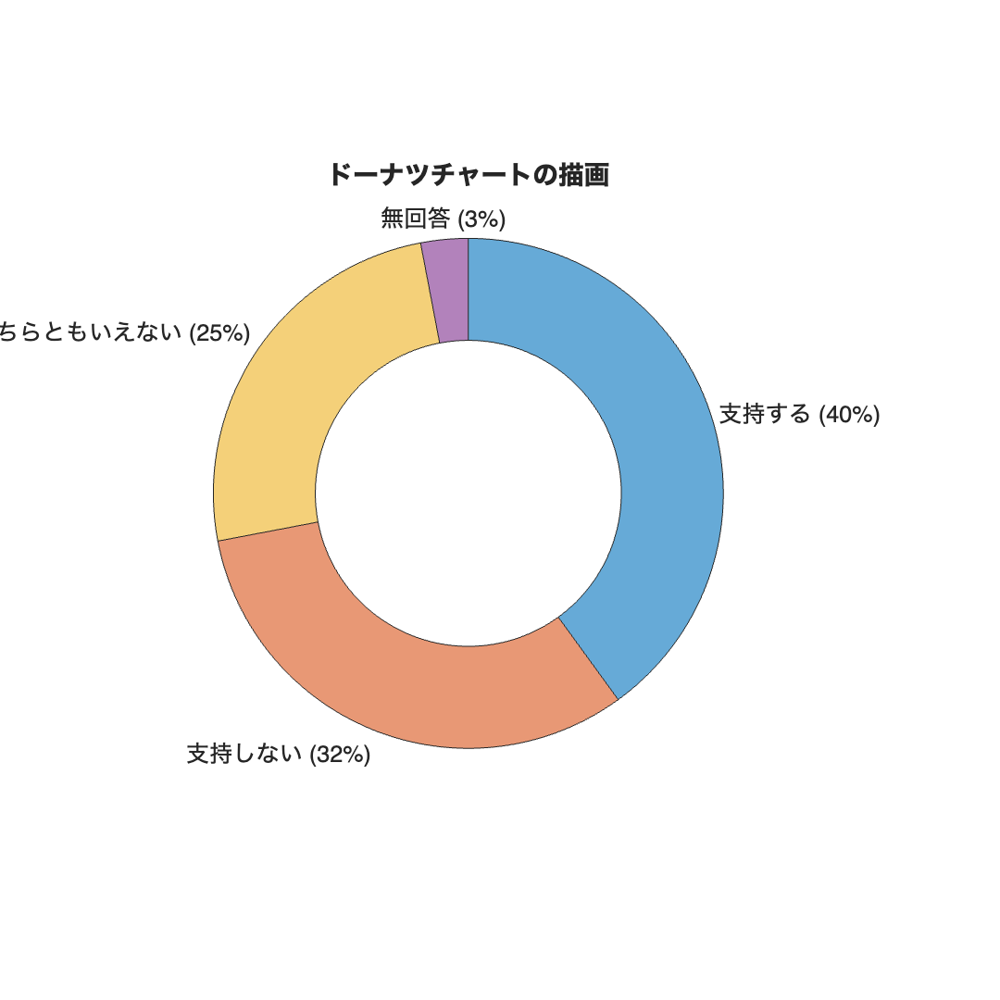

# <span style="color:rgb(213,80,0)">2.1 数量と図形の大きさを紐づける</span>
## 図 2.1.1 図形の大きさと数量を紐づける
```matlab
% パーセンテージのデータ
data = [40, 32, 25, 3];

% ラベル
labels = ["支持する", "支持しない", "どちらともいえない", "無回答"];

% MATLAB でのソートは各要素を個別にソートする必要があります
[~,idx] = sort(data,'descend');

% データ、ラベル、色を大きい順にソート
data = data(idx);
labels = labels(idx);

% figure の作成とサイズの指定
fig = figure;
fig.Position(3:4) = [600 600];

% ドーナツチャートの描画
donutchart(data,labels);
fontsize(14,'points')
title('ドーナツチャートの描画');

% 画像として保存
print('../figures/2_1_1_donut','-dpng','-r300');
```

<center></center>

## 図 2.1.2 ワードクラウドを用いた「頻度と見た目の大きさ」の紐づけ
```matlab
% テキストデータ
text = "Clustering coefficients for correlation networks, Energy landscape analysis of neuroimaging data, Simulation of space acquisition process of pedestrians using proxemic floor field model, Pedestrian flow through multiple bottlenecks, Closer to critical resting-state neural dynamics in individuals with higher fluid intelligence, Reinforcement learning explains conditional cooperation and its moody cousin, Jam-absorption driving with a car-following model, Age‐related changes in the ease of dynamical transitions in human brain activity, Potential global jamming transition in aviation networks, Methodology and theoretical basis of forward genetic screening for sleep/wakefulness in mice, Jamming transitions in force-based models for pedestrian dynamics, Inflow process of pedestrians to a confined space, Exact solution of a heterogeneous multilane asymmetric simple exclusion process, Exact stationary distribution of an asymmetric simple exclusion process with Langmuir kinetics and memory reservoirs, Taming macroscopic jamming in transportation networks, A demonstration experiment of a theory of jam-absorption driving, A balance network for the asymmetric simple exclusion process, Reinforcement learning account of network reciprocity, Towards understanding network topology and robustness of logistics systems, Inflow process: A counterpart of evacuation, Analysis on a single segment of evacuation network, Dynamics of assembly production flow, Presynaptic inhibition of dopamine neurons controls optimistic bias, Bridging the micro-macro gap between single-molecular behavior and bulk hydrolysis properties of cellulase, Cluster size distribution in 1D-CA traffic models, Modelling state‐transition dynamics in resting‐state brain signals by the hidden Markov and Gaussian mixture models, Positive congestion effect on a totally asymmetric simple exclusion process with an adsorption lane, Metastability in pedestrian evacuation, Constructing quantum dark solitons with stable scattering properties, The Autonomous Sensory Meridian Response Activates the Parasympathetic Nervous System, Trait, staging, and state markers of psychosis based on functional alteration of salience-related networks in the high-risk, first episode, and chronic stages, Critical brain dynamics and human intelligence, Influence of velocity variance of a single particle on cellular automaton models, Collective motion of oscillatory walkers, Reinforcing critical links for robust network logistics: A centrality measure for substitutability, Dynamic transitions between brain states predict auditory attentional fluctuations, Associations of conservatism/jumping to conclusions biases with aberrant salience and default mode network, Model retraining and information sharing in a supply chain with long-term fluctuating demands, Functional alterations of salience-related networks are associated with traits, staging, and the state of psychosis.";

% WordCloudオブジェクトを生成
figure; 
wordcloud(text);
print('../figures/2_1_2_wordcloud','-dpng','-r300');  % 画像として保存
```

<center></center>

## 図 2.1.3 ツリーマップによるグループ情報の付与（未完成）

Todo

