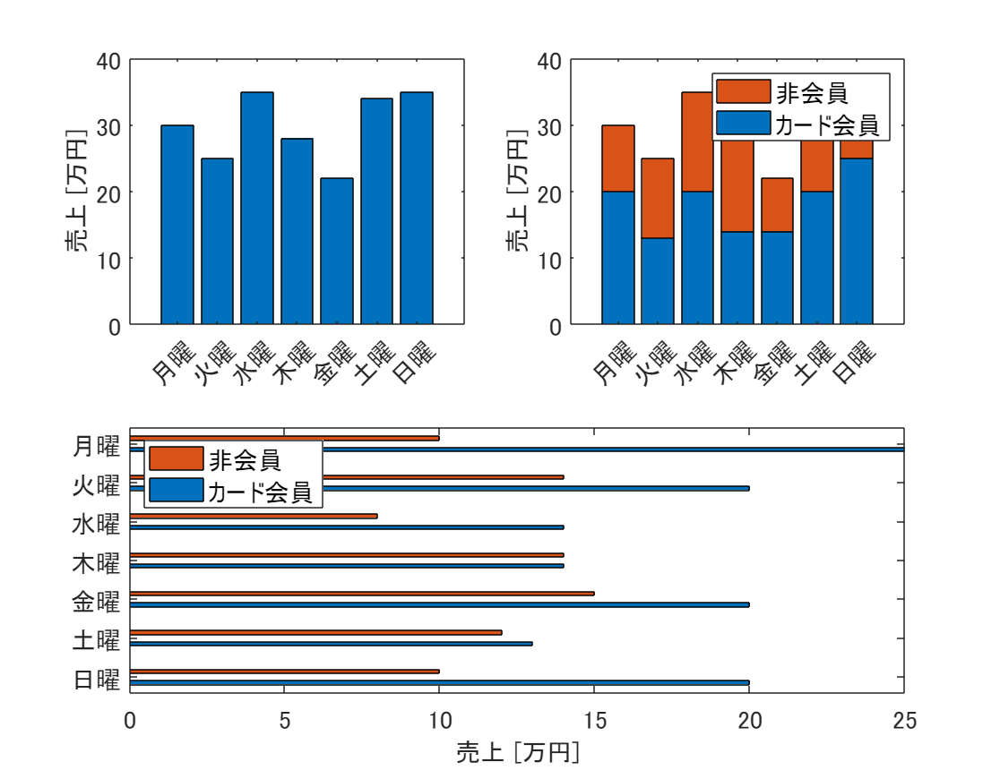
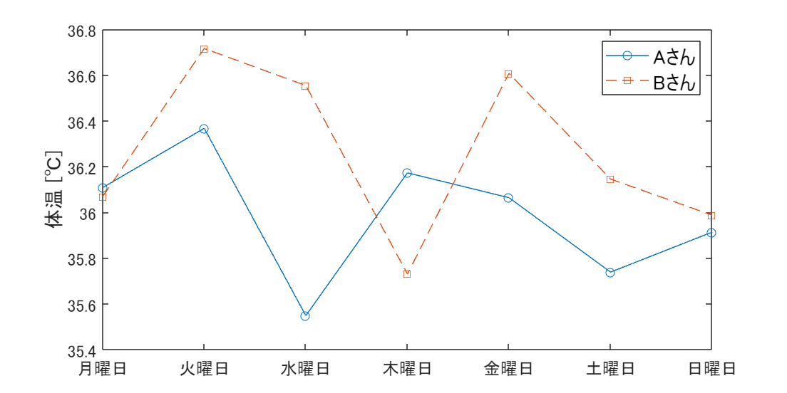
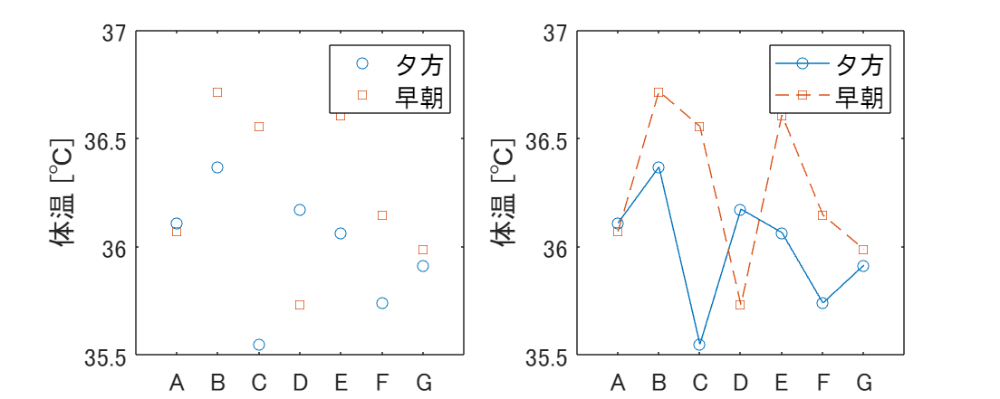

# <span style="color:rgb(213,80,0)">2.2 大きさを比較する</span>
## 図 2.2.1 棒グラフの例
```matlab
% データの定義
days = {'月曜', '火曜', '水曜', '木曜', '金曜', '土曜', '日曜'}';
sales = [30, 25, 35, 28, 22, 34, 35]';
cardMembers = [20, 13, 20, 14, 14, 20, 25]';
nonMembers = [10, 12, 15, 14, 8, 14, 10]';

% Figure サイズ設定
figure('Position', [10, 10, 800, 600]);

tiledlayout(2,2)
% 基本的な棒グラフの作成
nexttile  
bar(sales);
xticklabels(days)
ylabel('売上 [万円]');  
fontsize(14,'points');

% 積み上げ棒グラフの作成
nexttile 
bar([cardMembers, nonMembers], 'stacked', EdgeColor='none');  
xticklabels(days);
ylabel('売上 [万円]');
fontsize(14,'points')

% 水平棒グラフの作成
nexttile([1,2])
barh([cardMembers, nonMembers]);
yticklabels(days);
xlabel('売上 [万円]');  
legend('カード会員', '非会員');  
fontsize(14,'points')

% 画像として保存
print('../figures/2_2_1_bar_charts.png', '-dpng', '-r300');  
```

<center></center>

## 図 2.2.2 折れ線グラフの例
```matlab
rng(0);  % 乱数のシードを設定（再現性のため）
days = {'月曜日', '火曜日', '水曜日', '木曜日', '金曜日', '土曜日', '日曜日'}';
A = normrnd(36.0, 0.2, [7,1]);
B = normrnd(36.0, 0.2, [7,1]);

% プロットの設定
figure(Position=[10, 10, 800, 400]);  % Figureのサイズを変更

% AさんとBさんの体温推移をプロット
plot(1:7, A, 'o-', DisplayName='Aさん');
hold on;
plot(1:7, B, 's--', DisplayName='Bさん');
hold off;

xticklabels(days)
ylabel('体温 [℃]');  % y軸ラベルを設定
legend;  % 凡例の表示
fontsize(14,'points')

print('../figures/2_2_2_line_plot','-dpng','-r300');  % 画像として保存
```

<center></center>

## 図 2.2.3 見やすさのための折れ線グラフ
```matlab
% 乱数のシードを設定（再現性のため）
rng(0, 'twister');

% 人のリスト
people = {'A', 'B', 'C', 'D', 'E', 'F', 'G'};

% size=7の正規分布の乱数生成、平均36.0、標準偏差0.2
temp_evening = 36.0 + 0.2 * randn(1, 7);  % 夕方の体温
temp_morning = 36.0 + 0.2 * randn(1, 7);  % 早朝の体温

% FigureとAxes
figure(Position=[100 100 1000 400]);

tiledlayout('horizontal');

% マーカーのみの折れ線グラフをプロット
nexttile;
plot(1:7, temp_evening, 'o', DisplayName='夕方');
hold on
plot(1:7, temp_morning, 's', DisplayName='早朝');
hold off
ylabel('体温 [℃]');
xticklabels(people);

legend;
fontsize(14,'points')

% マーカーと折れ線のグラフをプロット
nexttile;
plot(1:7, temp_evening, 'o-', DisplayName='夕方');
hold on
plot(1:7, temp_morning, 's--', DisplayName='早朝');
hold off
ylabel('体温 [℃]');
xticklabels(people)
legend
fontsize(14,'points')

% 画像として保存
print('../figures/2_2_3_point_lineplot','-dpng', '-r300');
```

<center></center>

