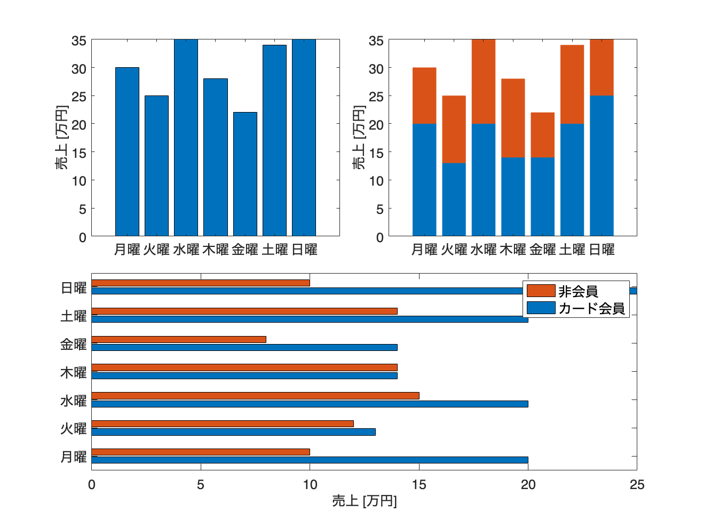
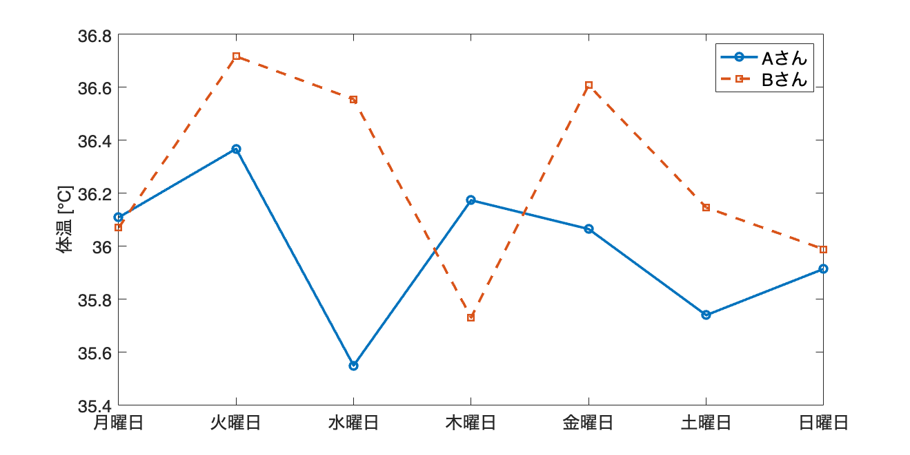
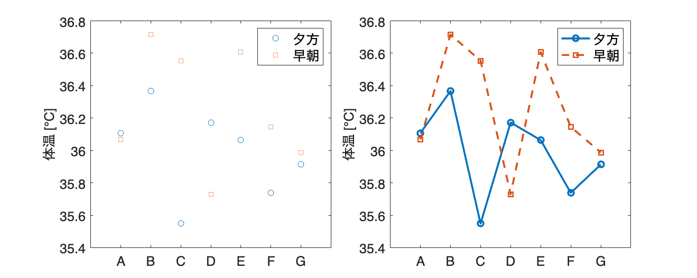

# 2.2 大きさを比較する
## 図 2.2.1 棒グラフの例
```matlab
% Data definition
days = {'月曜', '火曜', '水曜', '木曜', '金曜', '土曜', '日曜'};
sales = [30, 25, 35, 28, 22, 34, 35];
card_members = [20, 13, 20, 14, 14, 20, 25];
non_members = [10, 12, 15, 14, 8, 14, 10];

% Create color map
% cmap = colormap('tab10'); % 'tab10' is a commonly used color map

% Create a figure
figure('Position', [100, 100, 1000, 800]);

% Basic bar chart
subplot(2, 2, 1);
% bar(sales, 'FaceColor', cmap(1, :));
bar(sales)
set(gca, 'xticklabel', days, 'FontSize', 14);
ylabel('売上 [万円]', 'FontSize', 14);

% Stacked bar chart
subplot(2, 2, 2);
bar([card_members; non_members]', 'stacked');
set(gca, 'xticklabel', days, 'FontSize', 14);
ylabel('売上 [万円]', 'FontSize', 14);
legend({'カード会員', '非会員'}, 'FontSize', 14);

% Horizontal bar chart
subplot(2, 2, [3, 4]);
barh([card_members; non_members]', 'BarWidth', 0.35);
set(gca, 'yticklabel', flip(days), 'FontSize', 14); % Flip to match the order in Python
xlabel('売上 [万円]', 'FontSize', 14);
legend({'カード会員', '非会員'}, 'FontSize', 14, 'Location', 'northwest');

% Adjust the layout
set(gcf, 'PaperPositionMode', 'auto');

% Save the figure as an image
saveas(gcf, '2_2_1_bar_charts.png');
```



```matlab

% MATLAB figures are displayed by default
```
## 図 2.2.2 折れ線グラフの例
```matlab
% Data generation
rng(0); % Set random seed for reproducibility
days = {'月曜日', '火曜日', '水曜日', '木曜日', '金曜日', '土曜日', '日曜日'};
A_san = normrnd(36.0, 0.2, [1, 7]);
B_san = normrnd(36.0, 0.2, [1, 7]);

% Create figure and axes
fig = figure('Position', [100, 100, 800, 400]);

% Plot line charts for Aさん and Bさん
plot(1:7, A_san, 'o-', 'DisplayName', 'Aさん');
hold on; % Hold on to plot multiple lines on the same axes
plot(1:7, B_san, 's--', 'DisplayName', 'Bさん');
hold off;

% Set the x-axis to use custom labels
set(gca, 'xtick', 1:7, 'xticklabel', days, 'FontSize', 12);

% Set y-axis label
ylabel('体温 [℃]', 'FontSize', 14);

% Show legend
legend('FontSize', 14);

% Save the figure as an image
saveas(fig, '2_2_2_line_plot.png');
```


## 図 2.2.3 見やすさのための折れ線グラフ
```matlab
% Data generation
rng(0); % Set random seed for reproducibility
people = {'A', 'B', 'C', 'D', 'E', 'F', 'G'}; % List of people
evening_temps = normrnd(36.0, 0.2, [1, 7]); % Evening temperatures
morning_temps = normrnd(36.0, 0.2, [1, 7]); % Morning temperatures

% Create figure and subplots
fig = figure('Position', [100, 100, 1000, 400]);

% First subplot - Line chart with markers only
ax1 = subplot(1, 2, 1);
plot(ax1, 1:7, evening_temps, 'o', 'DisplayName', '夕方');
hold(ax1, 'on');
plot(ax1, 1:7, morning_temps, 's', 'DisplayName', '早朝');
hold(ax1, 'off');
ylabel(ax1, '体温 [℃]', 'FontSize', 14);
set(ax1, 'xtick', 1:7, 'xticklabel', people, 'FontSize', 14);
legend(ax1, 'FontSize', 14);

% Second subplot - Line chart with markers and lines
ax2 = subplot(1, 2, 2);
plot(ax2, 1:7, evening_temps, 'o-', 'DisplayName', '夕方');
hold(ax2, 'on');
plot(ax2, 1:7, morning_temps, 's--', 'DisplayName', '早朝');
hold(ax2, 'off');
ylabel(ax2, '体温 [℃]', 'FontSize', 14);
set(ax2, 'xtick', 1:7, 'xticklabel', people, 'FontSize', 14);
legend(ax2, 'FontSize', 14);

% Save the figure as an image
saveas(fig, '2_2_3_point_lineplot.png');
```


