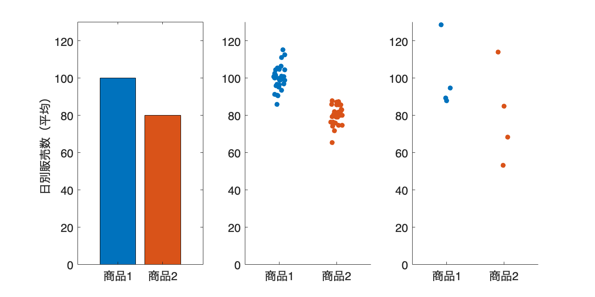
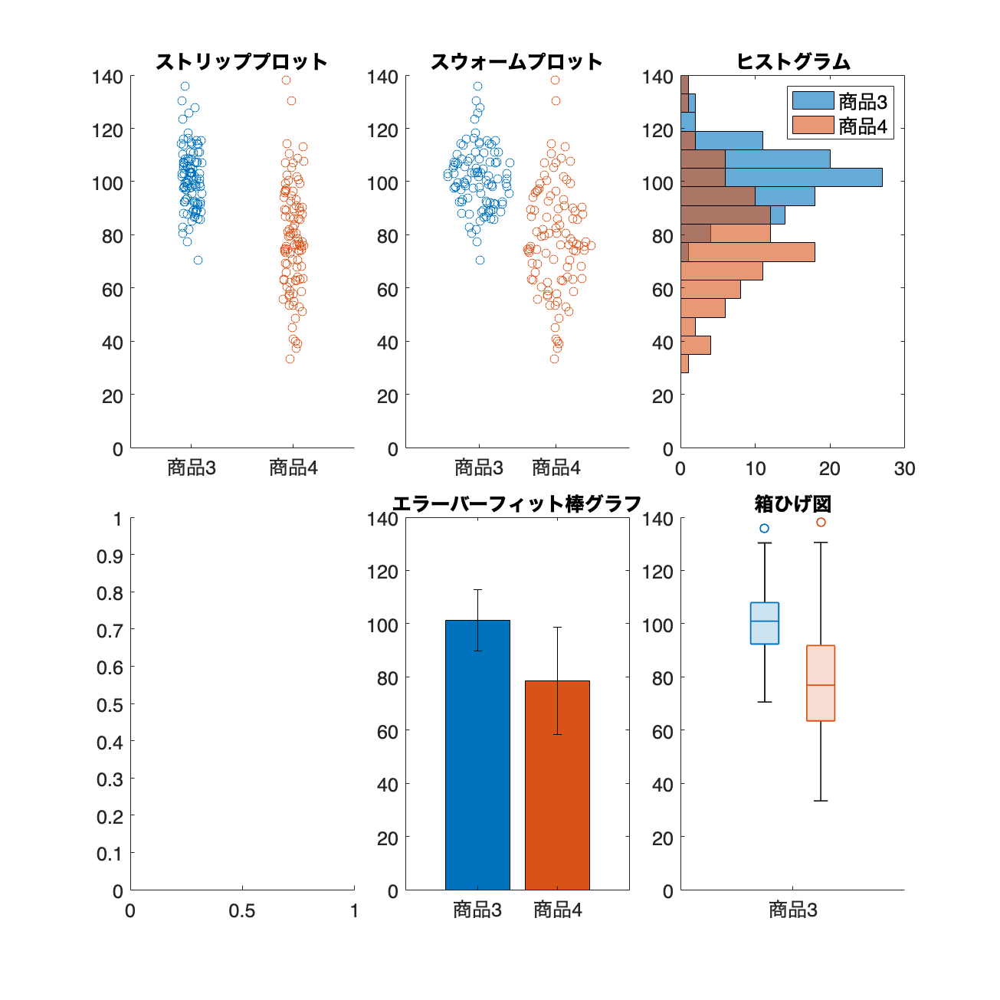
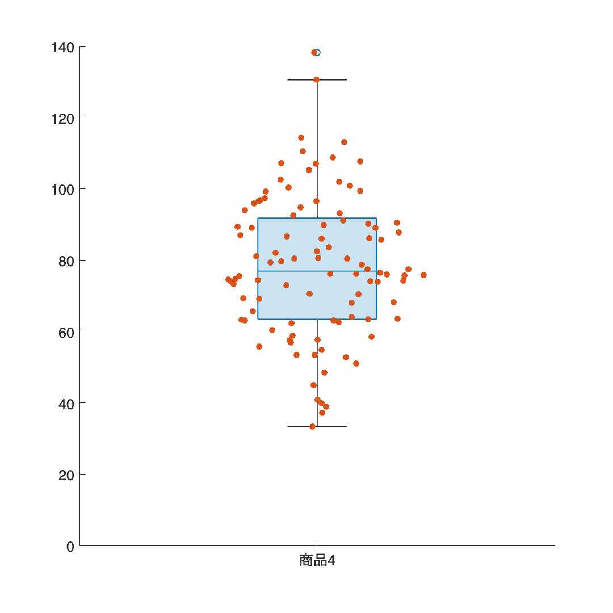

# <span style="color:rgb(213,80,0)">2.3 標本を視えるようにする</span>
## 図 2.3.1 平均値の棒グラフの危険性
```matlab
% データの生成
rng('default');  % 乱数のシードを設定（再現性のため）

% 商品1の日別販売数
product1_small_var = normrnd(100, 5, [30,1]);  % 平均100、標準偏差5の正規分布に従う乱数を30個生成
product1_small_var = product1_small_var - ...
    mean(product1_small_var) + 100;  % 平均値を100に調整

product1_large_var = normrnd(100, 20, [4,1]);  % 平均100、標準偏差20の正規分布に従う乱数を4個生成
product1_large_var = product1_large_var - ...
    mean(product1_large_var) + 100;  % 平均値を100に調整

% 商品2の日別販売数
product2_small_var = normrnd(80, 5, [30,1]);  % 平均80、標準偏差5の正規分布に従う乱数を30個生成
product2_small_var = product2_small_var - ...
    mean(product2_small_var) + 80;  % 平均値を80に調整

product2_large_var = normrnd(80, 20, [4,1]);  % 平均80、標準偏差20の正規分布に従う乱数を4個生成
product2_large_var = product2_large_var - ...
    mean(product2_large_var) + 80;  % 平均値を80に調整

figure(Position=[100, 100, 1000, 500]);
tiledlayout('horizontal')

% 棒グラフ
nexttile
bar(categorical(["商品1", "商品2"]), [100,80], ...
    FaceColor='flat', CData=[0 0 1; 1 0.5 0]);
ylim([0, 130]);
ylabel('日別販売数（平均）');

% ストリッププロット（分散小）
nexttile
x = categorical([repelem("商品1",30,1),repelem("商品2",30,1)]);
y = [product1_small_var, product2_small_var];
swarmchart(x,y,'filled',XJitter='rand',XJitterWidth=0.2);
ylim([0, 130]);

% ストリッププロット（分散大）
nexttile
x = categorical([repelem("商品1",4,1),repelem("商品2",4,1)]);
y = [product1_large_var, product2_large_var];
swarmchart(x,y,'filled',XJitter='rand',XJitterWidth=0.2);
ylim([0, 130]);
print('../figures/2_3_1_group_comparison','-dpng', '-r300');
```

<center></center>

## 図 2.3.2 様々な標本の可視化
```matlab
% データ生成
rng(0)  % 乱数のシードを設定（再現性のため）

num_samples = 100;  % サンプルサイズ
% 平均100、標準偏差10の正規分布に従う乱数をnum_samples個生成
category1 = 10.*randn(num_samples,1) + 100;
% 平均80、標準偏差20の正規分布に従う乱数をnum_samples個生成
category2 = 20.*randn(num_samples,1) + 80;

% サブプロットの作成
figure('Position', [0 0 1000 1000]);
tiledlayout(2,3)

% ストリッププロット
nexttile
x = categorical([repelem("商品3",num_samples,1),repelem("商品4",num_samples,1)]);
y = [category1, category2];
s = swarmchart(x,y,XJitter='rand',XJitterWidth=0.2);

title('ストリッププロット');
ylim([0 140]);

% スウォームプロット
nexttile
x = categorical([repelem("商品3",num_samples,1),repelem("商品4",num_samples,1)]);
y = [category1, category2];
swarmchart(x,y)
title('スウォームプロット');
ylim([0 140]);

% ヒストグラム
nexttile
histogram(category1, Orientation='horizontal', BinWidth=7);
hold on
histogram(category2, Orientation='horizontal', BinWidth=7);
legend('商品3','商品4');
title('ヒストグラム');
ylim([0 140]);

% バイオリンプロット
nexttile
% "violinplot"の描画はMATLAB製品として関数がないため除外します
% 以下の関数で実現可能
% https://github.com/bastibe/Violinplot-Matlab

% エラーバーフィット棒グラフ
nexttile
bar(categorical(["商品3", "商品4"]), [mean(category1), mean(category2)]);
hold on;
er = errorbar(categorical(["商品3", "商品4"]), ...
    [mean(category1), mean(category2)], [std(category1), std(category2)]);
er.Color = [0 0 0];                            
er.LineStyle = 'none'; 
hold off
title('エラーバーフィット棒グラフ');
ylim([0 140]);

% 箱ひげ図
nexttile
boxchart([category1, category2]);
title('箱ひげ図');
xticklabels(["商品3","商品4"])
ylim([0 140]);
print('../figures/2_3_2_dist_charts','-dpng', '-r300');
```

<center></center>

## 図 2.3.3 箱ひげ図の構成要素
```matlab
% データ生成
rng(0)  % 乱数のシードを設定（再現性のため）
num_samples = 100;  % サンプルサイズ

% 平均100、標準偏差10の正規分布に従う乱数をnum_samples個生成
category1 = normrnd(100, 10, [num_samples, 1]);
% 平均80、標準偏差20の正規分布に従う乱数をnum_samples個生成
category2 = normrnd(80, 20, [num_samples, 1]);

% テーブルの生成
type1 = repelem("商品3",num_samples,1);
type2 = repelem("商品4",num_samples,1);
data = table(categorical([type1; type2]), [category1;category2], VariableNames=["type","value"]);
data4 = data(data.type=="商品4",:);  % 商品4だけを選択

% 箱ひげ図
figure('Position', [10, 10, 600, 600])  % サブプロットの作成
boxchart(data4.type, data4.value)  % 箱ひげ図を描画

hold on
% スウォームプロット
swarmchart(data4,'type','value','filled')

ylim([0, 140])  % y軸の範囲を設定
fontsize(14,'points')
xlabel('');
ylabel('');

print('../figures/2_3_3_boxplot','-dpng','-r300')  % 画像として保存
```

<center></center>

