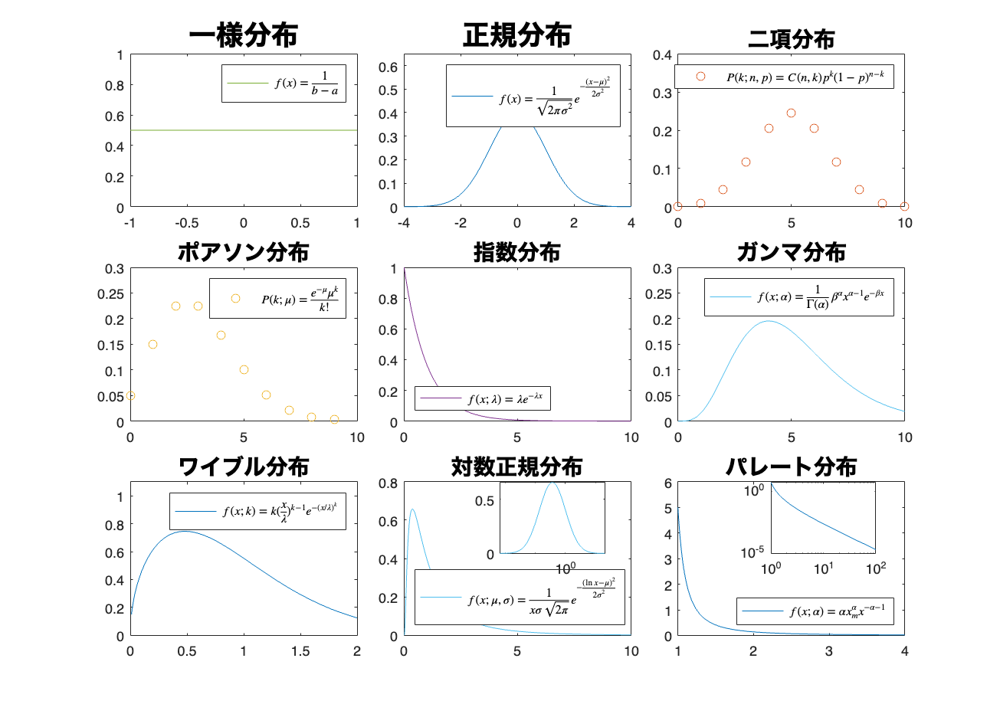

# <span style="color:rgb(213,80,0)">3.1 分布の特徴をとらえる</span>
## 図 3.1.1 基本的な分布の特徴
```matlab
rng('default'); % 乱数のシードを設定（再現性のため）

% 中央傾向：平均値が0と10の二つの分布
data1_a = randn(1, 1000); % 平均0、標準偏差1の正規分布に従う乱数を1000個生成
data1_b = 5 + randn(1, 1000); % 平均5、標準偏差1の正規分布に従う乱数を1000個生成

% 分散：分散が大きい分布と小さい分布
data2_a = 5 + randn(1, 1000); % 平均5、標準偏差1の正規分布に従う乱数を1000個生成
data2_b = 5 + 3*randn(1, 1000); % 平均5、標準偏差3の正規分布に従う乱数を1000個生成

% 形状：正規分布、左寄せの分布
data3_a = 5 + randn(1, 1000); % 平均5、標準偏差1の正規分布に従う乱数を1000個生成
data3_b = 2*gamrnd(2, 2, 1, 1000); % 形状パラメータ2、尺度パラメータ2のガンマ分布に従う乱数を1000個生成

% ピーク：ピーク一つとピーク二つの分布
data4_a = 5 + randn(1, 1000); % 平均5、標準偏差1の正規分布に従う乱数を1000個生成
data4_b = [3 + randn(1, 500), 7 + randn(1, 500)];  % 平均3、標準偏差1の正規分布と平均7、標準偏差1の正規分布に従う乱数を500個ずつ生成

%  外れ値：ごく少量の大きい外れ値が含まれている分布と含まれていない分布
data5_a = [5 + randn(1, 995), 50 + 5*randn(1, 5)];  % 平均5、標準偏差1の正規分布に従う乱数を995個と平均50、標準偏差5の正規分布に従う乱数を5個生成
data5_b = 5 + randn(1, 1000); % 平均5、標準偏差1の正規分布に従う乱数を1000個生成

% 外れ値：外れ値が多少ある分布とほぼない分布
data6_a = 5 + randn(1, 1000);  % 平均5、標準偏差1の正規分布に従う乱数を1000個生成
data6_b = [5 + randn(1, 975), 15 + randn(1, 25)];  % 平均5、標準偏差1の正規分布に従う乱数を975個と平均15、標準偏差1の正規分布に従う乱数を25個生成

% データのプロット
data_a = {data1_a, data2_a, data3_a, data4_a, data5_a, data6_a};
data_b = {data1_b, data2_b, data3_b, data4_b, data5_b, data6_b};

titles = ["ピークの位置", "広がりの度合い", "分布の形状", ...
    "ピークの数と位置", "外れ値", "外れ値？"]; % グラフのタイトル

figure
t = tiledlayout(2,3);
for ii = 1:6
    min_bin = min(min(data_a{ii}), min(data_b{ii})); % ヒストグラムの最小値
    max_bin = max(max(data_a{ii}), max(data_b{ii})); % ヒストグラムの最大値
    
    if i == 4
        bins = linspace(min_bin, max_bin, 100); % ビンの設定
    else
        bins = linspace(min_bin, max_bin, 30); % ビンの設定
    end
    nexttile;
    histogram(data_a{ii}, bins, FaceColor='blue', FaceAlpha=0.5)
    hold on
    histogram(data_b{ii}, bins, FaceColor='yellow', FaceAlpha=0.5)
    title(titles(ii)) % グラフのタイトル
end

% グラフの調整と傾かせる
xlabel(t,'観測値') % x軸ラベル
ylabel(t,'頻度') % y軸ラベル
print('../figures/3_1_1_dist_comparison.png', '-dpng', '-r300'); % 図の保存
```

<center></center>

# 図 3.1.2 ヒストグラムの形状とビンの定義
```matlab
rng('default');  % 乱数のシードを設定（再現性のため）

% 正規分布から100点をサンプル
mu = 0; sigma = 1;  % mean and standard deviation
s = randn(100, 1) * sigma + mu;  % 平均0、標準偏差1の正規分布に従う乱数を100個生成

% ビンのサイズ
bins_sizes = [5, 10, 50];

% 正規分布のプロット用のデータ
x = linspace(-4, 4, 200);
y = normpdf(x, mu, sigma);

% サブプロットとしてヒストグラムを生成
figure(Position=[10 10 800 300])
t = tiledlayout('horizontal',TileSpacing='compact');
for ii = 1:length(bins_sizes)
    nexttile
    histogram(s, NumBins=bins_sizes(ii), Normalization='pdf', ...
        FaceColor='blue', FaceAlpha=0.6);  % ヒストグラムを描画
    hold on;
    plot(x, y, 'r--')  % 正規分布を描画
    title("ビン 幅 = " + num2str(4/bins_sizes(ii)));  % タイトル
end
ylabel(t,'相対頻度');  % y軸ラベル
xlabel(t,'観測値');  % x軸ラベル
fontsize(14,'points') % フォントサイズを14に設定

print('../figures/3_1_2_1_bin_size.png', '-dpng', '-r300'); % 図の保存
```

<center></center>


```matlab

rng('default');  % 乱数のシードを設定（再現性のため）

% 正規分布から50点をサンプル
s = randn(50, 1) * sigma + mu;  % 平均0、標準偏差1の正規分布に従う乱数を50個生成

% ビンのサイズとオフセット
bins_sizes = [20, 20, 20];
offsets = [0, 0.1, 0.2];

% サブプロットとしてヒストグラムを生成
figure(Position=[10 10 800 300])
t = tiledlayout('horizontal',TileSpacing='compact');
for ii = 1:length(bins_sizes)
    nexttile
    edges = linspace(-4 + offsets(ii), 4 + offsets(ii), bins_sizes(ii) + 1);  % ビンの範囲をずらす
    histogram(s, BinEdges=edges, Normalization='pdf', ...
        FaceColor='blue', FaceAlpha=0.6);  % ヒストグラムを描画
    hold on;
    plot(x, y, 'r--')  % 正規分布を描画
    ylim([0, 0.6]);  % y軸の範囲を設定
    title("オフセット = " + num2str(offsets(ii)));  % タイトル
end
ylabel(t,'相対頻度');  % y軸ラベル
xlabel(t,'観測値');  % x軸ラベル
fontsize(14,'points') % フォントサイズを14に設定

print('../figures/3_1_2_2_bin_offset.png', '-dpng', '-r300'); % 図の保存
```

<center></center>

# 図 3.1.3 正規分布との比較
## データを正規分布でフィッティング
```matlab
% 乱数のシードを設定（再現性のため）
rng('default')

% サイコロを100回振った時の出目の総和を1000x100回サンプリングする
roll_dice = randi([1 6], 100, 1000*100);
dice_sums = sum(roll_dice,1);

% ヒストグラムを作成
figure
histogram(dice_sums, BinEdges=280:420, Normalization='pdf',...
    FaceColor='white',LineWidth=1,...
    EdgeColor='black'); 
hold on; % ヒストグラムを描画

% 正規分布のパラメータを推定
mu = mean(dice_sums) % 平均を推定
```

```TextOutput
mu = 350.0146
```

```matlab
sigma = std(dice_sums) % 標準偏差を推定
```

```TextOutput
sigma = 17.0574
```

```matlab

% 正規分布を描画
x = linspace(min(dice_sums), max(dice_sums), 100); % x軸の値
y = normpdf(x, mu, sigma); % 正規分布の値
plot(x, y, 'r--', LineWidth=2); % 正規分布を描画

% ラベルを設定
xlabel('サイコロを100回振って出た目の総和') % x軸ラベル
ylabel('相対頻度') % y軸ラベル
title('正規分布のフィッティング') % グラフのタイトル
legend(["実験", "正規分布"], Location='NorthWest') % 凡例

% レイアウトの設定
grid on; % グリッド線を追加
fontsize(14,'points') % フォントサイズを14に設定

% 画像として保存
print('../figures/3_1_3_1_gaussian_fitting', '-dpng', '-r300'); % 図の保存
```

<center></center>

## データから2つの正規分布を推定
```matlab
rng(0);  % 乱数のシードを設定（再現性のため）

% ピーク一つとピーク二つの分布
% 平均3、標準偏差1の正規分布と平均7、標準偏差1の正規分布に従う乱数を500個ずつ生成
data4_b = [normrnd(3, 1, [500, 1]); normrnd(7, 1, [500, 1])]; 

figure(Position=[10, 10, 500, 400]); % グラフのサイズを指定

% データをヒストグラムでプロット
histogram(data4_b, 30, Normalization='pdf', ...
    FaceColor='yellow', EdgeColor='black', FaceAlpha=0.5)

hold on; % 複数のグラフを重ねて描画

% データを2成分のガウシアン混合モデルでフィッティング
options = statset(Display='off', MaxIter=500);
gmm = fitgmdist(data4_b,2,Options=options,...
    RegularizationValue=0.1); % 混合ガウシアンモデルのパラメータを推定

% 混合ガウシアンモデルの結果をプロット
x = linspace(min(data4_b), max(data4_b)).'; % x軸の値
pdf_gmm = pdf(gmm, x); % 密度関数を計算
plot(x, pdf_gmm, '-k', Color='black', LineWidth=4) % 密度関数を描画

% 各ガウシアンをプロット
colors = ["red", "blue"]; % 各ガウシアンの色
for ii = 1:gmm.NumComponents
    % 各ガウシアンの密度関数
    mu = gmm.mu(ii);
    sigma = sqrt(gmm.Sigma(ii));
    weight = gmm.ComponentProportion(ii);
    pdf_individual = weight * normpdf(x, mu, sigma);
    plot(x, pdf_individual, '--', Color=colors(ii), LineWidth=1); % 各ガウシアンを描画
    fontsize(14,'points') % フォントサイズを14に設定
end

xlabel('観測値 X', Interpreter='tex')  % x軸ラベル
print('../figures/3_1_3_2_gmm_fitting', '-dpng', '-r300'); % 図の保存
```

<center></center>

## 対数正規分布によく従うデータ
```matlab
rng('default');  % 乱数のシードを設定（再現性のため）

% 対数正規分布のパラメータ
mu = 0.954;
sigma = exp(0.65);
sz = 10000;

% サンプルを生成
X_samples = lognrnd(mu, sigma, sz, 1);

log_X_samples = log(X_samples);  % 対数変換

% データを正規分布でフィット
N_samples = fitdist(log_X_samples, 'Normal');  % 正規分布へのフィッティング

% ヒストグラムとフィット結果をプロット
figure;
tiledlayout('horizontal');

% 対数正規分布
nexttile;
histogram(X_samples, 1000, Normalization='pdf');  % ヒストグラムを描画
xlim([-10,70])
xlabel('観測値 X')  % x軸ラベル
ylabel('相対頻度')  % y軸ラベル
fontsize(14,'points') % フォントサイズを14に設定

% 対数変換後の対数正規分布
nexttile
% ヒストグラムを描画
histogram(log_X_samples, 30, Normalization='pdf',...
    LineWidth=1); 
hold on;

x = linspace(min(log_X_samples), max(log_X_samples), 100); % x軸の値
y = normpdf(x, mu, sigma); % 正規分布の値
plot(x, y, 'r--', LineWidth=2); % 正規分布を描画
% histfit(log_X_samples, 30, 'normal');  % ヒストグラムを描画
xlabel('log X')  % x軸ラベル
fontsize(14,'points') % フォントサイズを14に設定

% 画像として保存
print('../figures/3_1_3_3_log_transform', '-dpng', '-r300'); % 図の保存
```

<center></center>

# 図 3.1.4 様々な理論分布
```matlab
% MATLABコード
rng('default');  % 乱数生成器を初期化

% グラフの色
colors = lines(8);
% {'red', 'blue', 'green', 'magenta', 'yellow', 'red', 'pink', 'black', 'cyan'};

% 3行3列のグラフを作成
figure(Position=[100, 100, 1400, 1000]);

% プロットの設定
tiledlayout(3,3,TileSpacing="compact");

% 一様分布
nexttile;
x_values = linspace(-1, 1, 1000);
plot(x_values, unifpdf(x_values, -1, 1), Color=colors(5,:));
ylim([0, 1]);
legend(' $f(x) = \frac{1}{b - a}$ ', Interpreter='latex');
title('一様分布', FontSize=20);

% 正規分布
nexttile;
x_values = linspace(-4, 4, 1000);
plot(x_values, normpdf(x_values, 0, 1), Color=colors(1,:));
ylim([0, 0.65]);
legend(' $f(x) = \frac{1}{\sqrt{2\pi\sigma^2}} e^{-\frac{(x-\mu)^2}{2\sigma^2}}$ ', ...
    Interpreter='latex');
title('正規分布', FontSize=20);

% 二項分布
nexttile
n = 10;
p = 0.5;
x_values = 0:n;
plot(x_values, binopdf(x_values, n, p), 'o', Color=colors(2,:));
ylim([0, 0.4]);
legend(' $P(k; n, p) = C(n, k) p^k (1-p)^{n-k}$ ', Interpreter='latex');
title('二項分布', FontSize=16);

% ポアソン分布
nexttile
mu = 3;
x_values = 0:9;
plot(x_values, poisspdf(x_values, mu), 'o', Color=colors(3,:));
ylim([0, 0.3]);
legend(' $P(k; \mu) = \frac{e^{-\mu} \mu^k}{k!}$ ', Interpreter='latex');
title('ポアソン分布', FontSize=16);

% 指数分布
nexttile
x_values = linspace(0, 10, 1000);
plot(x_values, exppdf(x_values, 1), Color=colors(4,:));
ylim([0, 1.0]);
legend(' $f(x; \lambda) = \lambda e^{-\lambda x}$ ', ...
    Interpreter='latex', Location='southwest');
title('指数分布', FontSize=16);

% ガンマ分布
nexttile
x_values = linspace(0, 10, 1000);
plot(x_values, gampdf(x_values, 5, 1), Color=colors(6,:));
ylim([0, 0.3]);
legend(' $f(x; \alpha) = \frac{1}{\Gamma(\alpha)} \beta^{\alpha} x^{\alpha - 1} e^{-\beta x}$ ', ...
    Interpreter='latex');
title('ガンマ分布', FontSize=16);

% ワイブル分布
nexttile
x_values = linspace(0.01, 2, 1000);
plot(x_values, wblpdf(x_values, 1, 1.5), Color=colors(8,:));
ylim([0, 1.1]);
legend(' $f(x; k) = k (\frac{x}{\lambda})^{k - 1} e^{-(x/\lambda)^{k}}$ ', ...
    Interpreter='latex', Location='northeast');
title('ワイブル分布', FontSize=16);

% 対数正規分布
nt1 = nexttile;
x_values = linspace(0.01, 10, 1000);
plot(x_values, lognpdf(x_values, 0, 1), Color=colors(6,:));
ylim([0, 0.8]);
legend(' $f(x; \mu, \sigma) = \frac{1}{x \sigma \sqrt{2\pi}} e^{-\frac{(\ln x - \mu)^2}{2\sigma^2}}$ ', ...
    Interpreter='latex', Location='southwest');
title('対数正規分布', FontSize=16);

% パレート分布
nt2 = nexttile;
x_values = linspace(1, 4, 1000);
plot(x_values, gppdf(x_values, 1, 1/5, 1), Color=colors(8,:));

ylim([0, 6]);
legend(' $f(x; \alpha) = \alpha x_m^{\alpha} x^{-\alpha - 1}$ ', ...
    Interpreter='latex', Location='southeast');
title('パレート分布', FontSize=16);
% 対数正規分布の挿入図
tp = nt1.Position;
axes('Position', [tp(1)+tp(3)*0.5 tp(2)+tp(4)*0.5 tp(3)*0.4 tp(4)*0.4]); % 挿入図の位置とサイズを調整
x_values_large = linspace(-5, 3, 100);
x_values_large = exp(x_values_large);
plot(x_values_large, lognpdf(x_values_large, 0, 1), Color=colors(6,:));
xscale('log');

% パレート分布の挿入図
tp = nt2.Position;
axes('Position', [tp(1)+tp(3)*0.4 tp(2)+tp(4)*0.5 tp(3)*0.4 tp(4)*0.4]); % 挿入図の位置とサイズを調整
x_values_large = linspace(1, 100, 1000);
plot(x_values_large, gppdf(x_values_large, 1, 1/5, 1), Color=colors(8,:));
xscale('log');
yscale('log');

% 画像として保存
print('../figures/3_1_4_various_distributions','-dpng','-r300'); % 図の保存
```

<center></center>

# 図 3.1.5 累積分布でデータを見る
```matlab
rng('default');  % 乱数生成器を初期化

% 正規分布のパラメータ
mu = 0;  %平均
sigma = 1;  %標準偏差

% 正規分布から100点と500点をサンプル
sample_sizes = [100, 500];  % サンプルサイズ
samples = cell(1, numel(sample_sizes));  % サンプルを保持するセル配列の初期化
for i = 1:numel(sample_sizes)
    samples{i} = normrnd(mu, sigma, [sample_sizes(i), 1]);  % サンプルの生成
end

% 正規分布の累積分布関数のプロット用のデータ
x = linspace(-3, 3, 100);  % x軸の値
y = normcdf(x, mu, sigma);  % 正規分布の累積分布関数の値

% サブプロットを2x2で生成
figure;
t = tiledlayout(2,2);

% 1つ目のサブプロットで80パーセンタイル点以下の領域を別の色で示すヒストグラムを表示
nexttile;
percentile_80 = prctile(samples{1}, 80);  % 80パーセンタイル点
bins = linspace(-3, 3, 30);  % ビンの設定
histogram(samples{1}, BinEdges=bins, FaceAlpha=0.3, FaceColor='blue');  % ヒストグラム描画
hold on;
histogram(samples{1}(samples{1} <= percentile_80), BinEdges=bins, FaceAlpha=1, FaceColor='blue');  % 80パーセンタイル以下の部分を描画
ylabel('頻度');  % y軸ラベル
xlabel('観測値');  % x軸ラベル
xlim([-3, 3]);  % x軸の範囲を設定

% 下段の累積分布を描画
titles = ["サンプルサイズ=100", "サンプルサイズ=500"];  % グラフのタイトル
for ii = 1:numel(samples)
    nexttile(2+ii);
    [f, x] = ecdf(samples{ii});  % Emprical CDF
    stairs(x, f, DisplayName="Empirical CDF");  % Empirical CDFを描画
    hold on;
    plot(linspace(-3, 3, 100), y, 'r--', DisplayName="Theoretical CDF");  % 理論的な累積分布関数を描画
    xlim([-3, 3]);  % x軸の範囲
    ylabel('累積相対頻度');  % y軸ラベル
    xlabel('観測値');  % x軸ラベル
    title(titles(ii));  % グラフのタイトル
    fontsize(14, 'points');  % フォントサイズを14に設定
end

% 画像として保存
print('../figures/3_1_5_cumulative_dist.png', '-dpng', '-r300'); % 図の保存
```

<center></center>

