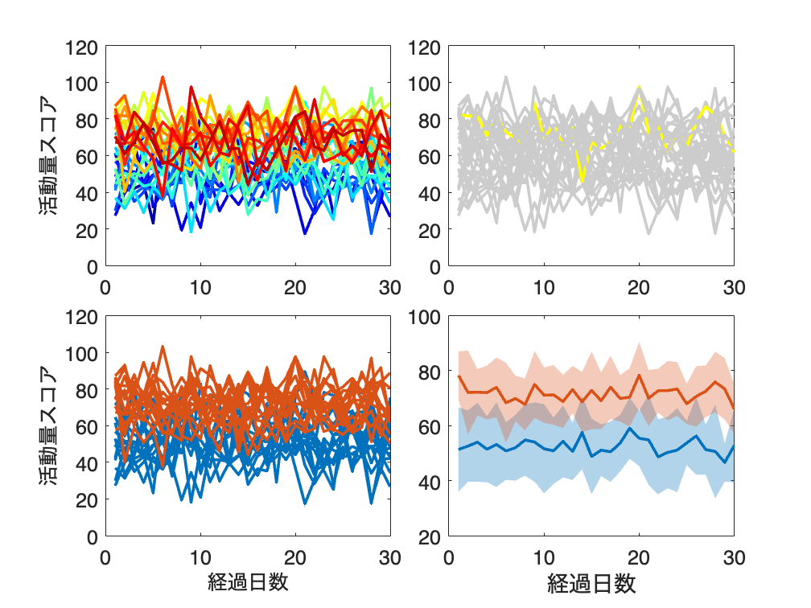

# <span style="color:rgb(213,80,0)">3.2 線で特徴をとらえる</span>
## 図 3.2.1 時間推移を可視化する
```matlab
% csv ファイルを読み込む
df = readtable(fullfile("data","gdp_data.csv"),VariableNamingRule='preserve',TextType='string');
% 千の位のカンマがあるのでひとまず文字列として読み込む（下で数値に変換）

% 冒頭の5行を表示
head(df,5) 
```

```TextOutput
    年度    国内総生産(支出側)    民間最終消費支出      民間住宅      民間企業設備     政府最終消費支出    公的固定資本形成
    ____    _______________    _____________    ___________    ___________    _____________    _____________
    1994     "447,936.90"      "250,795.70"     "32,051.20"    "66,987.40"     "73,111.70"      "45,721.00" 
    1995     "462,177.30"      "256,869.20"     "30,565.40"    "72,628.50"     "75,596.40"      "49,000.30" 
    1996     "475,806.10"      "263,038.00"     "34,246.30"    "76,894.40"     "77,203.40"      "48,217.60" 
    1997     "475,217.30"      "260,139.60"     "28,751.30"    "78,748.10"     "78,168.90"      "45,051.10" 
    1998     "470,507.40"      "260,945.60"     "25,853.40"    "75,980.60"     "79,694.60"      "46,026.60" 
```

```matlab
% 年ごとのGDPデータとセクターごとのデータ
years = df.("年度"); 
gdp = double(df.("国内総生産(支出側)")) ./ 1000; 
sectors = double(df{:,["民間最終消費支出", "民間住宅", "民間企業設備", "政府最終消費支出", "公的固定資本形成"]}) ./ 1000; 

% サブプロットを作成
figure;
tiledlayout('horizontal')

% 折れ線グラフ
nexttile
plot(years, gdp, Color=[0.529 0.808 0.922]);
title('折れ線グラフ');
ylabel('国内総生産（支出側） [兆円]');

% エリアチャート
nexttile
area(years, gdp, FaceColor=[0.529 0.808 0.922]);
title('エリアチャート');
xlabel('年度');
ylim([0 600]);

% 積み上げエリアチャート
nexttile
area(years, sectors);
title('積み上げエリアチャート');
ylim([0 600]);
legend('民間最終消費支出', '民間住宅', '民間企業設備', '政府最終消費支出', '公的固定資本形成',...
    Location='south');

% プロットを保存
print('../figures/3_2_1_line_plots', '-dpng', '-r300');
```

<center></center>

## 図 3.2.2 複数の時系列データの描画
```matlab
% データ生成
rng('default');  % 同じ乱数が生成されるようにシードを設定
n_days = 30;  % 30日間
n_individuals = 30;  % 個体数
half_n = floor(n_individuals / 2);  % 個体数の半分

% 各個体の活動量期待値を生成
expected_values_group1 = normrnd(50, 5, [half_n, 1]);  % 期待値50、標準偏差5の正規分布に従う乱数を生成
expected_values_group2 = normrnd(70, 5, [half_n, 1]);  % 期待値70、標準偏差5の正規分布に従う乱数を生成
expected_values = [expected_values_group1; expected_values_group2];  % 二つの配列を結合

% 各個体の30日間の活動量を生成
activity_data = zeros(n_individuals, n_days);
for index = 1:n_individuals
    activity_data(index, :) = normrnd(expected_values(index), 10, [1, n_days]);  %期待値ev、標準偏差10の正規分布に従う乱数を生成
end

% グラフ描画
figure
tiledlayout(2,2,TileSpacing="compact")

% 全個体をそれぞれ違う色で描画
% 関数jetを使用して色のリストを生成します。
nexttile
colors = jet(n_individuals);
for ii = 1:n_individuals
    plot(1:n_days, activity_data(ii, :), Color=colors(ii, :), LineWidth=2);
    hold on
end
fontsize(14,'points')
ylabel('活動量スコア');  % y軸のラベルを設定

nexttile
% 一番活動量の期待値が大きい個体を黄色、それ以外は灰色で描画
[~, max_ev_individual] = max(expected_values);  % 最大期待値の個体のインデックス
for ii = 1:n_individuals
    if ii == max_ev_individual
        plot(1:n_days, activity_data(ii, :), Color='yellow', LineWidth=2);
        hold on
    else
        plot(1:n_days, activity_data(ii, :), Color=[0.8,0.8,0.8], LineWidth=2);
        hold on
    end
end
fontsize(14,'points')

% 15個体のグループごとに描画
colors = colororder;
nexttile
for ii = 1:half_n
    plot(1:n_days, activity_data(ii, :), Color=colors(1,:), LineWidth=2);
    hold on
end
    
for ii = half_n + 1:n_individuals
    plot(1:n_days, activity_data(ii, :), Color=colors(2,:), LineWidth=2);
    hold on
end
fontsize(14,'points')
ylabel('活動量スコア');  % y軸のラベルを設定
xlabel('経過日数');    % x軸のラベルを設定

% 各グループの各日の平均値と標準偏差を計算し、平均値を折れ線グラフで、標準偏差をその周りの影付きの領域で描画
nexttile
for index = [1, half_n+1]
    group_activity_data = activity_data(index:index+half_n-1, :);  % グループのデータを取得
    group_mean = mean(group_activity_data, 1);  % グループの平均値を計算
    group_std = std(group_activity_data, 0, 1);  % グループの標準偏差を計算
    hp = plot(1:n_days, group_mean, LineWidth=2);  
    hold on
    fill([1:n_days, n_days:-1:1], [group_mean - group_std, fliplr(group_mean + group_std)], ...
        hp.Color, FaceAlpha=0.3, EdgeColor='none');
    hold on
end
fontsize(14,'points')
xlabel('経過日数');    % x軸のラベルを設定
print('../figures/3_2_2_many_line_plots.png', '-dpng', '-r300')  % print 関数でグラフを保存
```

<center></center>

## 図 3.2.3 スロープグラフで個々の変化をとらえる
```matlab
% 同じ乱数が生成されるようにシードを設定
rng('default')

% ランダムな体重データを生成
weights_1 = random('Normal', 60, 2, [50,1]);  % 平均60、標準偏差2の正規分布
weights_2 = weights_1 + random('Normal', -1, 0.5, [50,1]);  % 平均-1、標準偏差0.5の正規分布

% 図の描画
figure
tiledlayout('horizontal')

% 点のみプロット
nexttile
scatter(ones(50,1) * 0.25, weights_1, MarkerFaceAlpha=0.8);  % 実験開始時の体重を描画
hold on
scatter(ones(50,1) * 0.75, weights_2, MarkerFaceAlpha=0.8);  % 一か月後の体重を描画
xticks([0.25, 0.75]);
xlim([0,1]);
xticklabels(["実験開始時", "一か月後"])
ylabel('体重 [kg]')  % y軸のラベルを設定
fontsize(14,'points')

% スロープグラフ
nexttile
differences = weights_2 - weights_1;  % 体重の差を計算
cmap = colormap('turbo');  % カラーマップを取得

% 最大 -4,4 の差があると仮定して、1~256 に map する関数
colorindex = @(diff) floor((diff+4)/8*256) + 1;

for ii = 1:50
    idx = colorindex(differences(ii));
    idx = max(idx,1);
    idx = min(idx,256);
    plot([0.25, 0.75], [weights_1(ii), weights_2(ii)], ...
        Color=[cmap(idx,:)], ...
        Marker='o', LineWidth=2);  % スロープグラフを描画
    hold on
end
xticks([0.25, 0.75]);
xlim([0,1]);
xticklabels(["実験開始時", "一か月後"])
ylabel('体重 [kg]')  % y軸のラベルを設定
fontsize(14,'points')

% 先にシャッフルしたデータを用意
nexttile
weights_2_shuffle = weights_2(randperm(length(weights_2)));  % 一か月後の体重をランダムに並び替え
differences_shuffle = weights_2_shuffle - weights_1;  % 体重の差を計算
for ii = 1:50
    idx = colorindex(differences_shuffle(ii));
        idx = max(idx,1);
    idx = min(idx,256);
    plot([0.25, 0.75], [weights_1(ii), weights_2_shuffle(ii)], ...
        Color=[cmap(idx,:)], ...
        Marker='o', LineWidth=2);  % スロープグラフを描画
    hold on
end

xticks([0.25, 0.75]);
xlim([0,1]);
xticklabels(["実験開始時", "一か月後"])
ylabel('体重 [kg]')  % y軸のラベルを設定
fontsize(14,'points')

% カラーバー
colorbar
clim([-2 2])  % 正規化を作成

print('../figures/3_2_3_slope', '-dpng', '-r300')  % 画像を保存
```

<center></center>

## 図 3.2.4 医薬品の月間販売額を要素分解する

書籍では statsmodels の tsa.seasonal_decompose を使用しているため同じ手法の再現せず、[trenddecomp](https://jp.mathworks.com/help/matlab/ref/double.trenddecomp.html) で同様の処理を行うに止める。

```matlab
% データの読み込み
data = readtable('https://raw.githubusercontent.com/selva86/datasets/master/a10.csv');
[lt,st,r] = trenddecomp(data.value);

% 図の描画
figure;  % 新しいfigureウィンドウを開く
t = tiledlayout('vertical');

% 4行1列のグラフを作成
nexttile
plot(data.date, data.value, Color='b', LineWidth=0.5);  % 観測値を描画

nexttile
plot(data.date, lt, Color='r', LineWidth=0.5);  % トレンドを描画

nexttile
plot(data.date, st, Color='g', LineWidth=0.5);  % 季節性を描画 

nexttile
plot(data.date, r, Color='m', LineWidth=0.5);  % 残差を描画

% x軸の設定
xlabel('');

% グラフの設定
title(t,'Timeseries Analysis');
print('../figures/3_2_4_timeseries_analysis','-dpng','-r300');  % 画像として保存
```

<center></center>

