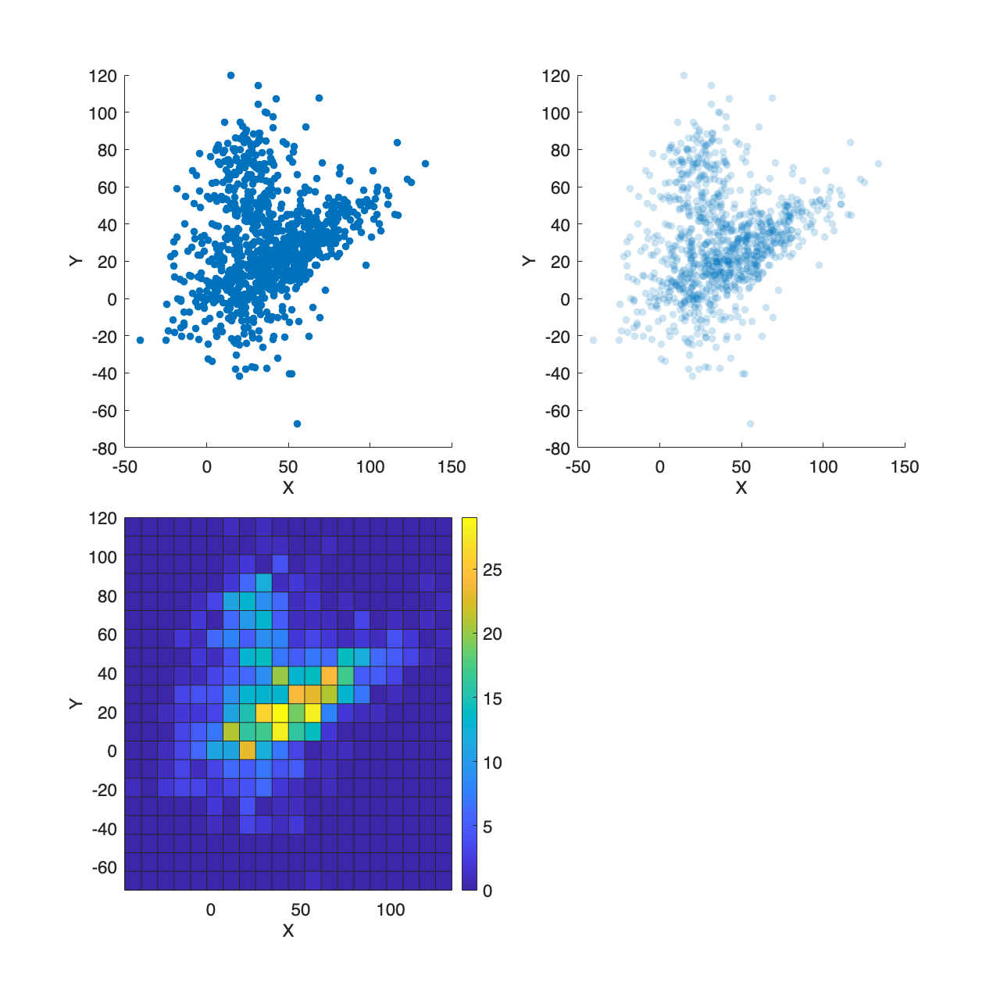

# <span style="color:rgb(213,80,0)">3.3 2 変数の関係をとらえる</span>
## 図 3.3.1 ペアプロットによる分布の可視化
```matlab
% データセットの読み込み
filename = "https://raw.githubusercontent.com/mwaskom/seaborn-data/master/penguins.csv"; 
penguins = readtable(filename);

% カラム名を日本語にする
penguins.Properties.VariableNames = {'種類', '島', 'くちばしの長さ [mm]', 'くちばしの厚さ [mm]', 'ひれの長さ [mm]', '体重 [g]', '性別'};

% ペアプロットの描画
xnames = penguins.Properties.VariableNames(3:6);
ynames = penguins.Properties.VariableNames(3:6);
hg = gplotmatrix(penguins{:,3:6},[],penguins.("種類"),[],'o',[],[],'grpbars',xnames);

% 画像として保存
print('../figures/3_3_1_pairplot','-dpng','-r300');
```

<center></center>

## 図 3.3.2 相関を見るための散布図
```matlab
% データセットの読み込み
filename = "https://raw.githubusercontent.com/mwaskom/seaborn-data/master/penguins.csv"; 
penguins = readtable(filename, TextType='string');

species = unique(penguins.species);
colors = lines(numel(species)); % lines カラーマップ配列

% 回帰直線を描画
figure; 
hold on;

% 種ごとの処理
for ii = 1:numel(species)
    penguin_sub = penguins(penguins.species==species{ii}, :);
    
    % NaNを除外して回帰直線を描く
    parsed_data = rmmissing(penguin_sub);
    linear_fit = fitlm(parsed_data, 'body_mass_g ~ bill_length_mm');
    
    % 相関係数とp値の算出
    r_value = corr(parsed_data.bill_length_mm, parsed_data.body_mass_g);
    p_value = coefTest(linear_fit);
    
    % 相関係数とp値の表示
    fprintf("For %s:\n r value is: %f\n p_value is: %f\n", species{ii}, r_value, p_value);
    
    % 直線の描画
    plot(linear_fit,Marker='o',DisplayName='none',MarkerFaceColor=colors(ii,:))
end
```

```TextOutput
For Adelie:
 r value is: 0.544276
 p_value is: 0.000000
For Chinstrap:
 r value is: 0.513638
 p_value is: 0.000007
For Gentoo:
 r value is: 0.666730
 p_value is: 0.000000
```

```matlab
xlabel('くちばしの長さ [mm]');  % x軸ラベル
ylabel('体重 [g]');  % y軸ラベル
legend off
fontsize(16,'points')

% 画像として保存
print('../figures/3_3_2_scatter_plot', '-dpng', '-r300');  % print関数を利用して保存
```

<center></center>

## 図 3.3.3 y = x との比較
```matlab
% データセットの読み込み
filename = "https://raw.githubusercontent.com/mwaskom/seaborn-data/master/penguins.csv"; 
penguins = readtable(filename, TextType='string');
speciesList = unique(penguins.species);  % データを種類ごとに分割

% 図の描画
figure('Position', [10 10 600 600])  % 図のサイズを指定
colors = lines(numel(speciesList)); % lines カラーマップ配列

% データの分割、学習、予測、描画を種類ごとに行う
for idx = 1:length(speciesList)
    species = speciesList{idx};

    % 種類ごとにデータをフィルタリング
    penguinsSpecies = penguins(strcmp(penguins.species, species), :);

    % 欠損値の処理
    penguinsSpecies = rmmissing(penguinsSpecies);

    % 特徴量とターゲットを定義
    X = table2array(penguinsSpecies(:, {'bill_length_mm', 'bill_depth_mm', 'flipper_length_mm'}));
    y = penguinsSpecies.body_mass_g;

    % データの分割
    c = cvpartition(length(y),'Holdout', 0.2);
    XTrain = X(training(c), :);
    XTest = X(test(c), :);
    yTrain = y(training(c), :);
    yTest = y(test(c), :);

    % モデルの作成と学習
    model = fitlm(XTrain, yTrain);

    % 予測
    predictions = predict(model, XTest);

    % 真の値と予測結果の散布図をプロット
    scatter(yTest, predictions, 100, colors(idx,:), 'filled')
    hold on % 同じグラフに複数の散布図をプロットするための関数

    % RMSEを計算
    rmse = sqrt(mean((yTest-predictions).^2));
    fprintf('Root Mean Squared Error for %s: %f\n', species, rmse)
end
```

```TextOutput
Root Mean Squared Error for Adelie: 341.639241
Root Mean Squared Error for Chinstrap: 277.120154
Root Mean Squared Error for Gentoo: 301.318459
```

```matlab

% x=y line
fplot(@(x) x, [3000,6000], Color='k', LineWidth=2)

xlabel('実際の体重 [g]')  % x軸ラベル
ylabel('モデルによる予測 [g]')  % y軸ラベル
grid on  % グリッド線を表示
fontsize(16,'points')

print('../figures/3_3_3_prediction_scatter', '-dpng', '-r300')  % 画像として保存
```

<center></center>

## 図 3.3.4 y = x との比較：その他の例
```matlab
% 再現性確保
rng(0);

% ユーザー数
num_users = 100;

% 送信したリプライ数
replies_sent = zeros(num_users, 1);

% 受信したリプライ数
replies_received = zeros(num_users, 1);

for ii = 1:num_users
    patterns = ["moderate", "one_sided_few", "one_sided_many"];
    pattern = patterns{randi([1, 3])};  % 3つのパターンからランダムに選択

    if pattern == "moderate"
        % お互いにそれなりの回数を送り合っている
        replies_sent(ii) = randi([10, 30]);  % 10~30回の間でランダムに送信
        replies_received(ii) = replies_sent(ii) + randi([-3, 3]);  % 送信した回数±3回の間でランダムに受信
        replies_sent(num_users - ii + 1) = replies_received(ii);  % 対称なユーザーの送信数を設定
        replies_received(num_users - ii + 1) = replies_sent(ii);  % 対称なユーザーの受信数を設定

    elseif pattern == "one_sided_few"
        % 片方が全く送らずにもう片方が０~３回送っている
        replies_sent(ii) = randi([0, 4]);  % ０〜3回の間でランダムに送信
        replies_received(ii) = 0;  % 受信は0回
        replies_sent(num_users - ii + 1) = replies_received(ii);  % やや非対称なユーザーの送信数を設定
        replies_received(num_users - ii + 1) = replies_sent(ii);  % やや非対称なユーザーの受信数を設定

    else  % pattern == "one_sided_many"
        % 片方が全く送らずにもう片方が２０回くらい送っている
        replies_sent(ii) = randi([10, 30]);  % 10〜30回の間でランダムに送信
        replies_received(ii) = 0;  % 受信は0回
        replies_sent(num_users - ii + 1) = replies_received(ii);  % 非対称なユーザーの送信数を設定
        replies_received(num_users - ii + 1) = replies_sent(ii);  % 非対称なユーザーの受信数を設定
    end
end

% 体重データを生成
weights1 = 60 + 2 * randn(50, 1);  % 平均60、分散10の正規分布
weights2 = weights1 -1 + 0.5 * randn(50, 1);  % 平均-1、分散0.5の正規分布

% 図の描画
figure;
tiledlayout('horizontal')

% サブプロット1:体重データ
nexttile
scatter(weights1, weights2, 'filled', MarkerEdgeColor=[.5 .5 .5], MarkerFaceColor=[0.8500 0.3250 0.0980]);
hold on
lims1 = [min([min(weights1) min(weights2)]), max([max(weights1) max(weights2)])];  % データプロット範囲設定用
plot(lims1, lims1, Color='black');  % y=xの直線を描画
xlabel('体重[kg]');
ylabel('一か月後体重[kg]');
grid on;
fontsize(14,'points')
axis square;

% サブプロット2:リプライ数データ
nexttile
scatter(replies_sent, replies_received, 'filled', MarkerEdgeColor=[.5 .5 .5], MarkerFaceColor=[.3010 .7450 .9330]);
hold on
lims2 = [min([min(replies_sent) min(replies_received)]), max([max(replies_sent) max(replies_received)])];  % データプロット範囲設定用
plot(lims2, lims2, Color='black');  % y=xの直線を描画
xlabel('送信したリプライ数');
ylabel('受信したリプライ数');
grid on;
fontsize(14,'points')
axis square;

% 保存
print('../figures/3_3_4_vs_x=y', '-dpng', '-r300');
```

<center></center>

## 図 3.3.5 サンプルサイズが大きいケース
```matlab
rng('default');  % 同じ乱数が生成されるようにシードを設定

% 相関の少ないデータの生成
x1 = 25 + 10.*randn(100, 1);  % 平均25、分散10の正規分布
y1 = 75 + 10.*randn(100, 1);  % 平均75、分散10の正規分布

% 相関の多いデータの生成
x2 = 50 + 30.*randn(500, 1);  % 平均50、分散30の正規分布
y2 = 0.5.*x2 + randn(500, 1).*10;  % y = 0.5x + ノイズ

x3 = 25 + 20.*randn(400, 1);  % 平均25、分散20の正規分布
y3 = 25 + 30.*randn(400, 1);  % 平均25、分散30の正規分布

% データの統合
x = [x1; x2; x3];  % xを統合
y = [y1; y2; y3];  % yを統合

figure('Position', [10, 10, 800, 800]);
tiledlayout(2,2);

% 散布図のプロット
nexttile % 左上のプロット領域を作成
scatter(x, y, 'filled', MarkerFaceAlpha=1);  % 散布図を描画
xlabel('X');  % x軸ラベル
ylabel('Y');  % y軸ラベル
fontsize(14,'points')

% 半透明散布図のプロット
nexttile % 右上のプロット領域を作成
scatter(x, y, 'filled', MarkerFaceAlpha=0.2);  % 散布図を描画
xlabel('X');  % x軸ラベル
ylabel('Y');  % y軸ラベル
fontsize(14,'points')

% ヒートマップのプロット（heatmap 関数も試したいところ）
nexttile  % 左下のプロット領域を作成
histogram2(x, y, 20, DisplayStyle='tile',ShowEmptyBins='on');  % ヒストグラムを描画
xlabel('X');  % x軸ラベル
ylabel('Y');  % y軸ラベル
colorbar;  % カラーバーを描画
fontsize(14,'points')

% 画像として保存
print('../figures/3_3_5_scatter_variations', '-dpng', '-r300')  % 画像として保存
```

<center></center>

## 図 3.3.6 バブルチャートによる情報提示
```matlab
% データの読み込み
df = readtable(fullfile("data","bubble_chart_data.csv"),VariableNamingRule="preserve");
region_df = readtable(fullfile("data","bubble_chart_region_data.csv"),VariableNamingRule="preserve");

% GDP, Life expectancy, Populationのデータを取得
gdp_df = df(df.('Series Name') == "GDP, PPP (current international $)", :);life_exp_df = df(df.('Series Name') == "Life expectancy at birth, total (years)" , :);population_df = df(df.('Series Name') == "Population, total", :);
% データの前処理gdp_df = rmmissing(gdp_df, DataVariables="2021 [YR2021]");life_exp_df = rmmissing(life_exp_df, DataVariables="2021 [YR2021]");population_df = rmmissing(population_df, DataVariables="2021 [YR2021]");
gdp_life_exp = innerjoin(gdp_df,life_exp_df,Keys="Country Name");data = innerjoin(gdp_life_exp,population_df,Keys="Country Name");merged_data = innerjoin(data, region_df, LeftKeys="Country Name", RightKeys="name");
vars = ["Country Name","region","2021 [YR2021]","2021 [YR2021]_gdp_df","2021 [YR2021]_life_exp_df"];merged_data = merged_data(:,vars);merged_data.Properties.VariableNames = ["Country Name","region","2021_YR2021_Population","2021_YR2021_GDP","2021_YR2021_Life_Expectancy"];
% GDP per capitaを計算merged_data.GDP_per_capita = merged_data.('2021_YR2021_GDP') ./ merged_data.('2021_YR2021_Population');
% 地域ごとに色を割り当てる[regions,~,ic] = unique(merged_data.region);h = figure;hold on;
colors = lines(length(regions));
for ii = 1:length(regions)    temp_df = merged_data(ic == ii,:);
    % バブルチャートを描画    bubblechart(temp_df.('GDP_per_capita'),...            temp_df.('2021_YR2021_Life_Expectancy'),...            temp_df.('2021_YR2021_Population')/1e6,...            colors(ii,:),...            'DisplayName', string(regions(ii)));
    hold onend
% 凡例を表示lgd = legend(Location='northwest',FontSize=14);title(lgd, "地域");
% バブルチャートの凡例調整blgd = bubblelegend(Location='southeast',NumBubbles=3);title(blgd, "人口")bubblesize([5,40]);lim = bubblelim;minLim = string(round(lim(1),2,"significant")) + " x 10^6";maxLim = string(round(lim(2),2,"significant")) + " x 10^6";blgd.LimitLabels = [minLim,"",maxLim];
% ラベル設定xlabel('一人あたりGDP [$ ]', FontSize=18);
ylabel('平均寿命 [年]', FontSize=18);
title('GDP and Life Expectancy by Region', FontSize=20);
xscale('log') % x軸を対数軸に設定

grid on;
hold off;
print('../figures/3_3_6_bubble_chart', '-dpng', '-r300')  % 画像として保存
```

<center></center>

