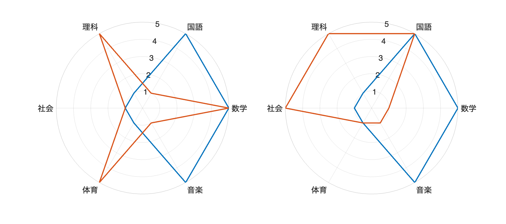
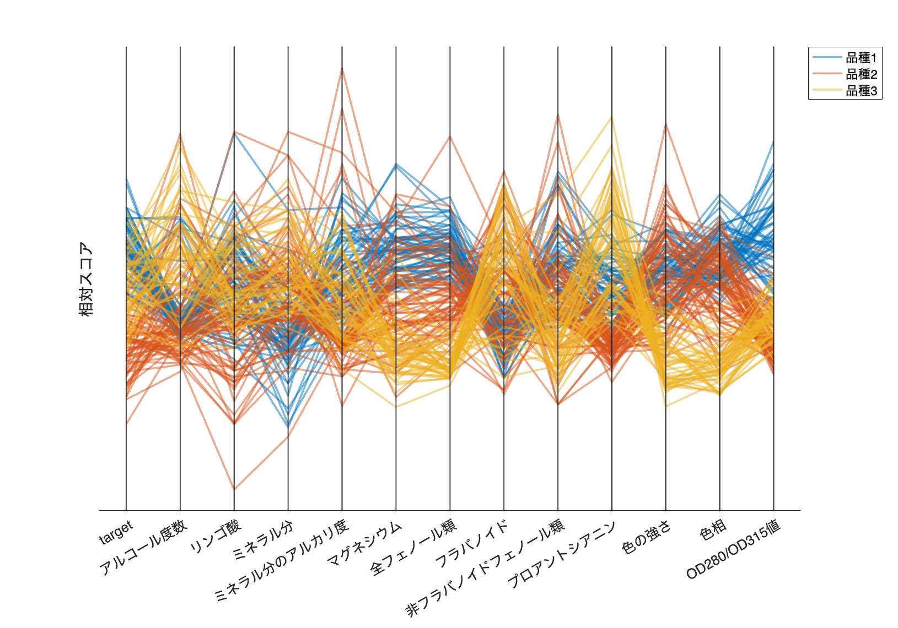
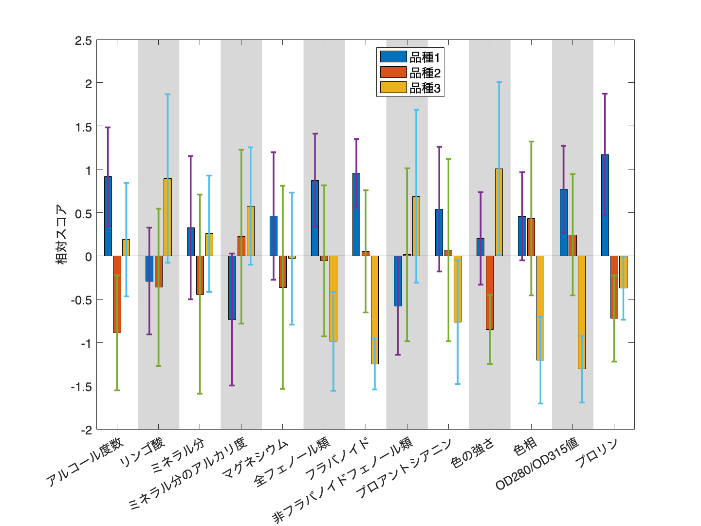
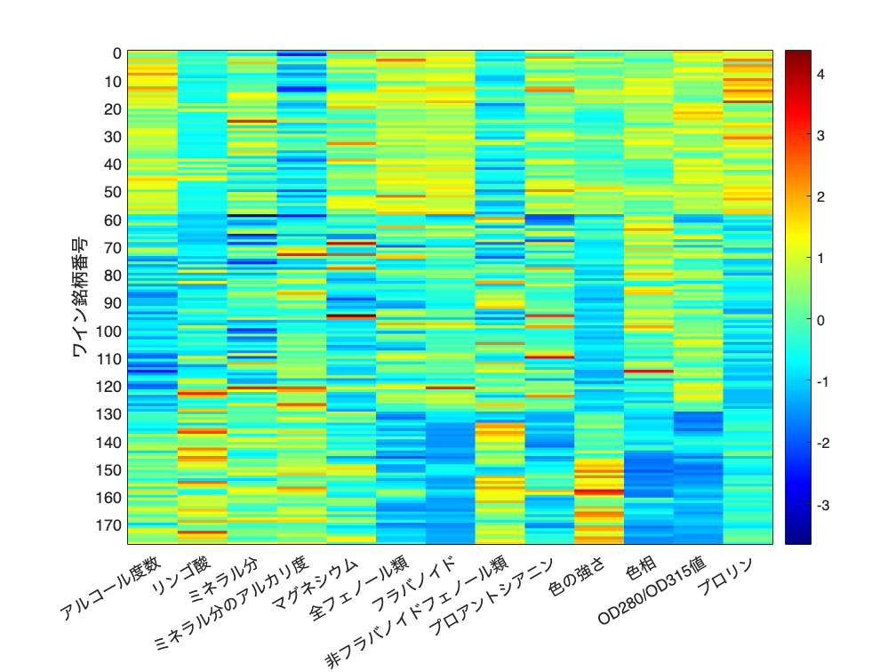
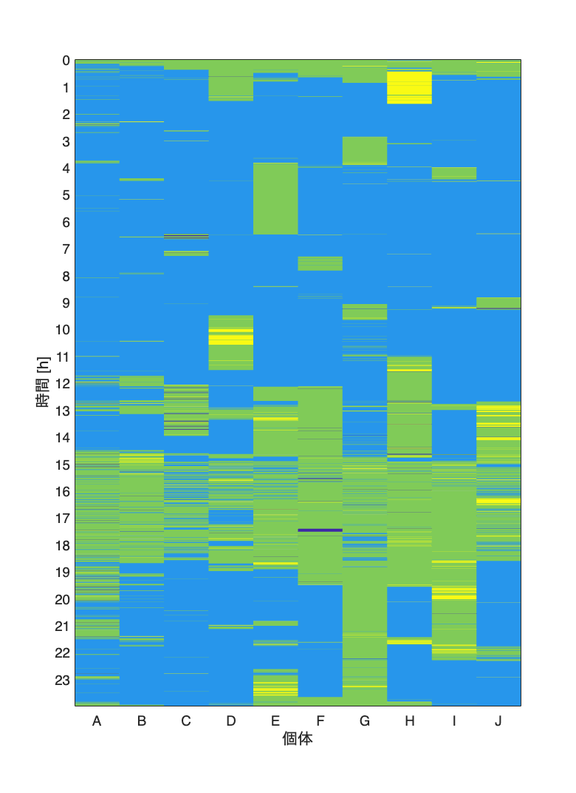
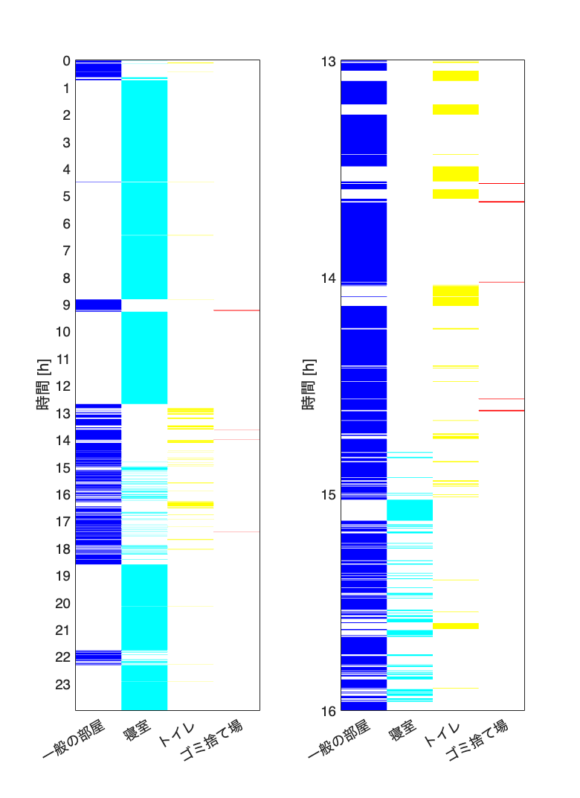

# <span style="color:rgb(213,80,0)">4.1 三つ以上の変数の可視化</span>
## 図 4.1.1 レーダーチャートの印象
```matlab
% データの定義
% overwhelming data
person = ["Aさん", "Bさん"];
sugaku = [5, 2];
kokugo = [5, 3];
rika = [5, 4];
shakai = [4, 3];
taiiku = [4, 4];
ongaku = [5, 2];

data = table(person', sugaku', kokugo', rika', shakai', taiiku', ongaku',...
    'VariableNames', {'person' '数学' '国語' '理科' '社会' '体育' '音楽'});

% 科目の順序のリストを定義
categories1 = ["数学", "国語", "理科", "社会", "体育", "音楽"];
categories2 = ["音楽", "数学", "理科", "体育", "社会", "国語"]; % 順序を変えたリスト

% グラフ描画
figure('Position', [10 10 900 400])
tiledlayout('horizontal')

% 各プロットについてループ処理を行う
categories = {categories1, categories2};
for ii=1:2
    nexttile

    category = categories{ii};
    title('Radar Chart of Person A and B');

    % 各人物のデータについて描画を行う
    for index = 1:height(data)
        % 各カテゴリを等間隔に配置し、最初のカテゴリを閉じた円形にする
        % theta = 0:2*pi/width(data(:,2:end)):2*pi;
        theta = linspace(0,2*pi,7)';
        % 各値について描画を行う
        values = table2array(data(index, category));
        
        polarplot(theta, [values values(1)], LineWidth=2, ...
            DisplayName=string(data.person(index)));
        hold on
    end
    % PolarAxesの設定を行う
    rticks([1 2 3 4 5]);
    thetaticks(rad2deg(theta)); % tick の設定は ~ 度のため rad2deg で変換
    thetaticklabels(categories1);
    fontsize(14,'points')
end
% 画像を保存
print('../figures/4_1_1_1_radar_chart_overwhelming','-dpng','-r300');
```

<center></center>


```matlab
% compeling data

sugaku = [5, 5];
kokugo = [5, 1];
rika = [1, 5];
shakai = [1, 1];
taiiku = [1, 5];
ongaku = [5, 1];
data = table(person', sugaku', kokugo', rika', shakai', taiiku', ongaku',...
    'VariableNames', {'person' '数学' '国語' '理科' '社会' '体育' '音楽'});

% グラフ描画（上と同じ処理のため、本来であれば関数にしておきたいところ。）
figure('Position', [10 10 900 400])
tiledlayout('horizontal')

% 各プロットについてループ処理を行う
categories = {categories1, categories2};
for ii=1:2
    nexttile

    category = categories{ii};
    title('Radar Chart of Person A and B');

    % 各人物のデータについて描画を行う
    for index = 1:height(data)
        % 各カテゴリを等間隔に配置し、最初のカテゴリを閉じた円形にする
        % theta = 0:2*pi/width(data(:,2:end)):2*pi;
        theta = linspace(0,2*pi,7)';
        % 各値について描画を行う
        values = table2array(data(index, category));
        
        polarplot(theta, [values values(1)], LineWidth=2, ...
            DisplayName=string(data.person(index)));
        hold on
    end
    % PolarAxesの設定を行う
    rticks([1 2 3 4 5]);
    thetaticks(rad2deg(theta)); % tick の設定は ~ 度のため rad2deg で変換
    thetaticklabels(categories1);
    fontsize(14,'points')
end
% 画像を保存
print('../figures/4_1_1_2_radar_chart_compelling','-dpng','-r300');
```

<center></center>

## 図 4.1.2 各変数の特徴を概観して比較する
```matlab
% Wineデータセットのロード
wine = readtable('https://archive.ics.uci.edu/ml/machine-learning-databases/wine/wine.data','FileType','text');

% wine は table 型
% 1 列目：品種（target）
% ターゲット（クラスラベル）を文字列に変更
% 1 = '品種1';
% 2 = '品種2';
% 3 = '品種3';
% 2~14 列目：各変数

% 列名を日本語に変更してみる（option）
wine.Properties.VariableNames = [
    "target",
    "アルコール度数",
    "リンゴ酸",
    "ミネラル分",
    "ミネラル分のアルカリ度",
    "マグネシウム",
    "全フェノール類",
    "フラバノイド",
    "非フラバノイドフェノール類",
    "プロアントシアニン",
    "色の強さ",
    "色相",
    "OD280/OD315値",
    "プロリン"];

% 品種番号に変更（カテゴリ型）
wine.target = categorical(wine.target,[1,2,3],["品種1","品種2","品種3"]);

% wine_data = wine{:,2:end};
% wine_data = zscore(wine_data); % Zスコア正規化
% これは p.DataNormalization = 'zscore'; % の設定で Zスコア表示になるため不要

figure('Position', [100, 100, 1000, 700]) % ピクセル単位となる。
p = parallelplot(wine{:,2:end}, LineAlpha=0.5, LineWidth=2);
p.GroupData = wine.target;

p.DataNormalization = 'zscore';
% x軸の設定
p.CoordinateTickLabels = wine.Properties.VariableNames(1:end-1);

ylabel('相対スコア');  % y軸ラベル
fontsize(14,'points')

print('../figures/4_1_2_parallel_plot_vertical', '-dpng', '-r300');  % 画像の保存
```

<center></center>

## 図 4.1.3 変数ごとに個別に可視化する方法
```matlab
% Wineデータセットのロード
wine = readtable('https://archive.ics.uci.edu/ml/machine-learning-databases/wine/wine.data','FileType','text');

% wine は table 型
% 1 列目：品種（target）
% ターゲット（クラスラベル）を文字列に変更
% 1 = '品種1';
% 2 = '品種2';
% 3 = '品種3';
% 2~14 列目：各変数

% 列名を日本語に変更してみる
varnames = ["target",
    "アルコール度数",
    "リンゴ酸",
    "ミネラル分",
    "ミネラル分のアルカリ度",
    "マグネシウム",
    "全フェノール類",
    "フラバノイド",
    "非フラバノイドフェノール類",
    "プロアントシアニン",
    "色の強さ",
    "色相",
    "OD280/OD315値",
    "プロリン"];

wine.Properties.VariableNames = varnames;

% ターゲット（クラスラベル）を品種番号に変更（カテゴリ型）
wine.target = categorical(wine.target,[1,2,3],["品種1","品種2","品種3"]);

% Zスコア正規化
wine(:,2:end) = varfun(@zscore, wine(:,2:end), InputVariables=@isnumeric);

% 品種ごとの平均値/標準偏差
wine_mean = groupsummary(wine,'target','mean');
wine_mean = removevars(wine_mean,'GroupCount'); % groupCount 変数は不要
wine_std = groupsummary(wine,'target','std');
wine_std = removevars(wine_std,'GroupCount'); % groupCount 変数は不要

%サブプロットの設定
figure('Position', [10, 10, 800, 600]) 

% 集団棒グラフ＋エラーバー
% Ref: https://jp.mathworks.com/help/matlab/creating_plots/bar-chart-with-error-bars.html
hb = bar(wine_mean{:,2:end}', 'FaceColor', 'flat');
hold on
errorbar(hb(1).XEndPoints, wine_mean{1,2:end}, wine_std{1,2:end},LineStyle="none",LineWidth=2);
errorbar(hb(2).XEndPoints, wine_mean{2,2:end}, wine_std{2,2:end},LineStyle="none",LineWidth=2);
errorbar(hb(3).XEndPoints, wine_mean{3,2:end}, wine_std{3,2:end},LineStyle="none",LineWidth=2);
% 凡例
legend(["品種1","品種2","品種3"],'Location', 'best', 'AutoUpdate', 'off')

% 交互に背景色を変える
for ii = 1:length(wine.Properties.VariableNames)-1
    if mod(ii, 2) == 0  % 偶数
        xregion(ii - 0.5,ii + 0.5,HandleVisibility="off") % 凡例に表示されないように
    end
end
% xtick 名
xticklabels(varnames(2:end));
ylabel('相対スコア')
fontsize(14,'points')
% バイオリンプロットは省略
print('../figures/4_1_3_group_bar_violin_chart.png','-dpng','-r300');  % 画像を保存
```

<center></center>

## 図 4.1.4 ヒートマップ
```matlab
% Wineデータセットのロード
wine = readtable('https://archive.ics.uci.edu/ml/machine-learning-databases/wine/wine.data','FileType','text');

% 列名を日本語に変更してみる
varnames = ["target",
    "アルコール度数",
    "リンゴ酸",
    "ミネラル分",
    "ミネラル分のアルカリ度",
    "マグネシウム",
    "全フェノール類",
    "フラバノイド",
    "非フラバノイドフェノール類",
    "プロアントシアニン",
    "色の強さ",
    "色相",
    "OD280/OD315値",
    "プロリン"];

wine.Properties.VariableNames = varnames;

% Zスコア正規化
wine(:,2:end) = varfun(@zscore, wine(:,2:end), InputVariables=@isnumeric);

figure
hmap = heatmap(wine{:,2:end}, 'Colormap', jet);
hmap.GridVisible = 'off';

% xtick 名
hmap.XDisplayLabels = varnames(2:end);

% アノテーションと軸ラベル
ylabel('ワイン銘柄番号') % y軸ラベル
hmap.YDisplayLabels = repmat("",height(wine),1);  % 一旦すべてのラベルを空にする

yticks_locations = 0:10:height(wine);
hmap.YDisplayLabels(yticks_locations+1) = cellstr(string(yticks_locations));  % 10ごとにラベルを設定

% 画像を保存
print('../figures/4_1_4_heatmap.png', '-dpng', '-r300') 
```

<center></center>

## 図 4.1.5 各個体の行動時系列を可視化する
```matlab
% CSVデータを読み込む
data = readtable(fullfile("data","behavior_data.csv"),'TextType','string');

% Time列を秒から時間に変換
data.Time = round(data.Time/3600, 2);  % 3600で割って、小数点第二位まで表示

% ヒートマップの作成
% 各個体の行動をカテゴリ変数として扱うために数値に変換
categories = unique(table2array(data(:,2:end)));  % カテゴリのリストを取得
dataNum = varfun(@(x) double(categorical(x,categories)), data, 'InputVariables', 2:width(data));  % カテゴリを数値に変換

% ヒートマップのプロット
figure('Position', [100, 100, 800, 1100]);  % フィギュアの作成

hmap = heatmap(dataNum.Variables);  % ヒートマップを描画
hmap.ColorbarVisible = 'off';  % カラーバーを非表示にする
hmap.GridVisible = 'off';
hmap.Colormap = parula(4); % カラーマップ

% 1時間=3600秒なので3600をタイムステップ（10秒）で割る
yticks_locations = 1:360:height(data);  % 1時間ごとの位置
yticks_labels = data.Time(yticks_locations);  % 1時間ごとのラベル

hmap.YDisplayLabels = repmat({''},height(data),1);  % 一旦すべてのラベルを空にする
hmap.YDisplayLabels(yticks_locations) = cellstr(string(yticks_labels));  % 1時間ごとにラベルを設定

% x軸とy軸のラベル
hmap.XLabel = '個体';
hmap.YLabel = '時間 [h]';
hmap.XDisplayLabels = {'A','B','C','D','E','F','G','H','I','J'};

fontsize(14,'points')

% 画像を保存するための記述
print("../figures/4_1_5_time_series_heat_map_flipped.png", "-dpng", "-r300");  % 画像を保存
```

<center></center>

## 図 4.1.6 1個体の各行動の可視化
```matlab
% CSVデータの読み込み
data = readtable(fullfile("data","behavior_data.csv"),'TextType','string');

% Time列を秒から時間に変換
data.Time = data.Time ./ 3600;

% 各行動に対するテーブルを作成
actions = ["Other", 'Nest', 'Toilet', 'Garbage'];  % 行動のリスト
data_actions = array2table(zeros(height(data), width(actions)),...
    'VariableNames', cellstr(actions)); % 初期化時に0を設定

% (Jさんの行動だけを取り出します)
% 各行動が発生しているときはそれぞれ異なる数値を設定
for ii = 1:length(actions)
    data_actions.(actions{ii})(data.J == actions{ii}) = ii; 
end

% 列名を日本語に変更
data_actions = renamevars(data_actions, actions, ["一般の部屋", "寝室", "トイレ", "ゴミ捨て場"]);
% 列名のリストを取得
actions = data_actions.Properties.VariableNames;

% 各行動に対応する色を取得
new_cmap = [1, 1, 1; jet(4)]; % カラーマップを作成([1 1 1](白) は 0 の箇所)

% ヒートマップのプロット
fig = figure('Position', [0 0 800 1100]); % サブプロットサイズはここで設定
tiledlayout(1, 2); % 1行2列のサブプロット

% 全体のヒートマップを描画
nexttile;
hmap1 = heatmap(data_actions.Variables,Colormap=new_cmap);  % ヒートマップを描画
hmap1.ColorbarVisible = 'off';  % カラーバーを非表示にする
hmap1.GridVisible = 'off';

% 1時間=3600秒なので3600をタイムステップ（10秒）で割る
yticks_locations = 1:360:height(data);  % 1時間ごとの位置
yticks_labels = 0:length(yticks_locations)-1;  % 1時間ごとのラベル

hmap1.YDisplayLabels = repmat({''},height(data),1);  % 一旦すべてのラベルを空にする
hmap1.YDisplayLabels(yticks_locations) = cellstr(string(yticks_labels));  % 1時間ごとにラベルを設定
hmap1.XDisplayLabels = actions;
ylabel('時間 [h]');  % y軸のラベルを設定

% 拡大図のヒートマップを描画
nexttile;

zoomed_idx = (data.Time >= 13) & (data.Time <= 16);  % 13時から16時までを抽出
data_actions_zoomed = data_actions(zoomed_idx, :);

hmap2 = heatmap(data_actions_zoomed.Variables, 'Colormap', new_cmap);
hmap2.ColorbarVisible = 'off';  % カラーバーを非表示にする
hmap2.GridVisible = 'off';

% 1時間=3600秒なので3600をタイムステップ（10秒）で割る
yticks_locations = 1:360:height(data_actions_zoomed);  % 1時間ごとの位置
yticks_labels = 0:length(yticks_locations)-1;  % 1時間ごとのラベル

hmap2.YDisplayLabels = repmat({''},height(data_actions_zoomed),1);  % 一旦すべてのラベルを空にする
hmap2.YDisplayLabels(yticks_locations) = cellstr(string(13+yticks_labels));  % 1時間ごとにラベルを設定
hmap2.XDisplayLabels = actions;

ylabel('時間 [h]');  % y軸のラベルを設定
fontsize(14,'points')

print("../figures/4_1_6_time_series_heat_map_individual", "-dpng", "-r300"); % 画像を保存
```

<center></center>

