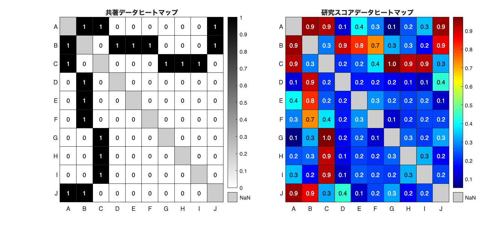

# <span style="color:rgb(213,80,0)">4.2 ネットワークをとらえる</span>
## 図 4.2.1 関係データのヒートマップによる可視化
```matlab
% 研究者リスト
researchers = ["A", "B", "C", "D", "E", "F", "G", "H", "I", "J"];

% 共著データ
collaboration = [NaN, 1, 1, 0, 0, 0, 0, 0, 0, 1;
                 1, NaN, 0, 1, 1, 1, 0, 0, 0, 1;
                 1, 0, NaN, 0, 0, 0, 1, 1, 1, 0;
                 0, 1, 0, NaN, 0, 0, 0, 0, 0, 0;
                 0, 1, 0, 0, NaN, 0, 0, 0, 0, 0;
                 0, 1, 0, 0, 0, NaN, 0, 0, 0, 0;
                 0, 0, 1, 0, 0, 0, NaN, 0, 0, 0;
                 0, 0, 1, 0, 0, 0, 0, NaN, 0, 0;
                 0, 0, 1, 0, 0, 0, 0, 0, NaN, 0;
                 1, 1, 0, 0, 0, 0, 0, 0, 0, NaN];

% ランダムシードを設定
rng('default');

% 研究スコア
research_score_data = NaN(10, 10);
for ii = 1:10
    for jj = 1:10
        if ii == jj
            continue
        elseif collaboration(ii, jj) == 1
            research_score_data(ii, jj) = rand(1) * 0.5 + 0.5;
        else
            research_score_data(ii, jj) = rand(1) * 0.5;
        end
    end
end

research_score_data = (research_score_data + research_score_data') / 2;

% ヒートマップの描画
figure('Position', [10 10 1000 450])
tiledlayout('horizontal')

nexttile
hmap1 = heatmap(researchers, researchers, collaboration);
hmap1.MissingDataColor = [1 1 1]*0.8; % データがないところの色
hmap1.Colormap = flipud(gray); % gray だと 1=白, 0=黒なので反転させておく
title('共著データヒートマップ');

nexttile
% heatmap(researchers, researchers, research_score_data, 'MissingDataColor', 'k', 'ColorMap', 'jet', 'GridVisible', 'on');
hmap2 = heatmap(researchers, researchers, research_score_data, 'MissingDataColor', 'k');
hmap2.MissingDataColor = [1 1 1]*0.8; % データがないところの色
hmap2.Colormap = jet; 
hmap2.CellLabelFormat = '%.1f'; % 数値の表示形式

title('研究スコアデータヒートマップ');

% 画像を保存
print('../figures/4_2_1_relation_heatmap', '-dpng', '-r300');
```

<center></center>

## 図 4.2.2 ネットワークによる関係データの可視化
```matlab
% 研究者リスト
researchers = {'A', 'B', 'C', 'D', 'E', 'F', 'G', 'H', 'I', 'J'};

% 共著データ
collaboration = [NaN, 1, 1, 0, 0, 0, 0, 0, 0, 1;
    1, NaN, 0, 1, 1, 1, 0, 0, 0, 1;
    1, 0, NaN, 0, 0, 0, 1, 1, 1, 0;
    0, 1, 0, NaN, 0, 0, 0, 0, 0, 0;
    0, 1, 0, 0, NaN, 0, 0, 0, 0, 0;
    0, 1, 0, 0, 0, NaN, 0, 0, 0, 0;
    0, 0, 1, 0, 0, 0, NaN, 0, 0, 0;
    0, 0, 1, 0, 0, 0, 0, NaN, 0, 0;
    0, 0, 1, 0, 0, 0, 0, 0, NaN, 0;
    1, 1, 0, 0, 0, 0, 0, 0, 0, NaN];

% ランダムシードを設定
rng('default');  % 再現性のため

% 研究スコア
research_score_data = zeros(10, 10);  % 10x10のゼロ行列を作成
for ii = 1:10
    for jj = 1:10
        if ii == jj
            research_score_data(ii, jj) = NaN;  % 自分自身との類似度は NaN
        elseif collaboration(ii, jj) == 1
            research_score_data(ii, jj) = 0.5 + 0.5*rand;  % 共著者は類似度が高い
        else
            research_score_data(ii, jj) = 0.5*rand;  % それ以外は類似度が低い
        end
    end
end
research_score_data = (research_score_data + research_score_data.') / 2;  % 対称行列にする

% 共著データのネットワークを作成
% 自己ループを削除 = 'omitselfloops';
% 上三角部分を使用 = 'upper'
collaboration_network = graph(collaboration, researchers,...
    'upper','omitselfloops');  % ネットワークに変換

% 研究スコアのネットワークを作成
research_scores_network = graph(research_score_data, researchers,...
    'upper','omitselfloops'); % ネットワークに変換

% 共著データと研究スコアのネットワークを描画
figure('Position',[1 1 800 800]);  % フィギュアの生成
tiledlayout(2,2);

% 共著データのネットワークを描画（手動で円状にレイアウト調整）
nexttile
plot(collaboration_network,Layout="circle",...
    LineWidth=2,NodeFontSize=14);
title('Collaboration - Circular');  

% 共著データのネットワークを描画（手動でforceレイアウトに調整）
nexttile
plot(collaboration_network,Layout="force",...
    LineWidth=2,NodeFontSize=14);
title('Collaboration - Spring');  

% 研究スコアのネットワークを描画（手動で円状にレイアウト調整）
nexttile
% 最も広いライン幅が 5 になるように各エッジのライン幅を設定します。
EdgeWeight = research_scores_network.Edges.Weight;
EdgeWeight = 5*EdgeWeight/max(EdgeWeight);

plot(research_scores_network,Layout="circle",...
    LineWidth=EdgeWeight,NodeFontSize=14);
title('Research Scores - Circular');  

% 研究スコアのネットワークを描画（手動でforceレイアウトに調整）
nexttile
EdgeWeight = research_scores_network.Edges.Weight;
EdgeWeight = 5*EdgeWeight/max(EdgeWeight);
plot(research_scores_network,Layout="force",...
    LineWidth=EdgeWeight,NodeFontSize=14);
title('Research Scores - Spring'); 

fontsize(14,'points')

% 画像を保存
print('../figures/4_2_2_network_visualization','-dpng','-r300');  % 画像を保存
```

<center></center>

## 図 4.2.3 指導関係の可視化
```matlab
% データとラベルの設定
% 共著データ
collaboration = [NaN, 1, 1, 0, 0, 0, 0, 0, 0, 1;
                 0, NaN, 0, 1, 1, 1, 0, 0, 0, 0;
                 0, 0, NaN, 0, 0, 0, 1, 1, 1, 0;
                 0, 0, 0, NaN, 0, 0, 0, 0, 0, 0;
                 0, 0, 0, 0, NaN, 0, 0, 0, 0, 0;
                 0, 0, 0, 0, 0, NaN, 0, 0, 0, 0;
                 0, 0, 0, 0, 0, 0, NaN, 0, 0, 0;
                 0, 0, 0, 0, 0, 0, 0, NaN, 0, 0;
                 0, 0, 0, 0, 0, 0, 0, 0, NaN, 0;
                 0, 0, 0, 0, 0, 0, 0, 0, 0, NaN];
                 
% 研究者リスト
researchers = ["A", "B", "C", "D", "E", "F", "G", "H", "I", "J"];

% ヒートマップの描画
figure;

hmap = heatmap(researchers, researchers, collaboration);
hmap.MissingDataColor = [1 1 1]*0.8; % データがないところの色
hmap.Colormap = flipud(gray); % gray だと 1=白, 0=黒なので反転させておく

title('指導された研究者');  % タイトルの追加
ylabel('指導した研究者')  % y軸のラベル
fontsize(14,'points')
print('../figures/4_2_3_1_hierarchy_relation_heatmap.png', '-dpng', '-r300');  % 画像の保存
```

<center></center>


```matlab
% Graphオブジェクトを用いてネットワークを作成
G = digraph(collaboration, researchers,...
    'omitselfloops');  % ネットワークに変換

% Graphオブジェクトのplotメソッドでネットワークを描画
figure;
plot(G,LineWidth=2,NodeFontSize=14,Layout="layered");
fontsize(14,'points')
title('Hierarchy Network Visualization');

% print関数を使って画像を保存
print('../figures/4_2_3_2_hierarchy_network_visualization','-dpng','-r300');
```

<center></center>

## 図 4.2.4 様々なレイアウトによるネットワーク描画

書籍内のレイアウトは再現が難しいので Todo


[https://jp.mathworks.com/matlabcentral/fileexchange/4206-erdos-renyi-random-graph](https://jp.mathworks.com/matlabcentral/fileexchange/4206-erdos-renyi-random-graph)


## 図 4.2.5 有向ネットワークの可視化

書籍内のレイアウトは再現が難しいので代わりに MATLAB でサポートされるレイアウト例を記載します。

```matlab
% ランダム有向グラフを生成
G_dir_random = digraph;  % 有向グラフを生成

for ii = 1:30
    for jj = 1:30
        if rand() < 0.1 && ii ~= jj
            G_dir_random = addedge(G_dir_random, ii, jj);  % 10%の確率でエッジを追加
        end
    end
end

% ヒエラルキーのある有向グラフを生成
G_dir_hierarchy = digraph;
edges = zeros(1, 30);

for ii = 2:30
    edges(ii) = randi([1 ii-1]);  % 各ノードは前方の全てのノードからランダムに接続
end

G_dir_hierarchy = addedge(G_dir_hierarchy, 1:29, edges(2:end));  % エッジを追加

% レイアウトを設定
% MATLABでは、Layout = layered というレイアウトオプションを使用して描画します。

% 各グラフとレイアウトでループ
graphs = {G_dir_random, G_dir_hierarchy};
titles = ["Directed Random Graph", "Directed Graph with Wide Hierarchy"];

figure('Position',[1 1 800 1400]);  % フィギュアの生成
tiledlayout(4,2)
layouts = ["layered","circle","force","subspace"];
for layout = layouts
    for jj = 1:2
        nexttile
        hPlot = plot(graphs{jj},Layout=layout);
        title(titles(jj))
    end
end
print('../figures/4_2_5_network_layouts_directed', '-dpng', '-r300' );  % 画像を保存
```

<center></center>


