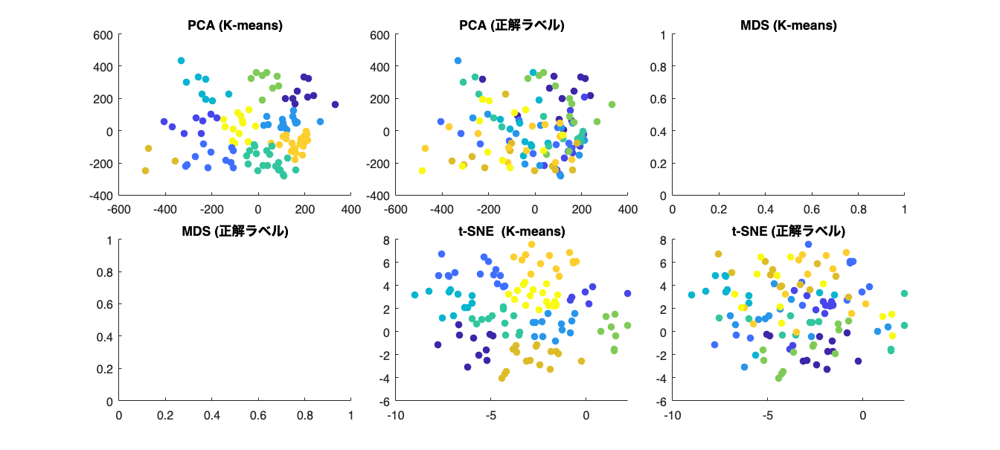

# <span style="color:rgb(213,80,0)">4.3 「まとめる」可視化</span>
## 図 4.3.1 クラスターマップによるデータの可視化
## 図 4.3.3 様々なクラスタリング手法
## 図 4.3.4 多変数をペアプロットで見る

データの生成部分 Todo

```matlab
% データ生成
rng('default');  % 乱数のシードを設定
% [X, ~] = make_classification(300, 10, 'nInformative', 2, 'nRedundant', 5, 'nClustersPerClass', 1, 'nClasses', 3);
X = randn(300,10); % 乱数で代用

% ペアプロットの作成
figure;

% plotmatrix(X) % 表示だけならこれでOK
[S,AX,BigAx,H,HAx] = plotmatrix(X);
% S – 散布図の chart line オブジェクト
% AX – 各小座標軸の axes オブジェクト
% BigAx – 小座標軸を囲む大きな座標軸の axes オブジェクト
% H – ヒストグラム プロットの histogram オブジェクト
% HAx – 非表示のヒストグラム座標軸の axes オブジェクト

% Ticklabel の編集
emptyChar = repelem({""},10,1);
[AX(10,:).XTickLabel] = deal(emptyChar{:});
[AX(:,1).YTickLabel] = deal(emptyChar{:});

% 画像の保存
print('../figures/4_3_4_pairplot','-dpng','-r300'); % 画像の保存
```

<center></center>

## 図 4.3.5 主成分分析のイメージ
```matlab
% データセットの生成
% 注意：この部分は make_classification 関数の挙動を模した手動でのデータ作成例です。
rng('default');
N = 300;       % Number of points per group
x = rand(10,N);   % Random data
y = [ones(N,1); 2*ones(N,1); 3*ones(N,1)];  % Labels 

% 主成分分析 (PCA)
[coeff,score,latent,~,explained] = pca(x');

% PCAの2次元に対してSpectral Clustering
T = clusterdata(score(:,1:2),'maxclust',3,'distance','cosine');

% PCAの各主成分の説明力
explained_variance_all = explained;

% グラフ描画
figure(Position=[100,100,800,450]);
tiledlayout('horizontal')

% PCA結果のクラスタリング
nexttile
scatter(score(:,1),score(:,2),15,T,'filled')
xlabel('PC1')  % x軸のラベル
ylabel('PC2')  % y軸のラベル

% PCAの各主成分の説明力
nexttile
bar(explained_variance_all) % Show the explained variance ratios
xticklabels(cellstr("PC" + string(1:length(explained_variance_all)))) % x軸のラベルを設定

fontsize(14,'points')

% 画像を保存
print('../figures/4_3_5_pca','-dpng','-r300')  % dpi設定できます
```

<center></center>

## 図 4.3.6 画像データの次元削減

MDS, UMAPによる次元圧縮は省略しています（Todo）


参照：次元削減と特徴抽出：https://jp.mathworks.com/help/stats/dimensionality-reduction.html

```matlab
% load('digits.mat');  % MATLAB has built-in digit dataset

% このコマンドでデータがコピーされます(各数字12枚)
% 16x16x3 unit8
if ~exist("handwritten",'dir')
    copyfile([fullfile(toolboxdir('vision'), 'visiondata','digits','handwritten')],[fullfile(pwd,'handwritten')]);
end
imds = imageDatastore('handwritten', IncludeSubfolders=true, LabelSource='foldernames');

% データの抽出とサイズを取得
% 16x16x1 だけ使用します。
data = readall(imds); % 120x1 cell
data = cellfun(@(x) x(:,:,1), data, UniformOutput=false);
X = cat(3,data{:}); % 16x16x120 に整形

[nRow, nCol, nImages] = size(X);
X = reshape(X, [nRow * nCol, nImages])';
y = imds.Labels;

% 最初の画像データを取得
first_image = reshape(X(1,:), [16, 16]);

% 画像サイズを5x5に指定
figure
imshow(first_image, 'InitialMagnification', 'fit')  % 画像を表示
colormap('gray');  % グレースケール表示
colorbar  % カラーバーを追加
print('../figures/4_3_6_2_digit_image.png', '-dpng', '-r300')  % PNGファイルとして保存
```

<center></center>


```matlab
% 次元圧縮を実施する
% 主成分分析 (PCA)
[coeff, X_pca, ~, ~, ~] = pca(double(X), 'NumComponents', 2);

rng('default')

% t-SNE による次元圧縮
X_tsne = tsne(double(X), 'NumDimensions', 2);

% MDS による次元圧縮
% X_mds = mdscale(X, 2); % need fix

% K-means クラスタリング
clusters_pca = kmeans(X_pca, 10);  % PCA
% clusters_mds = kmeans(X_mds, 10);  % MDS
clusters_tsne = kmeans(X_tsne, 10);  % t-SNE

% 描画
figure(Position=[100,100,1000,450]);
tiledlayout('flow')

nexttile
scatter(X_pca(:, 1), X_pca(:, 2), [], clusters_pca, 'filled')  % PCA結果のクラスタリングを描画
title('PCA (K-means)')

nexttile
scatter(X_pca(:, 1), X_pca(:, 2), [], y, 'filled')  % PCA結果のクラスタリングを描画
title('PCA (正解ラベル)')

nexttile
% scatter(X_mds(:, 1), X_mds(:, 2), [], clusters_mds, 'filled')  % MDS結果のクラスタリングを描画
title('MDS (K-means)')

nexttile
% scatter(X_mds(:, 1), X_mds(:, 2), [], y, 'filled')  % MDS結果のクラスタリングを描画
title('MDS (正解ラベル)')

nexttile
scatter(X_tsne(:, 1), X_tsne(:, 2), [], clusters_tsne, 'filled')  % t-SNE結果のクラスタリングを描画
title('t-SNE  (K-means)')

nexttile
scatter(X_tsne(:, 1), X_tsne(:, 2), [], y, 'filled')  % t-SNE結果のクラスタリングを描画
title('t-SNE (正解ラベル)')
print('../figures/4_3_6_1_dimensionality_reduction.png', '-dpng', '-r300')  % 画像を保存
```

<center></center>

## 図 4.3.7 HMM による時系列解析

