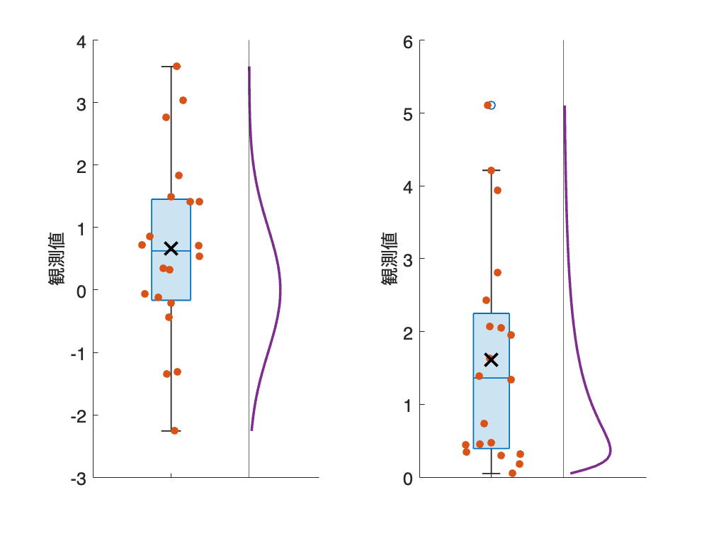
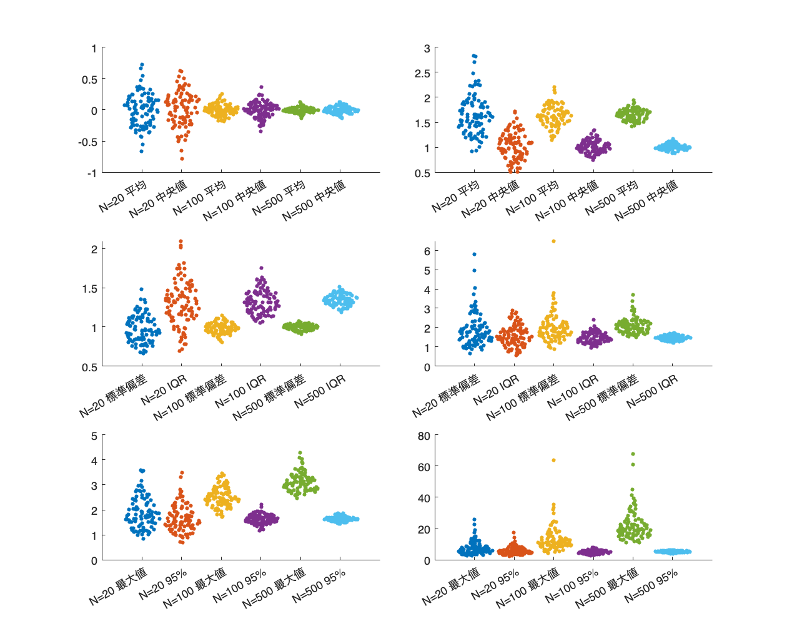
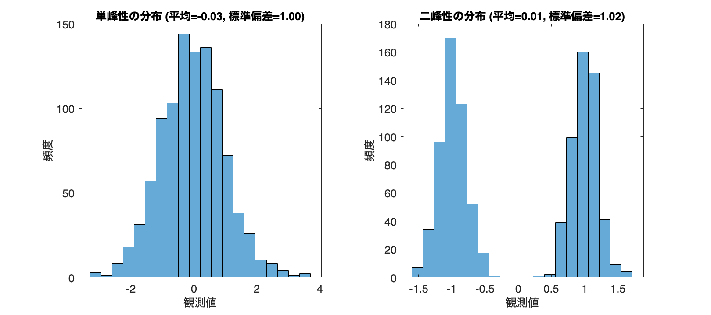

# <span style="color:rgb(213,80,0)">5.1 分布と統計量</span>
## 図 5.1.1 サンプリング実験の概要
```matlab
rng('default'); % シード値を固定
sample_size = 20; % サンプルサイズ
offset = 2; % 理論分布と基準線の描画位置のオフセット

% 図の準備
fig = figure;
tiledlayout('horizontal')

% 正規分布からのサンプリング
nexttile
normal_sample = randn(sample_size,1); 
boxchart(normal_sample) 
hold on
swarmchart(ones(sample_size,1), normal_sample, "filled");
plot(1, mean(normal_sample), 'kx', MarkerSize=14, LineWidth=2); % 平均値のバツマーク

% 正規分布の理論分布
x_normal = linspace(min(normal_sample), max(normal_sample), 100); 
y_normal = normpdf(x_normal, 0, 1); 
plot(y_normal+offset, x_normal, LineWidth=2); 
xline(offset) % 基準線

% 軸ラベルの設定
xticklabels('');
ylabel('観測値');
fontsize(14,'points')

% 対数正規分布からのサンプリング
nexttile
lognormal_sample = exp(randn(sample_size,1)); 
boxchart(lognormal_sample)
hold on;
swarmchart(ones(sample_size,1), lognormal_sample, 'filled');
plot(1, mean(lognormal_sample), 'kx', MarkerSize=14, LineWidth=2); % 平均値のバツマーク

% 対数正規分布の理論分布
x_lognormal = linspace(min(lognormal_sample), max(lognormal_sample), 100); 
y_lognormal = lognpdf(x_lognormal, 0, 1); 
plot(y_lognormal+offset, x_lognormal, LineWidth=2); 
xline(offset); % 基準線

% 軸ラベルの設定
xticklabels('');
ylabel('観測値');
fontsize(14,'points')

% 画像を保存と表示
print('../figures/5_1_1_sampling_experiment.png', '-dpng', '-r300'); 
```

<center></center>

## 図 5.1.2 サンプリングごとの統計量の振る舞い
```matlab
% シード値を固定
rng('default')

% サンプルサイズ
sample_sizes = [20, 100, 500];

% グラフの準備
figure(Position=[100, 100, 700, 560])
tiledlayout(3,2,TileSpacing="compact") % 3行2列のプロット
tmp = ones(100,1);

% 正規分布と対数正規分布をループ
for idx = 1:2
    % サンプリング数ごとのループ
    for kk = 1:length(sample_sizes)
        sample_size = sample_sizes(kk);
        means = [];
        medians = [];
        max_values = [];
        percentiles_95 = [];
        std_devs = [];
        iqr_values = [];

        % 100回のサンプリング
        for n_sample = 1:100
            if idx == 1
                sample = normrnd(0,1,[sample_size,1]);  % 正規分布からサンプリング
            else
                sample = lognrnd(0,1,[sample_size,1]);  % 対数正規分布からサンプリング
            end

            means = [means; mean(sample)];  % 平均値
            medians = [medians; median(sample)];  % 中央値
            max_values = [max_values; max(sample)];  % 最大値
            percentiles_95 = [percentiles_95; prctile(sample,95)];  % 95パーセンタイル点
            std_devs = [std_devs; std(sample)];  % 標準偏差
            iqr = prctile(sample,75) - prctile(sample,25);  % 四分位範囲（IQR）
            iqr_values = [iqr_values; iqr];
        end

        offset = (kk-1)*2; 
        % 平均値とメディアンのプロット
        nexttile(1+idx-1)
        hold on
        swarmchart(offset*tmp, means, 12, 'filled')
        swarmchart((1+offset)*tmp, medians, 12, 'filled')

        % 標準偏差とIQRのプロット
        nexttile(3+idx-1)
        hold on
        swarmchart(offset*tmp,std_devs, 12, 'filled')
        swarmchart((1+offset)*tmp,iqr_values, 12, 'filled')
        
        % 最大値と95パーセンタイルのプロット
        nexttile(5+idx-1)
        hold on
        swarmchart(offset*tmp,max_values, 12, 'filled')
        swarmchart((1+offset)*tmp,percentiles_95, 12, 'filled')
    end
end

% ラベル設定（細かい・・）
texts = ["N=20 平均", "N=20 中央値",...
    "N=100 平均", "N=100 中央値", ...
    "N=500 平均", "N=500 中央値"]; 
nexttile(1), xticks(0:5)
xticklabels(texts)
nexttile(2), xticks(0:5)
xticklabels(texts)

texts = ["N=20 標準偏差", "N=20 IQR",...
    "N=100 標準偏差", "N=100 IQR", ...
    "N=500 標準偏差", "N=500 IQR"];
nexttile(3), xticks(0:5)
xticklabels(texts)
nexttile(4), xticks(0:5)
xticklabels(texts)

texts = ["N=20 最大値", "N=20 95%",...
    "N=100 最大値", "N=100 95%", ...
    "N=500 最大値", "N=500 95%"];

nexttile(5), xticks(0:5)
xticklabels(texts)
nexttile(6), xticks(0:5)
xticklabels(texts)

% 画像を保存
print('../figures/5_1_2_compare_statistics','-dpng','-r300')
```

<center></center>

## 図 5.1.3 統計指標と分布の形状
```matlab
% 乱数のシード設定
rng('default');

% 単峰性の分布
single_peak_distribution = randn(1, 1000);  % 正規分布

% 二峰性の分布
bimodal_distribution = [random('Normal',-1,0.2,[1,500]) , random('Normal',1,0.2,[1,500])];  % 正規分布を二つ結合

% 単峰性の分布の平均値と標準偏差
single_peak_mean = mean(single_peak_distribution);
single_peak_std = std(single_peak_distribution);

% 二峰性の分布の平均値と標準偏差
bimodal_mean = mean(bimodal_distribution);
bimodal_std = std(bimodal_distribution);

% サブプロットの設定
figure(Position=[10, 10, 900, 400]);
tiledlayout('horizontal')

% 単峰性の分布のヒストグラム
nexttile
histogram(single_peak_distribution, 20);
title(['単峰性の分布 (平均=', num2str(single_peak_mean,'%.2f'), ', 標準偏差=', num2str(single_peak_std,'%.2f'), ')']);
ylabel('頻度');
xlabel('観測値');
set(gca, 'FontSize', 14);

% 二峰性の分布のヒストグラム
nexttile
histogram(bimodal_distribution, 20);
title(['二峰性の分布 (平均=', num2str(bimodal_mean,'%.2f'), ', 標準偏差=', num2str(bimodal_std,'%.2f'), ')']);
ylabel('頻度');
xlabel('観測値');
fontsize(14,'points')

% 画像を保存
print('../figures/5_1_3_uni_bimodal_statistics', '-dpng', '-r300'); 
```

<center></center>

