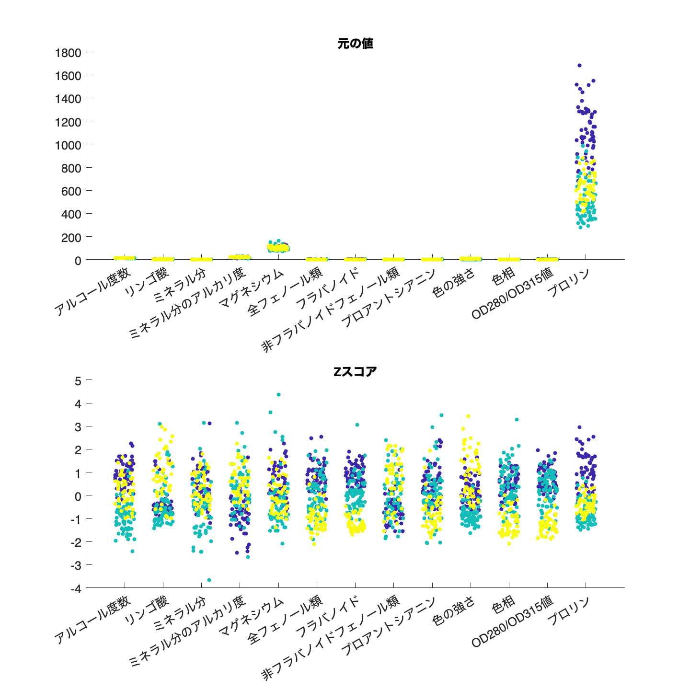
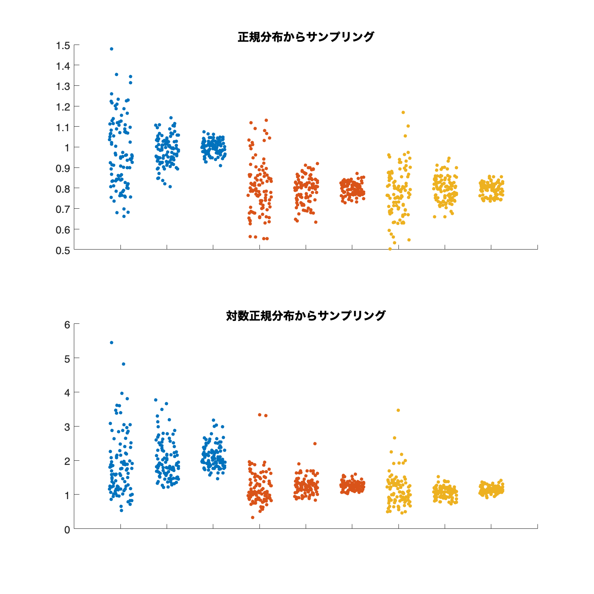

# <span style="color:rgb(213,80,0)">5.2 ばらつきをとらえる</span>
## 図 5.2.2 ワインデータの Z スコア化
```matlab
% Wineデータセットのロード
wine = readtable('https://archive.ics.uci.edu/ml/machine-learning-databases/wine/wine.data','FileType','text');

feature_names = [
    "target",
    "alcohol",
    "malic_acid",
    "ash",
    "alcalinity_of_ash",
    "magnesium",
    "total_phenols",
    "flavanoids",
    "nonflavanoid_phenols",
    "proanthocyanins",
    "color_intensity",
    "hue",
    "od280/od315_of_diluted_wines",
    "proline"];

% 日本語列名の設定
columns_jp = [
    "ブドウ品種",
    "アルコール度数",
    "リンゴ酸",
    "ミネラル分",
    "ミネラル分のアルカリ度",
    "マグネシウム",
    "全フェノール類",
    "フラバノイド",
    "非フラバノイドフェノール類",
    "プロアントシアニン",
    "色の強さ",
    "色相",
    "OD280/OD315値",
    "プロリン"];

wine.Properties.VariableNames = columns_jp;
figure(Position=[100, 100, 1000, 1000])
tiledlayout('vertical');

nexttile
for ii=1:13
    x = ii*ones(height(wine),1);
    y = wine{:,ii+1};
    c = wine.("ブドウ品種");
    swarmchart(x,y,20,c,'filled',XJitter='rand',XJitterWidth=0.5);
    hold on
end
xticks(1:13);
xticklabels(columns_jp(2:end))
title('元の値');
fontsize(14,'points')

nexttile
for ii=1:13
    x = ii*ones(height(wine),1);
    y = zscore(wine{:,ii+1});
    c = wine.("ブドウ品種");
    s = swarmchart(x,y,20,c,'filled',XJitter='rand',XJitterWidth=0.5);
    hold on
end
xticks(1:13);
xticklabels(columns_jp(2:end))
title('元の値');
fontsize(14,'points')
title('Zスコア');
print('../figures/5_2_2_wine_normalization','-dpng','-r300');  % 画像を保存
```

<center></center>


## 図 5.2.4 絶対偏差指標の振る舞い
```matlab
% シード値を固定
rng("default")

% サンプルサイズ
sample_sizes = [20, 100, 500];

% 指標
metrics = ["標準偏差", "平均絶対偏差", "中央絶対偏差"];

% 図の準備
figure(Position=[100, 100, 1000, 1000])
tiledlayout('vertical')

% 正規分布と対数正規分布をループ
for idx_distribution = 1:2
    metrics_values = zeros(100,9);

    % 指標ごとのループ
    for idx_metric = 1:3
        metric_values = [];

        % サンプルサイズごとのループ
        for sample_size = sample_sizes
            if idx_distribution == 1
                sample = normrnd(0,1,[sample_size, 100]); % 正規分布からサンプリング
            else
                sample = lognrnd(0,1,[sample_size, 100]); % 対数正規分布からサンプリング
            end

            if metrics(idx_metric) == "標準偏差"
                metric_values = [metric_values, std(sample)']; % 標準偏差を記録
            elseif metrics(idx_metric) == "平均絶対偏差"
                % 平均絶対偏差を記録
                metric_values = [metric_values, mean(abs(sample - mean(sample)))'];
            elseif metrics(idx_metric) == "中央絶対偏差"
                % 中央絶対偏差を記録
                metric_values = [metric_values, mean(abs(sample - median(sample)))'];
            end
        end
        metrics_values(:, (idx_metric-1)*3+1:idx_metric*3) = metric_values; % dataを追加
    end

    % スウォームプロット
    nexttile(idx_distribution) 
    colorspec = lines(3); % 3色
    hold on
    for idx_metric = 1:9
        x = idx_metric*ones(100,1);
        y = metrics_values(:, idx_metric);
        c = colorspec(ceil(idx_metric/3),:);
        swarmchart(x, y, 20, c, 'filled', XJitter='rand',XJitterWidth=0.5);
    end
    hold off
    
    % x軸の目盛ラベルとy軸のラベルを非表示
    xticklabels("");
    fontsize(14,'points')
end

nexttile(1)
title('正規分布からサンプリング')

nexttile(2)
title('対数正規分布からサンプリング')

% 画像を保存
print('../figures/5_3_4_compare_deviation_statistics','-dpng','-r300'); 
```

<center></center>

