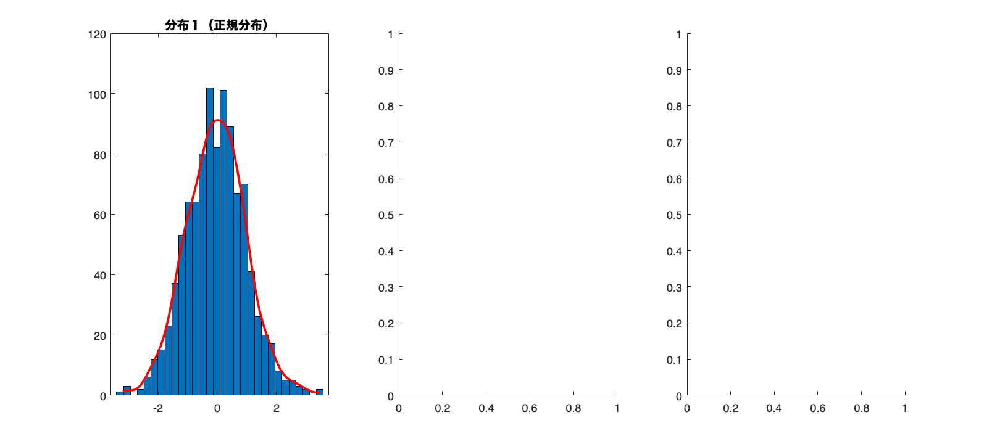
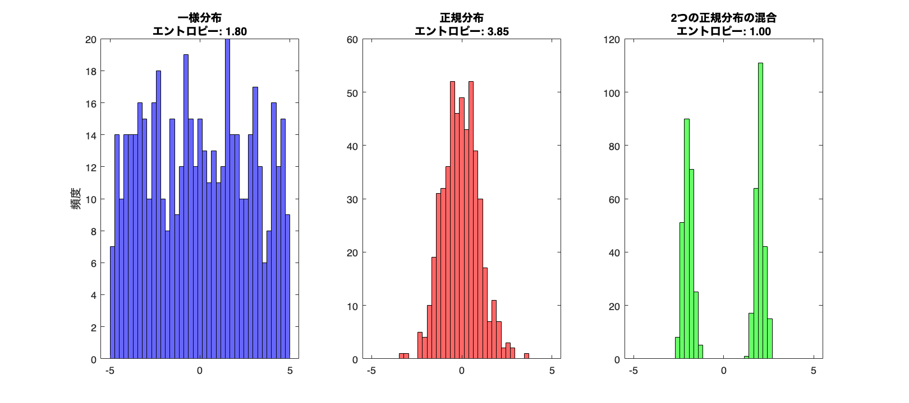
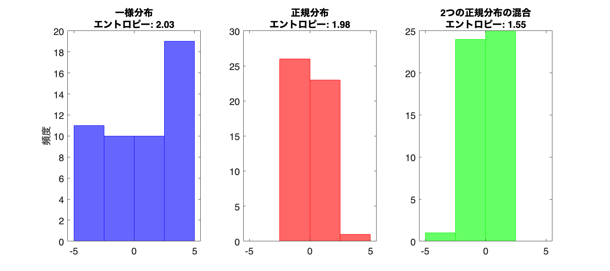
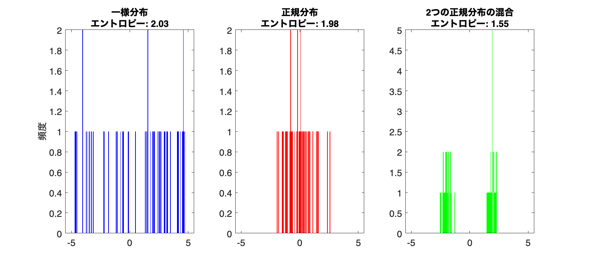
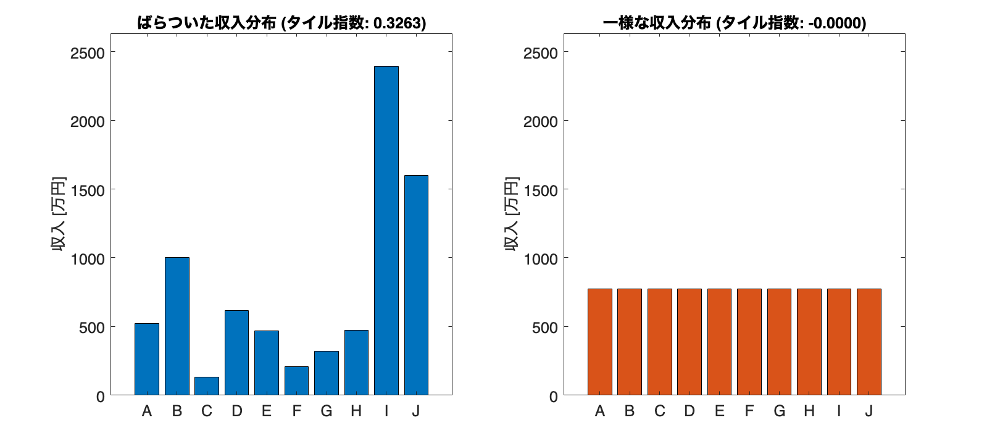

# <span style="color:rgb(213,80,0)">5.3 分布の形をとらえる</span>
## 図 5.3.1 歪度と尖度

歪正規分布、ラプラス分布の定義がないため、それぞれ代案を要検討

```matlab
rng('default'); % 乱数のシード設定

% 正規分布（歪度=0, 尖度=3）
mu = 0; 
sigma = 1;
normal_dist = normrnd(mu,sigma,[1000,1]);  % 正規分布からサンプリング

% 歪度がある分布（歪度>0, 尖度異なる）
% a = 4; 
% skewed_scale = 2;
% skewed_mu = 0;
% pd = makedist('Stable','alpha',2,'beta',a,'mu',skewed_mu,'sigma',skewed_scale,'gamma',1);
% skewed_dist = random(pd,1000,1); % 歪度がある分布からサンプリング

% ラプラス分布（歪度=0, 尖度>3）
% b = 1;
% laplace_dist = laprnd(1000,1,mu,b);  % ラプラス分布からサンプリング

% 上段のプロット（ヒストグラム）
figure(Position=[10 10 900 400])
tiledlayout('horizontal')

nexttile
histfit(normal_dist,30,'kernel'); title('分布１（正規分布）')
nexttile
% histfit(skewed_dist,30,'kernel'); title('分布２（歪正規分布）')
nexttile
```

<center></center>


```matlab
% histfit(laplace_dist,30,'kernel'); title('分布３（ラプラス分布）')

% print('../figures/5_3_1_1_distorted_dist_histograms','-dpng','-r300')

```

```matlab
% 統計量の計算
% dist_array = {normal_dist, skewed_dist, laplace_dist};
% median_skews = cellfun(@(v) (mean(v) - median(v)) / std(v),dist_array);
% kurt_values = cellfun(@(v) kurtosis(v) + 3,dist_array);
% skew_values = cellfun(@(v) skewness(v),dist_array);
% quartile_skews = cellfun(@(v) (quantile(v,0.75) + quantile(v,0.25) - 2 * median(v)) / (quantile(v,0.75) - quantile(v,0.25)),dist_array);

% 下段のプロット（棒グラフ）
% figure('Position', [10 10 900 400])
% tiledlayout('horizontal')
% 
% nexttile
% bar(skew_values, 'FaceColor', [0 0 1],'FaceAlpha',0.6); title('歪度')
% set(gca,'xticklabel',{'分布１' '分布２' '分布３'})
% 
% nexttile
% bar(median_skews, 'FaceColor', [0 0 1],'FaceAlpha',0.6); title('中央値歪度')
% set(gca,'xticklabel',{'分布１' '分布２' '分布３'})
% 
% nexttile
% bar(quartile_skews, 'FaceColor', [0 0 1],'FaceAlpha',0.6); title('四分位歪度')
% set(gca,'xticklabel',{'分布１' '分布２' '分布３'})
% 
% nexttile
% bar(kurt_values, 'FaceColor', [0 0 1],'FaceAlpha',0.6); title('尖度')
% set(gca,'xticklabel',{'分布１' '分布２' '分布３'})
% 
% print('../figures/5_3_1_2_dist_metric_bar_charts','-dpng','-r300')

```
## 図 5.3.2 ヒストグラムに対して情報エントロピー指標を計算する
```matlab
% シード値を固定
rng('default')

% サンプルサイズ
n_samples = 500;

% ビンの設定
bins = linspace(-5, 5, 40);

% 一様分布
uniform_samples = -5 + (5+5)*rand(n_samples, 1);  % 一様分布からサンプリング
uniform_hist = histcounts(uniform_samples, bins);  % ヒストグラムで集計する
uniform_entropy = entropy(uniform_samples);  % エントロピー計算

% 正規分布
normal_samples = normrnd(0, 1, [n_samples, 1]);  % 正規分布からサンプリング
normal_hist = histcounts(normal_samples, bins);  % ヒストグラムで集計する
normal_entropy = entropy(normal_samples);  % エントロピー計算

% 2つの正規分布
gmm_samples1 = normrnd(-2, 0.25, [n_samples/2, 1]);  % 正規分布からサンプリング
gmm_samples2 = normrnd(2, 0.25, [n_samples/2, 1]);  % 正規分布からサンプリング
gmm_samples = [ gmm_samples1; gmm_samples2 ];  % 二つのサンプルを結合
gmm_hist = histcounts(gmm_samples, bins);  % ヒストグラムで集計する
gmm_entropy = entropy(gmm_samples);  % エントロピー計算

% ヒストグラムの描画
figure(Position=[10, 10, 900, 400])  % 図の準備
tiledlayout('horizontal')

% 一様分布のヒストグラム描画
nexttile % 1行3列の左
histogram(uniform_samples, BinEdges=bins, FaceColor='b', EdgeColor='k')  % ヒストグラム描画
title(sprintf('一様分布\nエントロピー: %.2f', uniform_entropy))  % タイトル
ylabel('頻度')  % y軸ラベル

% 正規分布のヒストグラム描画
nexttile  % 1行3列の中央
histogram(normal_samples, BinEdges=bins, FaceColor='r', EdgeColor='k')  % ヒストグラム描画
title(sprintf('正規分布\nエントロピー: %.2f', normal_entropy))  % タイトル

% 混合正規分布のヒストグラム描画
nexttile % 1行3列の右
histogram(gmm_samples, BinEdges=bins, FaceColor='g', EdgeColor='k')  % ヒストグラム描画
title(sprintf('2つの正規分布の混合\nエントロピー: %.2f', gmm_entropy))  % タイトル

% レイアウトの調整と画像を保存
print('../figures/5_3_2_entropy_histogram', '-dpng', '-r300')  % 画像を保存
```

<center></center>

## 図 5.3.3 ビンの幅とエントロピー
```matlab
% シード値を固定
rng('default')

% サンプルサイズ
n_samples = 50;

% 一様分布からのサンプリング
uniform_samples = unifrnd(-5, 5, [1 n_samples]);
uniform_hist = histcounts(uniform_samples, bins);
uniform_entropy = entropy(uniform_hist/sum(uniform_hist));

% 正規分布からのサンプリング
normal_samples = normrnd(0, 1, [1 n_samples]);
normal_hist = histcounts(normal_samples, bins);
normal_entropy = entropy(normal_hist/sum(normal_hist));

% 2つの正規分布からサンプリング
gmm_samples1 = normrnd(-2, 0.25, [1 n_samples / 2]);
gmm_samples2 = normrnd(2, 0.25, [1 n_samples / 2]);
gmm_samples = [gmm_samples1 gmm_samples2];
gmm_hist = histcounts(gmm_samples, bins);
gmm_entropy = entropy(gmm_hist/sum(gmm_hist));

% 大きなビン（5分割）でプロット
large_bins = linspace(-5, 5, 5);

% ヒストグラムの描画
figure(Position=[10, 10, 900, 400])  % 図の準備
tiledlayout('horizontal')

nexttile
histogram(uniform_samples, large_bins, FaceColor='b', EdgeColor='b')
title(sprintf('一様分布\nエントロピー: %.2f', uniform_entropy))
ylabel('頻度')

nexttile
histogram(normal_samples, large_bins, FaceColor='r', EdgeColor='r')
title(sprintf('正規分布\nエントロピー: %.2f', normal_entropy))

nexttile
histogram(gmm_samples, large_bins, FaceColor='g', EdgeColor='g')
title(sprintf('2つの正規分布の混合\nエントロピー: %.2f', gmm_entropy))

fontsize(14,'points')

print('../figures/5_3_3_entropy_large_bins', '-dpng', '-r300');  % 画像の保存
```

<center></center>


```matlab
% 小さなビン（400分割）でプロット
small_bins = linspace(-5, 5, 400);

% ヒストグラムの描画
figure(Position=[10, 10, 900, 400])  % 図の準備
tiledlayout('horizontal')

nexttile
histogram(uniform_samples, small_bins, FaceColor='b', EdgeColor='b')
title(sprintf('一様分布\nエントロピー: %.2f', uniform_entropy))
ylabel('頻度')

nexttile
histogram(normal_samples, small_bins, FaceColor='r', EdgeColor='r')
title(sprintf('正規分布\nエントロピー: %.2f', normal_entropy))

nexttile
histogram(gmm_samples, small_bins, FaceColor='g', EdgeColor='g')
title(sprintf('2つの正規分布の混合\nエントロピー: %.2f', gmm_entropy))

fontsize(14,'points')

print('../figures/5_3_3_entropy_small_bins', '-dpng', '-r300');  % 画像の保存
```

<center></center>

## 図 5.3.4 ジニ係数の計算
```matlab
% シード値を固定
rng('default');

% サンプルサイズ
n_samples = 100;

% 通常分布からのサンプリング(平均400万、標準偏差20万)
normal_samples = normrnd(400, 20, [n_samples, 1]);

% 平均400万の対数正規分布からのサンプリング
mean_lognormal = 400;
sigma_lognormal = 0.5;  % 任意の標準偏差

mu_lognormal = log(mean_lognormal) - 0.5 * sigma_lognormal^2;  % 計算のためのmu 
lognormal_samples = lognrnd(mu_lognormal, sigma_lognormal, [n_samples, 1]); 

% calculate_lorenz_curve 関数は下部参照
% 正規分布のローレンツ曲線とジニ係数
[cum_population_normal, cum_frequencies_normal, gini_normal] ...
    = calculate_lorenz_curve(normal_samples, n_samples);

% 対数正規分布のローレンツ曲線とジニ係数
[cum_population_lognormal, cum_frequencies_lognormal, gini_lognormal] ...
    = calculate_lorenz_curve(lognormal_samples, n_samples);

% 図の描画
figure(Position=[10, 10, 900, 700])  % 図の準備
colors = lines(2);

nexttile % 2行2列の左上を指定
histogram(normal_samples, 20, FaceColor=colors(1,:));  % ヒストグラム描画
title('年収分布その１');  % タイトル
xlabel('年収（万円）');  % x軸ラベル
ylabel('頻度'); % y軸ラベル

nexttile % 2行2列の右上を指定
histogram(lognormal_samples, 20, FaceColor=colors(2,:));  % ヒストグラム描画
title('年収分布その２');  % タイトル
xlabel('年収（万円）');  % x軸ラベル

nexttile % 2行2列の左下を指定
plot(cum_population_normal, cum_frequencies_normal, LineWidth=2, DisplayName='ローレンツ曲線');  % ローレンツ曲線の描画
hold on
plot(linspace(0,1), linspace(0,1), '--', LineWidth=2, DisplayName='全員同じ年収の場合');  % 基準線の描画
plot([0, 1, 1], [0, 0, 1], ':', LineWidth=2, DisplayName='一人が独占の場合');  % 基準線の描画
legend('show','Location','northwest') % 凡例の表示
hold off

title(sprintf('ジニ係数: %.3f',gini_normal));  % タイトル
xlabel('累積人数の割合');  % x軸ラベル
ylabel('累積年収の割合');  % y軸ラベル

nexttile % 2行2列の右下を指定
plot(cum_population_lognormal, cum_frequencies_lognormal, LineWidth=2, DisplayName='ローレンツ曲線');  % ローレンツ曲線の描画

hold on
plot(linspace(0,1), linspace(0,1), '--', LineWidth=2, DisplayName='全員同じ年収の場合');  % 基準線の描画
plot([0, 1, 1], [0, 0, 1], ':', LineWidth=2, DisplayName='一人が独占の場合');  % 基準線の描画
legend('show','Location','northwest') % 凡例の表示
hold off

title(sprintf('ジニ係数: %.3f',gini_lognormal));  % タイトル
xlabel('累積人数の割合'); 

fontsize(14,'points')
print('../figures/5_3_4_gini_coef.png','-dpng', '-r300'); % 画像として保存
```

<center></center>

## 図 5.3.5 タイル指数を計算する
```matlab
% シードの固定
rng('default');

% パラメータ設定
n = 10;
mean_income = 400;  % 平均収入
mean_log = log(mean_income);  % 対数正規分布の平均（ログスケール）
std_dev_log = 0.5;  % 対数正規分布の標準偏差（ログスケール）

% 対数正規分布から収入をサンプリング
unequal_incomes = lognrnd(mean_log, std_dev_log, [1 n]);

% 完全均一な収入を作成
mean_income = mean(unequal_incomes);
equal_incomes = ones(1,n)*mean_income;

% タイル指数を計算 (calc_theil_index 関数は下部参照)
unequal_theil = calc_theil_index(unequal_incomes, n);  % 不均一な収入のケース
equal_theil = calc_theil_index(equal_incomes, n);  % 均一な収入のケース

% サブプロットで描画
figure(Position=[10, 10, 900, 400])  % 図の準備
tiledlayout('horizontal')
colors = lines(2);

% 縦軸のレンジを決定
y_max = max([unequal_incomes, equal_incomes]) * 1.1;  % 1.1は余裕を持たせるため

% 不均一な収入のプロット
nexttile
bar(1:n, unequal_incomes, FaceColor=colors(1,:));  % 棒グラフを描画
ylim([0 y_max]);  % 縦軸の範囲を設定
title(['ばらついた収入分布 (タイル指数: ' num2str(unequal_theil, '%.4f') ')']);  % タイトル
xlabel('');  % x軸ラベル
ylabel('収入 [万円]');  % y軸ラベル
xticks(1:n);  % x軸の目盛りを設定
xticklabels(cellstr(char('A' + (0:n-1)')));  % x軸の目盛りのラベルを設定
fontsize(14,'points')

% 均一な収入のプロット
nexttile
bar(1:n, equal_incomes, FaceColor=colors(2,:));  % 棒グラフを描画
ylim([0 y_max]);  % 縦軸の範囲を設定
title(['一様な収入分布 (タイル指数: ' num2str(equal_theil, '%.4f') ')']);  % タイトル
xlabel('');  % x軸ラベル
ylabel('収入 [万円]');  % y軸ラベル
xticks(1:n);  % x軸の目盛りを設定
xticklabels(cellstr(char('A' + (0:n-1)')));  % x軸の目盛りのラベルを設定
fontsize(14,'points')

% レイアウトの調整・画像を保存
print('../figures/5_3_5_theil_index','-dpng','-r300');
```

<center></center>


ローレンツ曲線とジニ係数の計算を行う関数

```matlab
function [cum_population, cum_frequencies, gini] = calculate_lorenz_curve(samples, n_samples)
    sorted_samples = sort(samples);  % サンプルを昇順に並び替える
    cum_frequencies = cumsum(sorted_samples) / sum(sorted_samples);  % 累積相対度数
    cum_population = (1:n_samples)' / n_samples;   % 累積人口の割合
    gini = mean(cum_population - cum_frequencies) * 2;  % ジニ係数
end
```

タイル指数（Theil Index）を計算する関数

```matlab
function theil_index = calc_theil_index(incomes, n)
    mean_income = mean(incomes);
    theil_index = sum((incomes / mean_income) .* log(incomes / mean_income)) / n;
end
```
