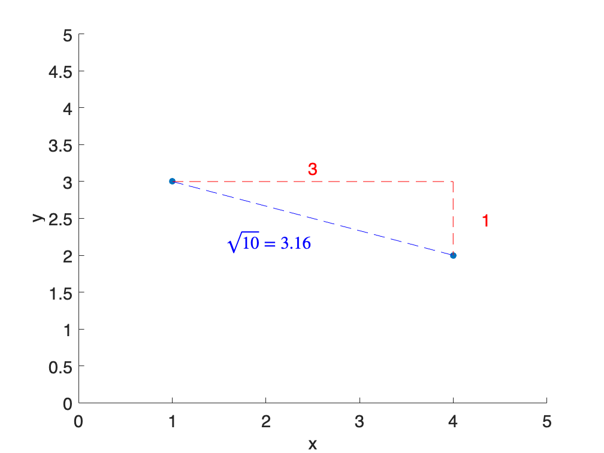
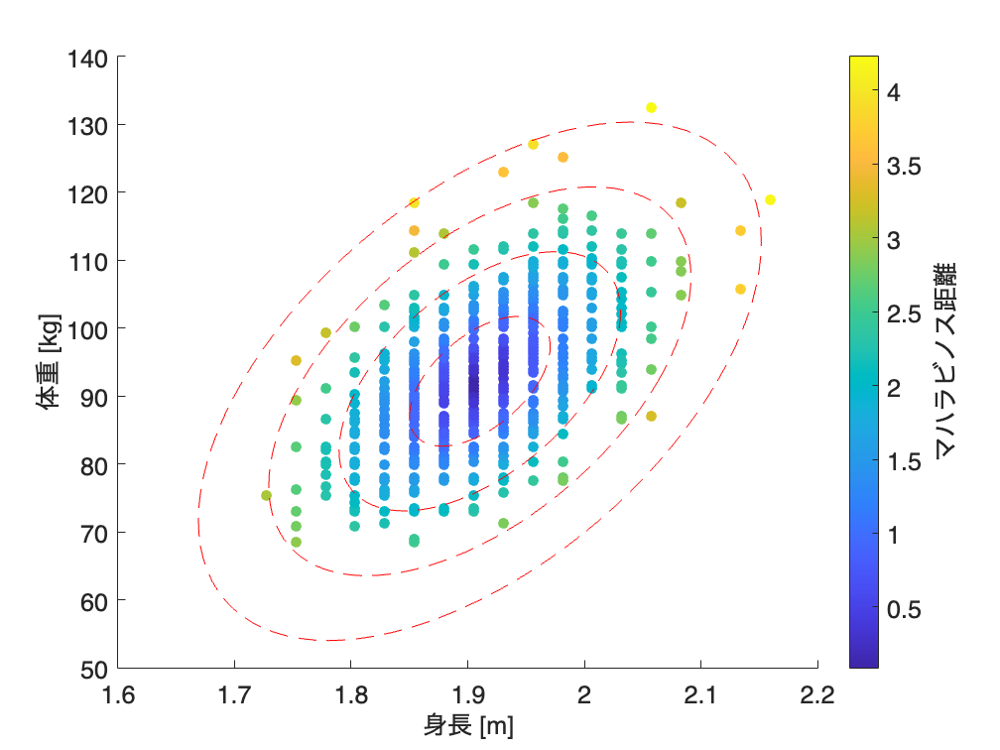
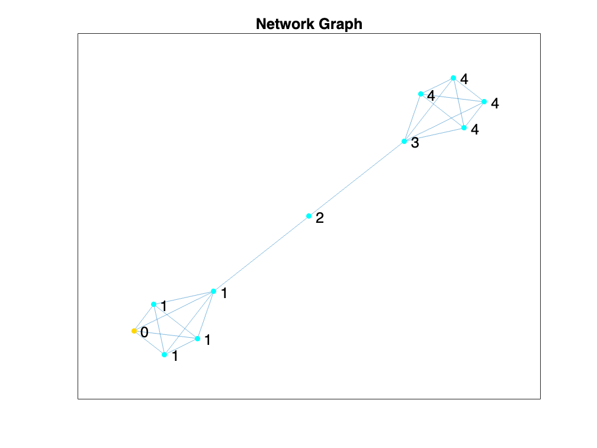

# <span style="color:rgb(213,80,0)">6.1 「近いか遠いか」をとらえる</span>
## 図 6.1.1 ユークリッド距離とマンハッタン距離
```matlab
% ポイントの定義
x1 = 1; y1 = 3;
x2 = 4; y2 = 2;

% ユークリッド距離の計算
euclidean_distance = sqrt((x2 - x1)^2 + (y2 - y1)^2);

% マンハッタン距離の計算
manhattan_distance = abs(x2 - x1) + abs(y2 - y1);

% プロット
figure % 図の準備
scatter([x1, x2], [y1, y2], 'filled')  % 各点のプロット
hold on
line([x1, x2], [y1, y2], Color='blue', LineStyle='--')  % ユークリッド距離の線
line([x1, x2], [y1, y1], Color='red', LineStyle='--')  % マンハッタン距離の線
line([x2, x2], [y1, y2], Color='red', LineStyle='--')  % マンハッタン距離の線

% マンハッタン距離の線のラベル
text((x1 + x2) / 2 + 0.05, y1 + 0.05,...
    num2str(abs(x2-x1)), VerticalAlignment='bottom', HorizontalAlignment='right', Color='red')
text(x2 + 0.4, (y1 + y2) / 2 - 0.15,...
    num2str(abs(y2-y1)), VerticalAlignment='bottom', HorizontalAlignment='right', Color='red')

% ユークリッド距離の線のラベル
mid_x = (x1 + x2) / 2;
mid_y = (y1 + y2) / 2;
text(mid_x, mid_y - 0.5, [' $\sqrt{10}=$ ', num2str(euclidean_distance, '%.2f')],...
    Interpreter='latex', VerticalAlignment='bottom', HorizontalAlignment='right', Color='blue')

xlabel('x')  % x軸ラベル
ylabel('y')  % y軸ラベル

% x_rangeとy_rangeを0から5に設定
xlim([0, 5])  % x軸の範囲を設定
ylim([0, 5])  % y軸の範囲を設定
fontsize(16,'points')

print('../figures/6_1_1_euclidean_manhattan_metric', '-dpng', '-r300')  % 画像を保存
```

<center></center>

## 図 6.1.2 集団の中での逸脱度を測る
```matlab
% CSVファイルを読み込む
filename = fullfile("data","baseball_players_dummy.csv")
```

```TextOutput
filename = "data/baseball_players_dummy.csv"
```

```matlab
data = readtable(filename,VariableNamingRule="modify")
```

```TextOutput
Warning: Column headers from the file were modified to make them valid MATLAB identifiers before creating variable names for the table. The original column headers are saved in the VariableDescriptions property.
Set 'VariableNamingRule' to 'preserve' to use the original column headers as table variable names.
```
| |Height_inches_|Weight_pounds_|
|:--:|:--:|:--:|
|1|68|166|
|2|69|156|
|3|69|161|
|4|69|210|
|5|69|168|
|6|69|151|
|7|69|197|
|8|69|182|
|9|70|177|
|10|70|181|
|11|70|181|
|12|70|219|
|13|70|173|
|14|70|166|

```matlab
% 注：変数名が（例：Height(inches) => Height_inches_ に変換されてます。

% Height(inches)をメートルに、Weight(pounds)をキログラムに変換
data.Height_m_ = data.Height_inches_ * 0.0254;
data.Weight_kg_ = data.Weight_pounds_ * 0.453592;

% マハラビノス距離を計算
% d2 = mahal(Y,X) は、X の平均ベクトルに対する Y 内の各観測値のマハラノビス距離の二乗を返します。
d2 = mahal(data{:, ["Height_m_", "Weight_kg_"]}, data{:, ["Height_m_", "Weight_kg_"]});
data.Mahalanobis = sqrt(d2);

% プロット（マハラビノス距離一定の複数の楕円を含む）
figure;
h = scatter(data, "Height_m_", "Weight_kg_", 'filled', ...
    ColorVariable="Mahalanobis");
cbar = colorbar;
ylabel(cbar, 'マハラビノス距離');

% % 楕円描画用関数
fnc = @(x,y,x0,y0,a,b) ((x-x0).^2)/a + ((y-y0).^2)/b -1;
% fimplicit(fnc)
% ylim([-5 5])

% 共分散行列と平均ベクトルを計算
cov_matrix = cov(data{:, {'Height_m_', 'Weight_kg_'}});
inv_cov_matrix = inv(cov_matrix);
mean_vector = mean(data{:, {'Height_m_', 'Weight_kg_'}});

hold on
% マハラビノス距離が一定の楕円を複数描画（ここでは距離 1, 2, 3, 4 に対して）

[w, v] = eig(cov_matrix);  % 固有値と固有ベクトルを計算
u = w(:,1) / norm(w(:,1));  % 固有ベクトルの単位ベクトル
angle = atan2d(u(2), u(1));  % 固有ベクトルの傾き (度数法)

for md = 1:4
    ellipse_radius = md^2;  % 楕円の半径
    r = sqrt(ellipse_radius) * sqrt(v);  % 固有値を楕円の半径に変換

    % 楕円を描画
    h_ellipse = ellipse(mean_vector(1), mean_vector(2), r(1,1), r(2,2));

    % rotate で回転できるのは surface、patch、line、text または image オブジェクト
    rotate(h_ellipse, [0, 0, 1], 180.0 + angle, [mean_vector, 0]); % 回転
end

% グラフのラベルを設定
xlabel('身長 [m]');  % x軸ラベル
ylabel('体重 [kg]');  % y軸ラベル
fontsize(14,'points')

% 画像を保存
print('../figures/6_1_2_mahalanobis', '-dpng', '-r300');  % 画像を保存
```

<center></center>

## 図 6.1.4 ネットワーク上の最短経路長
```matlab
% 乱数のシードを設定
rng('default');

% グラフ（バーベルグラフ）を生成
% MATLAB ではバーベルグラフの直接生成は難しいため、ネットワークを手動で定義します
% G = bridgedGraph();
s = [1 1 1 1 2 2 2 3 3 4 5 6 7 7 7  7  8 8  8  9  9  10];
t = [2 3 4 5 3 4 5 4 5 5 6 7 8 9 10 11 9 10 11 10 11 11];
G = graph(s,t);

% 基準となるノード（ここではノード 1）
source_node = 1;

% 基準ノードからの最短距离を計算
D = distances(G);
shortest_paths = D(source_node,:);

% ネットワークを描画する際のノードの色を設定
cm = jet(2);
node_colors = repelem(cm(2,:),G.numnodes,1);
node_colors(source_node, :) = [1 0.84 0];

% ネットワークを描画
figure
plot(G, NodeColor=node_colors, NodeLabel=shortest_paths, NodeFontSize=14);
title('Network Graph')
fontsize(14,'points')

% グラフを保存
print('../figures/network_distance', '-dpng', '-r300')
```

<center></center>


楕円を描く補助関数

```matlab
function h = ellipse(x,y,a,b)
th = 0:pi/50:2*pi;
xunit = a*cos(th) + x;
yunit = b*sin(th) + y;
h = plot(xunit, yunit,LineStyle='--', Color='red');
end
```
