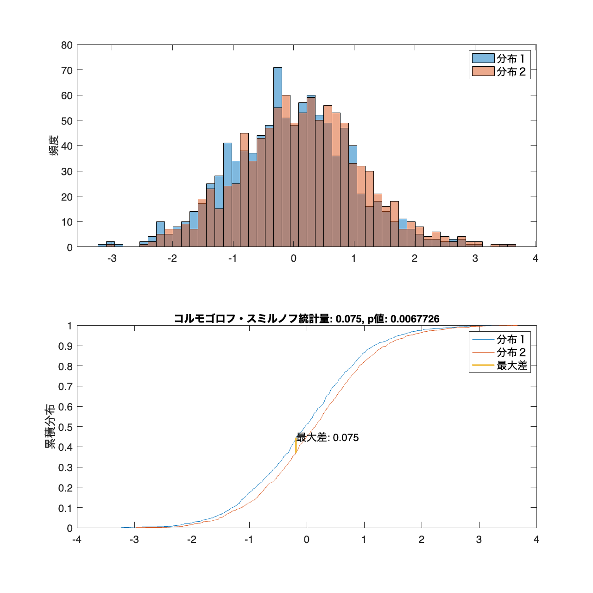

# <span style="color:rgb(213,80,0)">6.2 分布同士の距離を測る</span>
## 図 6.2.1 コルモゴロフ・スミルノフ統計量
```matlab
% シード値を固定
rng('default');

% サンプルサイズを設定。
sample_size = 1000;

% 一つ目と二つ目の分布ペアを生成
mean1 = 0; std1 = 1;
mean2 = 0.1; std2 = 1;
dist1 = mean1 + std1 .* randn(sample_size, 1);
dist2 = mean2 + std2 .* randn(sample_size, 1);

% Kolmogorov-Smirnov 統計量を計算 
[~, p_value, ks_stat] = kstest2(dist1, dist2);

% 累積分布関数 (CDF) を計算。
dist1_sorted = sort(dist1);  % dist1をソート
dist2_sorted = sort(dist2);  % dist2をソート
cdf1 = cumsum(ones(sample_size, 1)) / sample_size;  % dist1のCDFを計算
cdf2 = cumsum(ones(sample_size, 1)) / sample_size;  % dist2のCDFを計算

% 図の準備
figure(units='normalized',outerposition=[0, 0, 0.8,0.8]);

% 共通のビンを設定
bin_edges = linspace(min([dist1; dist2]), max([dist1; dist2]), 51);

% ヒストグラムをプロット
subplot(2, 1, 1);
histogram(dist1, BinEdges=bin_edges, FaceAlpha=0.5, DisplayName='分布１');
hold on
histogram(dist2, BinEdges=bin_edges, FaceAlpha=0.5, DisplayName='分布２');
legend();  % 凡例を表示
ylabel('頻度');  % y軸ラベルを設定

% CDFをプロット
subplot(2, 1, 2);
plot(dist1_sorted, cdf1, DisplayName='分布１');
hold on
plot(dist2_sorted, cdf2, DisplayName='分布２');

% CDFの差の最大値を見つける
% まずdist1_sortedとdist2_sortedをマージしてソート
merged_sorted_dists = sort([dist1_sorted; dist2_sorted]);

% 全体の中でそれぞれの分布のそれぞれの値がどこにあるかを計算
idx1 = cumsum(histcounts(dist1_sorted, merged_sorted_dists) > 0) / sample_size;
idx2 = cumsum(histcounts(dist2_sorted, merged_sorted_dists) > 0) / sample_size;

% y方向の差の最大値とその位置を求める
[max_diff_y, max_diff_y_idx] = max(abs(idx1 - idx2));

% 最大差に対応する場所に線を引く
x_max_diff = merged_sorted_dists(max_diff_y_idx);
y1_max_diff = idx1(max_diff_y_idx);
y2_max_diff = idx2(max_diff_y_idx);

% 縦線をプロットして最大差を表示
plot([x_max_diff, x_max_diff], [y1_max_diff, y2_max_diff],...
    LineStyle='-', LineWidth=2, DisplayName='最大差')
text(x_max_diff, 0.45, "最大差: " + max_diff_y);
% CDFプロットの設定
title("コルモゴロフ・スミルノフ統計量: " + ks_stat + ", p値: " + p_value);
legend();  % 凡例を表示
fontsize(14,'points')
ylabel('累積分布');  % y軸ラベルを設定

% 画像を保存
print('../figures/6_2_1_Kolmogorov_Smirnov', '-dpng', '-r300');
```

<center></center>

## 図 6.2.2 全変動距離を求める
```matlab
% シード値を固定
rng('default');

% 正規分布のパラメータ（平均と標準偏差）
mu1 = -1; sigma1 = 1;
mu2 = 1; sigma2 = 1;

% サンプルデータの生成
num_samples = 10000;
samples1 = normrnd(mu1, sigma1, [num_samples, 1]);
samples2 = normrnd(mu2, sigma2, [num_samples, 1]);

% ビンの設定
bins = linspace(-5, 5, 50);
bin_centers = (bins(2:end)+bins(1:end-1))/2;

% ヒストグラムを計算
hist1 = histcounts(samples1, bins, Normalization='probability');
hist2 = histcounts(samples2, bins, Normalization='probability');

% 全変動距離（TVD）を計算
tvd_sample = 0.5 * sum(abs(hist1 - hist2)) * (bins(2) - bins(1));

% サンプルデータに対する全変動距離と面積を表示
figure;  % 新しい描画ウィンドウを開く
hold on;  % 現在の描画を保持
histogram(samples1, bins, FaceAlpha=0.3, Normalization='probability');
histogram(samples2, bins, FaceAlpha=0.3, Normalization='probability');
plot(bin_centers, hist1, 'r-', LineWidth=2);
plot(bin_centers, hist2, 'b-', LineWidth=2);

legend('Sample Distribution 1', 'Sample Distribution 2');
title("全変動距離: " + num2str(tvd_sample, '%.4f'));
ylabel("確率密度");
fontsize(14,'points')

% 図の保存
print('../figures/6_2_2_total_variation','-dpng','-r300');
```

<center></center>

## 図 6.2.3 ワッサースタイン計量の計算のイメージ
```matlab
% シード値を固定
rng('default'); 

% 正規分布のパラメータ（平均と標準偏差）
mu1 = 0; sigma1 = 1;
mu2 = 2; sigma2 = 1;

% サンプルデータの生成
num_samples = 50;
samples1 = normrnd(mu1, sigma1, [num_samples,1]);
samples2 = normrnd(mu2, sigma2, [num_samples,1]);

% ソート
samples1 = sort(samples1);
samples2 = sort(samples2);

% 可視化
figure('Position', [10 10 800 400]);  % 図の準備
scatter(samples1, ones(num_samples,1), 60, 'filled'); % マーカーを設定
hold on; 
scatter(samples2, zeros(num_samples,1), 60, 'filled'); % マーカーを設定

% 最短距離を繋ぐ線を描画
for idx = 1:num_samples
    line([samples1(idx), samples2(idx)], [1, 0], Color='black', LineWidth=1);
end

yticks([0, 1]); % y軸の目盛りを設定
yticklabels(["分布２", "分布１"]); % Y軸のラベルを設定
fontsize(14,'points')

% 図の保存
print('../figures/6_2_3_wasserstein_distance','-dpng','-r300');  
```

<center></center>

## 図 6.2.4 カルバック・ライブラー情報量とイェンセン・シャノン情報量
```matlab
% シード値を固定
rng('default');

% 正規分布のパラメータ (平均と標準偏差)
mu1 = 0; sigma1 = 0.5;
mu2 = 2; sigma2 = 1;

% サンプルデータの生成
num_samples = 10000;
samples1 = mu1 + sigma1 .* randn(num_samples, 1);
samples2 = mu2 + sigma2 .* randn(num_samples, 1);

% サンプルを[-1, 3]の範囲に絞り込む
filtered_samples1 = samples1(samples1 >= -1 & samples1 <= 3);
filtered_samples2 = samples2(samples2 >= -1 & samples2 <= 3);

% 非ゼロのビンを確保するために、限られた範囲でヒストグラムを生成
limited_bins = linspace(-1, 3, 50);
hist1 = histcounts(filtered_samples1, limited_bins, Normalization='pdf');
hist2 = histcounts(filtered_samples2, limited_bins, Normalization='pdf');

% ヒストグラムを正規化
bin_width = limited_bins(2) - limited_bins(1);
hist1 = hist1 / sum(hist1 .* bin_width);
hist2 = hist2 / sum(hist2 .* bin_width);

% KLダイバージェンスを再計算(関数定義は最下部に)
kl_1_to_2 = get_kldivergence(hist1, hist2);
kl_2_to_1 = get_kldivergence(hist2, hist1);

% JSダイバージェンスを再計算
js_divergence = 0.5 * (get_kldivergence(hist1, 0.5 * (hist1 + hist2)) + ...
                       get_kldivergence(hist2, 0.5 * (hist1 + hist2)));

% ヒストグラムを再描画し、ダイバージェンスを表示
figure('Position', [10 10 800 500]);
hist1_handle = histogram(filtered_samples1, BinEdges=limited_bins, Normalization='pdf', FaceAlpha=0.5);
hold on;
hist2_handle = histogram(filtered_samples2, BinEdges=limited_bins, Normalization='pdf', FaceAlpha=0.5);
hold off;

% タイトルを設定
title(sprintf('KL情報量: %.4f (1→2), ∞ (2→1), JS情報量: %.4f', kl_1_to_2, js_divergence));
ylabel('相対頻度');  % y軸ラベルを設定
fontsize(14,'points')

% 図の保存
print('../figures/6_2_4_kl_js_divergence', '-dpng', '-r300');  % DPIを300に設定して保存
```

<center></center>

## 図 6.2.5 様々な分布間距離指標
```matlab
% サンプルサイズとパラメータを設定
sample_size = 1000;
mean1 = 0; std1 = 1;
mean2 = 1; std2 = 1;
mean3 = -1; std3 = 0.5;
mean4 = 1; std4 = 1.5;
mean5 = -2; std5 = 1;
mean6 = 2; std6 = 1;
mean7 = 0; std7 = 1.5;

% データを生成
rng('default');
dist1_1 = normrnd(mean1, std1, sample_size, 1);
dist1_2 = normrnd(mean2, std2, sample_size, 1);
dist2_1 = normrnd(mean3, std3, sample_size, 1);
dist2_2 = normrnd(mean4, std4, sample_size, 1);
dist3_1 = [normrnd(mean5, std5, sample_size/2, 1);
           normrnd(mean6, std6, sample_size/2, 1)];
dist3_2 = normrnd(mean7, std7, sample_size, 1);

% ビンのエッジを計算
all_data = [dist1_1; dist1_2; dist2_1; dist2_2; dist3_1; dist3_2];
min_val = min(all_data);
max_val = max(all_data);
bin_edges = linspace(min_val, max_val, 21);

% 各距離指標を計算 (see below: 関数 compute_metrics)
metrics = ["コルモゴロフ・スミルノフ統計量", "全変動距離", "ワッサースタイン距離", "JS情報量"];
distances1 = compute_metrics(dist1_1, dist1_2, bin_edges);
distances2 = compute_metrics(dist2_1, dist2_2, bin_edges);
distances3 = compute_metrics(dist3_1, dist3_2, bin_edges);

% 棒グラフのY軸のスケールを調整
max_distance = 2.5;

% ヒストグラムを描画
figure('Position', [10 10 1000 300]);
tiledlayout('horizontal')

nexttile;
histogram(dist1_1, BinEdges=bin_edges, Normalization='probability', FaceAlpha=0.5);
hold on;
histogram(dist1_2, BinEdges=bin_edges, Normalization='probability', FaceAlpha=0.5);
title('分布ペア1');

nexttile
histogram(dist2_1, BinEdges=bin_edges, Normalization='probability', FaceAlpha=0.5);
hold on;
histogram(dist2_2, BinEdges=bin_edges, Normalization='probability', FaceAlpha=0.5);
title('分布ペア2');

nexttile
histogram(dist3_1, BinEdges=bin_edges, Normalization='probability', FaceAlpha=0.5);
hold on;
histogram(dist3_2, BinEdges=bin_edges, Normalization='probability', FaceAlpha=0.5);
title('分布ペア3');

fontsize(14,'points')
print('../figures/6_2_5_1_dist_pairs', '-dpng', '-r300');  % DPIを300に設定して保存
```

<center></center>


```matlab

% 各指標の距離をグループ棒グラフとして描画
figure('Position', [10 10 1000 300]);
bar(metrics,[distances1; distances2; distances3]');
ylim([0, max_distance]);
legend('分布ペア1', '分布ペア2', '分布ペア3');
title('各指標における分布ペアの距離');
fontsize(14,'points')

% 図の保存
print('../figures/6_2_5_2_dist_metrics', '-dpng', '-r300');  % DPIを300に設定して保存
```

<center></center>

## 補助関数
### KL情報量を計算する関数

図 6.2.4 カルバック・ライブラー情報量とイェンセン・シャノン情報量


図 6.2.5 様々な分布間距離指標


で使用

```matlab
function kl_divergence = get_kldivergence(p, q)

idx = p ~= 0 & q ~= 0;
p = p(idx);
q = q(idx);
kl_divergence = sum(p .* log(p ./ q));

end

```
### 各距離を計算する関数

図 6.2.5 様々な分布間距離指標で使用

```matlab
function metrics = compute_metrics(dist_a, dist_b, bin_edges)

% 分布（Probability or PDF） を計算
hist_a = histcounts(dist_a, bin_edges, Normalization='probability');
hist_b = histcounts(dist_b, bin_edges, Normalization='probability');

% 各距離を計算する関数を定義

% スミルノフ-コロモゴロフ統計量(kstest2 の第三出力引数)
% https://jp.mathworks.com/help/stats/kstest2.html
[~,~,ksstats] = kstest2(dist_a,dist_b);

% 全変動距離
total_variation_distance = 0.5*sum(abs(hist_a - hist_b))/(bin_edges(2)-bin_edges(1));

% ワッサースタイン距離 (see below)
wasserstein_distance = Wasserstein_Dist(dist_a,dist_b);

% JSダイバージェンス
hist_ab = 0.5*(hist_a+hist_b);
js_divergence = 0.5*get_kldivergence(hist_a,hist_ab) + 0.5*get_kldivergence(hist_b, hist_a);

metrics = [ksstats, total_variation_distance, wasserstein_distance, js_divergence];

end
```
### ワッサースタイン距離

図 6.2.5 様々な分布間距離指標で使用。Koorosh Aslansefat (2020). ECDF-based Distance Measure Algorithms ([https://www.github.com/koo-ec/CDF-based-Distance-Measure](https://www.github.com/koo-ec/CDF-based-Distance-Measure)), GitHub. Retrieved April 29, 2020.

```matlab
function WS_Dist = Wasserstein_Dist(XX,YY)
% MIT License Copyright (c) 2020 Koorosh Aslansefat
% X = normrnd(1,1,[100,1]);
% Y = normrnd(1,1.1,[100,1]);
    YY(~any(~isnan(YY), 2),:)=[];
    XX(~any(~isnan(XX), 2),:)=[];
    for jj = 1:size(XX,2)
          X = XX(:,jj);
          Y = YY(:,jj);
          nx = length(X);
          ny = length(Y);
          n = nx + ny;
          XY = [X;Y];
          X2 = [(1/nx).*ones(nx,1);zeros(ny,1)];
          Y2 = [zeros(nx,1);(1/ny).*ones(ny,1)];
          [SortedXY ,I] = sort(XY);
          X2_Sorted = X2(I);
          Y2_Sorted = Y2(I);
          Res = 0;
          E_CDF = 0;
          F_CDF = 0;
          power = 1;
          for ii = 1:n-1
              E_CDF = E_CDF + X2_Sorted(ii);
              F_CDF = F_CDF + Y2_Sorted(ii);
              height = abs(F_CDF-E_CDF);
              width = SortedXY(ii+1) - SortedXY(ii);
              Res = Res + (height ^ power) * width;  
          end
          WS_Dist_temp(jj) = Res;  
    end
    WS_Dist = max(WS_Dist_temp);
end
```
