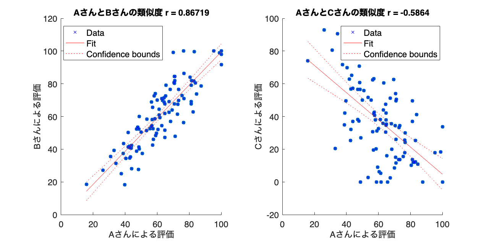
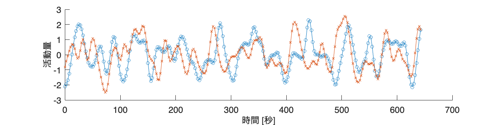
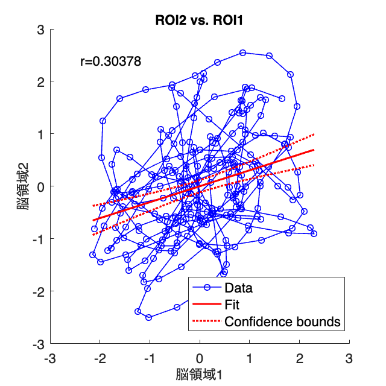
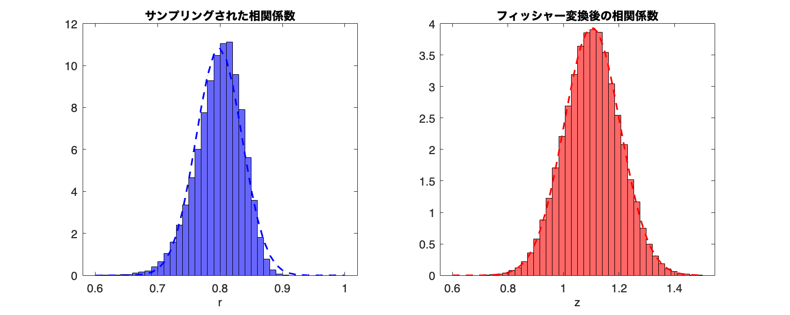
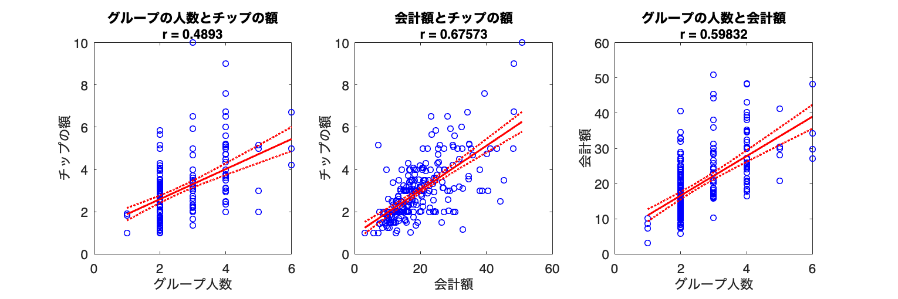
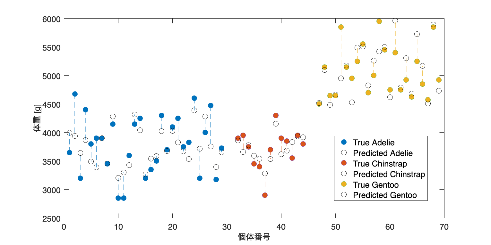

# <span style="color:rgb(213,80,0)">6.3 ペアになった分布間の距離指標</span>
## 図 6.3.1 相関として類似度をとらえる
```matlab
%シード値の設定
rng('default')

% 書籍の数
n_books = 100;

% Aさんのレビュー
a_scores = randn(1, n_books) * 15 + 60;
a_scores = max(min(a_scores,100),0);  % 0から100の範囲にクリップ

% Bさんのレビュー（Aさんと高い相関）
b_scores = a_scores + randn(1, n_books) * 10;
b_scores = max(min(b_scores,100),0); % 0から100の範囲にクリップ

% Cさんのレビュー（Aさんと緩い逆相関）
c_scores = 100 - a_scores + randn(1, n_books) * 20;
c_scores = max(min(c_scores,100),0); % 0から100の範囲にクリップ

% 結果の表示
% disp(['Aさんのレビュー    Bさんのレビュー    Cさんのレビュー'])
% disp([num2str(a_scores'), num2str(b_scores'), num2str(c_scores')]);

% 相関係数の計算
corr_ab = corrcoef(a_scores, b_scores);
corr_ab = corr_ab(1,2);  % 相関係数のみ
corr_ac = corrcoef(a_scores, c_scores);
corr_ac = corr_ac(1,2);  % 相関係数のみ

% 線形回帰の描画
figure(Position=[10 10 800 400])
tiledlayout("horizontal")

% 最小二乗線を引くだけなら lsline だけでOK
% AさんとBさんのレビューの散布図と線形回帰直線を描画
nexttile
scatter(a_scores, b_scores, 'filled'); 
hold on;
yfit = fitlm(a_scores, b_scores);
plot(yfit)

title(['AさんとBさんの類似度 r = ', num2str(corr_ab)]);  % タイトルを設定
xlabel('Aさんによる評価');  % x軸ラベルを設定
ylabel('Bさんによる評価');  % y軸ラベルを設定

% AさんとCさんのレビューの散布図と線形回帰直線を描画
nexttile
scatter(a_scores, c_scores, 'filled'); 
hold on;
yfit = fitlm(a_scores, c_scores);
plot(yfit)

title(['AさんとCさんの類似度 r = ', num2str(corr_ac)]);  % タイトルを設定
xlabel('Aさんによる評価');  % x軸ラベルを設定
ylabel('Cさんによる評価');  % y軸ラベルを設定

fontsize(14,'points')

% 相対スコアを元にコサイン類似度を計算
a_scores_rel = a_scores - mean(a_scores);
b_scores_rel = b_scores - mean(b_scores);
c_scores_rel = c_scores - mean(c_scores);

cos_sim_ab = dot(a_scores_rel, b_scores_rel) / (norm(a_scores_rel) * norm(b_scores_rel));
cos_sim_ac = dot(a_scores_rel, c_scores_rel) / (norm(a_scores_rel) * norm(c_scores_rel));
disp(['コサイン類似度（AさんとBさん）: ', num2str(cos_sim_ab)]);
```

```TextOutput
コサイン類似度（AさんとBさん）: 0.86719
```

```matlab
disp(['コサイン類似度（AさんとCさん）: ', num2str(cos_sim_ac)]);
```

```TextOutput
コサイン類似度（AさんとCさん）: -0.5864
```

```matlab

% 図の保存
print('../figures/6_3_1_correlation_similarity','-dpng','-r300'); 
```

<center></center>

## 図 6.3.2 時系列同士の相関で類似度を測る
```matlab
% データを読み込む（著者が準備したサンプルデータ）
path = fullfile("data","brain.txt");
% データをtableに変換
data = readtable(path, 'Delimiter', '\t');

% 時刻を1ステップにつき2.5秒に変換（2.5秒に一回のペースで撮像されたデータ）
time_steps = (0:2.5:(height(data)-1)*2.5)';

% 時系列の折れ線グラフを描画して保存
figure(Position=[10 10 800 200]);
hold on;
plot(time_steps, data.ROI1, Marker='o', MarkerSize=5, DisplayName='脳領域1');
plot(time_steps, data.ROI2, Marker='x', MarkerSize=5, DisplayName='脳領域2');
xlabel('時間 [秒]');  % x軸ラベルを設定
ylabel('活動量');  % y軸ラベルを設定
fontsize(14,'points')

print('../figures/6_3_2_1_time_series_line_plot', '-dpng', '-r300');  % 図の保存
```

<center></center>


```matlab
% r値の計算
[r_value,p_value] = corrcoef(table2array(data(:, 'ROI1')), table2array(data(:, 'ROI2')));

% 散布図と回帰直線、信頼区間を描画して保存
figure(Position=[10 10 400 400]);
hold on;

% 回帰直線
mdl = fitlm(data, 'ROI2~ROI1');
h = plot(mdl);

% 以下の 4 つの object が作成されます
% h(1): データ点
% h(2): 回帰線
% h(3): 信頼限界（下限）
% h(4): 信頼限界（上限）
% 以下で見栄えを調整します。
% 時系列を繋ぐ
h(1).LineStyle = '-';
h(1).Marker = 'o';
% 線を太く
[h.LineWidth] = deal(1,2,2,2);

xlabel('脳領域1');  % x軸ラベルを設定
ylabel('脳領域2');  % y軸ラベルを設定
% r値をグラフに追加
text(0.1, 0.9, ['r=' num2str(r_value(1,2))], Units='Normalized');
fontsize(14,'points')
print('../figures/6_3_2_2_time_series_scatter_plot', '-dpng', '-r300');  % 図の保存
```

<center></center>

## 図 6.3.3 サンプリングされた相関係数とフィッシャー変換
```matlab
% 正規分布からランダムに30点からなるサンプルを二つ生成して相関係数を計算する関数
generate_correlation=@(target_corr) mvnrnd([0 0],[1 target_corr; target_corr 1],100);  

% 相関係数とフィッシャーのz変換した値を保存する疎リスト
correlations = [];
fisher_z = [];

% 1000回繰り返し
for k = 1:100000
    % 相関係数を計算する
    samples = generate_correlation(0.8);  % 相関係数を計算
    sample1 = samples(:,1);
    sample2 = samples(:,2);
    correlation = corr(sample1, sample2);
    % 相関係数を保存
    correlations = [correlations; correlation];  % 相関係数を保存
    % フィッシャーのz変換した値を保存
    fisher_z = [fisher_z; 0.5 * log((1 + correlation) / (1 - correlation))];  % フィッシャーのz変換した値を保存
end

% 共通のビンを設定（40分割）
bins_orig = linspace(0.6, 1.0, 41);
bins_z = linspace(0.6, 1.5, 41);

% ヒストグラムを描画
figure(Position=[10 10 1000 400]);
tiledlayout('horizontal')

% 相関係数のヒストグラム
nexttile
histogram(correlations, BinEdges=bins_orig, Normalization='pdf', ...
          FaceAlpha=0.6, FaceColor='b', DisplayName='Observed Data');  % ヒストグラムを描画
hold on;

x = min(bins_orig):0.01:max(bins_orig);  % x軸の範囲を100分割した配列を生成
pd = fitdist(correlations,'Normal'); 
y = pdf(pd,x);  % 正規分布の確率密度関数を計算
plot(x, y, 'Color', 'blue', 'LineStyle', '--', ...  % 正規分布を描画
     'Linewidth', 2, 'DisplayName', 'Fitted Normal');
title('サンプリングされた相関係数');  % タイトルを設定
xlabel('r');  % x軸ラベルを設定
% legend;  % 凡例の表示

% フィッシャーのz変換した値のヒストグラム
nexttile
histogram(fisher_z, BinEdges=bins_z, Normalization='pdf', ...
          FaceAlpha=0.6, FaceColor='red', DisplayName='Observed Data');  % ヒストグラムを描画
hold on;

x = min(bins_z):0.01:max(bins_z);  % x軸の範囲を100分割した配列を生成
pd = fitdist(fisher_z,'Normal'); 
y = pdf(pd,x);  % 正規分布の確率密度関数を計算
plot(x, y, Color='red', LineStyle='--', ...  % 正規分布を描画
     Linewidth=2, DisplayName='Fitted Normal');
title('フィッシャー変換後の相関係数');  % タイトルを設定
xlabel('z');  % x軸ラベルを設定
fontsize(14,'points')
% legend;  % 凡例の表示

% 画像を保存
print('../figures/6_3_3_z_transformation_experiment','-dpng','-r300');  
```

<center></center>

## 図 6.3.4 他の変数の影響を考慮して相関をとらえる
```matlab
% Seabornのtipsデータセットを使用
data = readtable('https://raw.githubusercontent.com/mwaskom/seaborn-data/master/tips.csv');
head(data)
```

```TextOutput
    total_bill    tip        sex        smoker      day         time       size
    __________    ____    __________    ______    _______    __________    ____
      16.99       1.01    {'Female'}    {'No'}    {'Sun'}    {'Dinner'}     2  
      10.34       1.66    {'Male'  }    {'No'}    {'Sun'}    {'Dinner'}     3  
      21.01        3.5    {'Male'  }    {'No'}    {'Sun'}    {'Dinner'}     3  
      23.68       3.31    {'Male'  }    {'No'}    {'Sun'}    {'Dinner'}     2  
      24.59       3.61    {'Female'}    {'No'}    {'Sun'}    {'Dinner'}     4  
      25.29       4.71    {'Male'  }    {'No'}    {'Sun'}    {'Dinner'}     4  
       8.77          2    {'Male'  }    {'No'}    {'Sun'}    {'Dinner'}     2  
      26.88       3.12    {'Male'  }    {'No'}    {'Sun'}    {'Dinner'}     4  
```

```matlab

% 相関係数の計算
corr_total_tip = corr(data.total_bill, data.tip);
corr_total_size = corr(data.total_bill, data.size);
corr_tip_size = corr(data.tip, data.size);

% total_billで統制したtipとsizeの偏相関係数の計算
partial_corr_tip_size = (corr_tip_size - corr_total_tip * corr_total_size) / ...
    sqrt((1 - corr_total_tip^2) * (1 - corr_total_size^2));

% 散布図と回帰直線を描画する
figure(Position=[10 10 1200 400]);
tiledlayout('horizontal')

% tipとsizeの散布図
nexttile
mdl = fitlm(data,'tip~size');
h = plot(mdl);
h(1).Marker = 'o';
[h.LineWidth] = deal(1,2,2,2);% 線を太く
legend off
xlabel("グループ人数")
ylabel("チップの額")
title("グループの人数とチップの額" + newline + "r = " + corr_tip_size)

% total_billとtipの散布図
nexttile
mdl = fitlm(data,'tip~total_bill');
h = plot(mdl);
h(1).Marker = 'o';
[h.LineWidth] = deal(1,2,2,2);% 線を太く
legend off
xlabel("会計額")
ylabel("チップの額")
title("会計額とチップの額" + newline + "r = " + corr_total_tip)

% total_billとsizeの散布図
nexttile
mdl = fitlm(data,'total_bill~size');
h = plot(mdl);
h(1).Marker = 'o';
[h.LineWidth] = deal(1,2,2,2);% 線を太く
legend off
xlabel("グループ人数")
ylabel("会計額")
title("グループの人数と会計額" + newline + "r = " + corr_total_size)

fontsize(14,'points')

% レイアウトの設定と画像の保存
print('../figures/6_3_4_partial_correlation', '-dpng','-r300');
```

<center></center>


```matlab

% 相関係数の表示
disp([corr_total_tip, corr_total_size, corr_tip_size, partial_corr_tip_size])
```

```TextOutput
    0.6757    0.5983    0.4893    0.1439
```
## 図 6.3.6 予測モデルの誤差
```matlab
% データの読み込み
penguins = readtable('https://raw.githubusercontent.com/mwaskom/seaborn-data/master/penguins.csv',...
   TextType='string');
head(penguins)
```

```TextOutput
    species       island       bill_length_mm    bill_depth_mm    flipper_length_mm    body_mass_g       sex   
    ________    ___________    ______________    _____________    _________________    ___________    _________
    "Adelie"    "Torgersen"         39.1             18.7                181              3750        "MALE"   
    "Adelie"    "Torgersen"         39.5             17.4                186              3800        "FEMALE" 
    "Adelie"    "Torgersen"         40.3               18                195              3250        "FEMALE" 
    "Adelie"    "Torgersen"          NaN              NaN                NaN               NaN        <missing>
    "Adelie"    "Torgersen"         36.7             19.3                193              3450        "FEMALE" 
    "Adelie"    "Torgersen"         39.3             20.6                190              3650        "MALE"   
    "Adelie"    "Torgersen"         38.9             17.8                181              3625        "FEMALE" 
    "Adelie"    "Torgersen"         39.2             19.6                195              4675        "MALE"   
```

```matlab

% データを種類ごとに分割
species_list = unique(penguins.species)
```

```TextOutput
species_list = 3x1 string    
"Adelie"    
"Chinstrap" 
"Gentoo"    
```

```matlab

% 図の初期化
figure(Position=[100, 100, 1000, 500]);

% 'tab10'カラーマップの取得
cmap = lines(numel(species_list));

counter = 1;  % カウンタ（横軸の位置を管理するため）

handle2display = [];
% 種類ごとに処理
for idx = 1:numel(species_list)
    species = species_list(idx);

    % 種類ごとにデータをフィルタリング
    penguins_species = penguins(strcmp(penguins.species, species), :);
    
    % 欠損値の処理
    penguins_species = rmmissing(penguins_species);
    
    % 特徴量とターゲットを定義
    X = penguins_species{:, ["bill_length_mm", "bill_depth_mm", "flipper_length_mm"]};
    y = penguins_species.body_mass_g;

    % データの分割
    cv = cvpartition(numel(y), 'holdout', 0.2);

    X_train = X(training(cv), :);
    X_test = X(test(cv), :);
    y_train = y(training(cv));
    y_test = y(test(cv));
    
    % モデルの作成と学習
    mdl = fitlm(X_train, y_train);
    
    % 予測
    predictions = predict(mdl, X_test);
    
    % RMSEを計算
    rmse = sqrt(mean((y_test - predictions).^2));
    fprintf('Root Mean Squared Error for %s: %.2f\n', species, rmse)

    % 横軸の位置を計算
    x_positions = (counter):(counter + numel(y_test)-1);

    % 真の値と予測値のプロット
    % scatter(x_positions, y_test, 'filled', 'MarkerFaceColor', cmap(idx, :), 'DisplayName', ['True ' species]);
    h1 = plot(x_positions, y_test, 'o', MarkerSize=10, MarkerFaceColor=cmap(idx, :), DisplayName="True "+ species);
    hold on;
    h2 = plot(x_positions, predictions, 'o', MarkerSize=10, MarkerEdgeColor='k', DisplayName="Predicted "+ species);
    
    handle2display = [handle2display; h1; h2];
    % 縦線で誤差を可視化
    plot([x_positions;x_positions], [y_test'; predictions'], Color=cmap(idx, :), LineStyle='--',...
        DisplayName="");
    
    % カウンタを更新
    counter = counter + numel(y_test) + 2;  % 種類ごとに間隔を開けるために+2
end
```

```TextOutput
Root Mean Squared Error for Adelie: 337.44
Root Mean Squared Error for Chinstrap: 200.95
Root Mean Squared Error for Gentoo: 316.30
```

```matlab

% グラフの設定
xlabel('個体番号');  % x軸ラベルを設定
ylabel('体重 [g]');  % y軸ラベルを設定
legend(handle2display, Location='best');  % 凡例の表示

fontsize(16,'points')
print('../figures/6_3_6_prediction_error', '-dpng', '-r300');  % 図の保存
```

<center></center>

