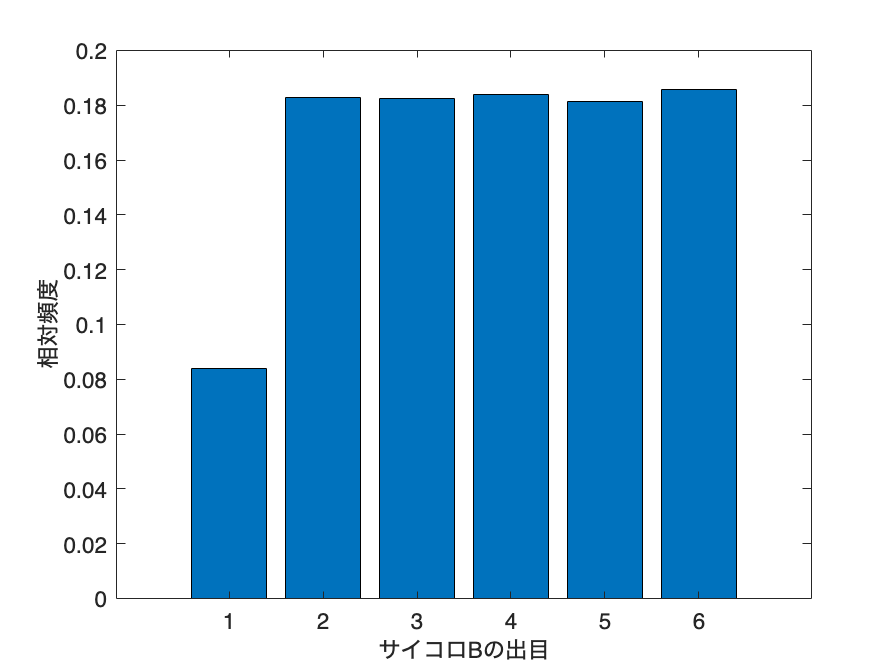

# <span style="color:rgb(213,80,0)">6.4 「つながり」をとらえる</span>
## 図 6.4.1 サイコロの同時確率と条件付き確率
```matlab
% 確率分布を準備
joint_prob = [
    (1 / 36 - 1 / 72), (1 / 36 + 1 / 72 / 5), (1 / 36 + 1 / 72 / 5), (1 / 36 + 1 / 72 / 5), (1 / 36 + 1 / 72 / 5), (1 / 36 + 1 / 72 / 5);
    (1 / 36 + 1 / 72 / 5), (1 / 36 - 1 / 72), (1 / 36 + 1 / 72 / 5), (1 / 36 + 1 / 72 / 5), (1 / 36 + 1 / 72 / 5), (1 / 36 + 1 / 72 / 5);
    (1 / 36 + 1 / 72 / 5), (1 / 36 + 1 / 72 / 5), (1 / 36 - 1 / 72), (1 / 36 + 1 / 72 / 5), (1 / 36 + 1 / 72 / 5), (1 / 36 + 1 / 72 / 5);
    (1 / 36 + 1 / 72 / 5), (1 / 36 + 1 / 72 / 5), (1 / 36 + 1 / 72 / 5), (1 / 36 - 1 / 72), (1 / 36 + 1 / 72 / 5), (1 / 36 + 1 / 72 / 5);
    (1 / 36 + 1 / 72 / 5), (1 / 36 + 1 / 72 / 5), (1 / 36 + 1 / 72 / 5), (1 / 36 + 1 / 72 / 5), (1 / 36 - 1 / 72), (1 / 36 + 1 / 72 / 5);
    (1 / 36 + 1 / 72 / 5), (1 / 36 + 1 / 72 / 5), (1 / 36 + 1 / 72 / 5), (1 / 36 + 1 / 72 / 5), (1 / 36 + 1 / 72 / 5), (1 / 36 - 1 / 72)];
joint_prob = joint_prob / sum(joint_prob,'all');

% サンプリング（1000回）
rng('default'); % 再現性のため

% 1~n の整数から非復元抽出: randsample
samples = randsample(36,1000000,true,joint_prob(:)); %サンプルをjoint_probに従って1000回サンプリング
samples = samples - 1; % 0~n-1 に調整

% サンプリングされた値を(X,Y)ペアに変換
samples_die1 = floor(samples/6)+1;
samples_die2 = mod(samples,6)+1;

% 結果を集計する(ヒートマップ用)
heatmap_data_sampled = zeros(6,6);
for kk = 1:1000000
    heatmap_data_sampled(samples_die1(kk),samples_die2(kk)) ...
        = heatmap_data_sampled(samples_die1(kk),samples_die2(kk)) + 1/1000000;
end

% ヒートマップを描画
figure;
h = heatmap(1:6,1:6,heatmap_data_sampled);
h.Colormap = parula; % colormapの設定
h.Title = 'Dice Sampling Heatmap';
h.XLabel = 'サイコロBの出目';
h.YLabel = 'サイコロAの出目';
fontsize(14,'points')

print('6_4_1_1_dice_experiment_1_heatmap', '-dpng', '-r300'); %図の保存
```

<center></center>


```matlab
% サイコロAが1が出たときのサイコロBの結果を棒グラフで描画
figure;
samples_die2_filtered = samples_die2(samples_die1 == 1);
histogram_data = histcounts(samples_die2_filtered, 1:7);
bar(1:6,histogram_data/sum(histogram_data)); % 相対頻度を計算してから描画
xlabel('サイコロBの出目'); % x軸ラベルを設定
ylabel('相対頻度'); % y軸ラベルを設定
fontsize(14,'points')

print('6_4_1_2_dice_experiment_1_bar', '-dpng', '-r300'); %図の保存
```

<center></center>

## 図 6.4.3 各試行での出目の発生確率
## 図 6.4.4 サイコロ出目の時間的な関係
```matlab
n_trials = 100000;

% サイコロの実験をシミュレーションする関数
rng('default'); % シード設定

% ボーナスタイムと通常時の確率
bonus_prob = [1 / 11, 2 / 11, 2 / 11, 2 / 11, 2 / 11, 2 / 11];
normal_prob = [2 / 11, 9 / 55, 9 / 55, 9 / 55, 9 / 55, 9 / 55];
faces = 1:6;

% 結果の格納用
heatmap_data = zeros(6, 6);
bonus_time_die1 = [];
bonus_time_die2 = [];
samples_die1 = zeros(n_trials,1);
samples_die2 = zeros(n_trials,1);
bonus_time = false;

for i = 1:n_trials
    if bonus_time
        die1 = randsample(faces, 1, true, bonus_prob);  % ボーナスタイム時のサイコロAの出目
        die2 = randsample(faces, 1, true, bonus_prob);  % ボーナスタイム時のサイコロBの出目
        samples_die1(i) = die1;
        samples_die2(i) = die2;
        bonus_time_die1 = [bonus_time_die1; die1];
        bonus_time_die2 = [bonus_time_die2; die2];
    else
        die1 = randsample(faces, 1, true, normal_prob);  % 通常時のサイコロAの出目
        die2 = randsample(faces, 1, true, normal_prob);  % 通常時のサイコロBの出目
        samples_die1(i) = die1;
        samples_die2(i) = die2;
    end

    heatmap_data(die1, die2) = heatmap_data(die1, die2) + 1;
    bonus_time = (die1 == 1);
end

heatmap_data = heatmap_data / sum(sum(heatmap_data));

% ヒートマップを描画
figure;
h = heatmap(1:6,1:6,heatmap_data);
h.Colormap = parula; % colormapの設定
h.XLabel = 'サイコロBの出目';
h.YLabel = 'サイコロAの出目';
fontsize(14,'points')
print('../figures/6_4_3_1_dice_experiment_2_heatmap', '-dpng', '-r300'); %図の保存
```

<center></center>


```matlab

% サイコロAが1が出たときのサイコロBの結果を棒グラフで描画
figure;

% データの集計
condition = samples_die1 == 1;
counts = histcounts(samples_die2(condition), Normalization='probability');

% 棒グラフの描画
bar(1:6, counts);

xlabel("サイコロBの出目");
ylabel("相対頻度");
fontsize(14,'points')

print('../figures/6_4_3_2_dice_experiment_2_bar', '-dpng', '-r300'); %図の保存
```

<center></center>


```matlab
% サンプルされた二つのサイコロの時系列を折れ線グラフ
figure(Position=[100,100,1000,400]);

% データの折れ線グラフの描画
hold on;
h1 = plot(1:50, samples_die1(1:50), 'o-', MarkerFaceColor='blue', DisplayName='Die 1');
h2 = plot(1:50, samples_die2(1:50), 'o-', MarkerFaceColor='red', DisplayName='Die 2');

% サイコロAで1が出た場合（ボーナスタイム）に背景色をつける
idx = find(samples_die1(1:50)==1);
x_background = [idx+0.5, idx+1.5];
xregion(x_background,FaceColor='blue')

ylabel("サイコロの出目");
xlabel("試行回数");
grid on
xlim([-2, 52]);
ylim([0.7, 6.2]);
fontsize(16,'points')
legend([h1,h2],Location='northwestoutside'); %凡例表示
print('../figures/6_4_4_1_dice_experiment_2_time_series', '-dpng', '-r300'); %図の保存
```

<center></center>


```matlab

% ボーナスタイム時の棒グラフを描画する関数
figure(Position=[100,100,1000,400]);
tiledlayout('horizontal')

nexttile;
hold on;
% データの集計
counts1 = histcounts(bonus_time_die1,Normalization="probability");

% 棒グラフの描画
bar(1:6, counts1, FaceColor='blue', EdgeColor='black', FaceAlpha=0.7);

xlabel("サイコロAの出目");
ylabel("相対頻度");

nexttile
hold on;
% データの集計
counts2 = histcounts(bonus_time_die2,Normalization="probability");

% 棒グラフの描画
bar(1:6, counts2, FaceColor='red', EdgeColor='black', FaceAlpha=0.7);

xlabel("サイコロBの出目");
ylabel("相対頻度");
fontsize(14,'points')

print('../figures/6_4_4_2_dice_experiment_2_conditioned_bar', '-dpng', '-r300'); %図の保存
```

<center></center>

