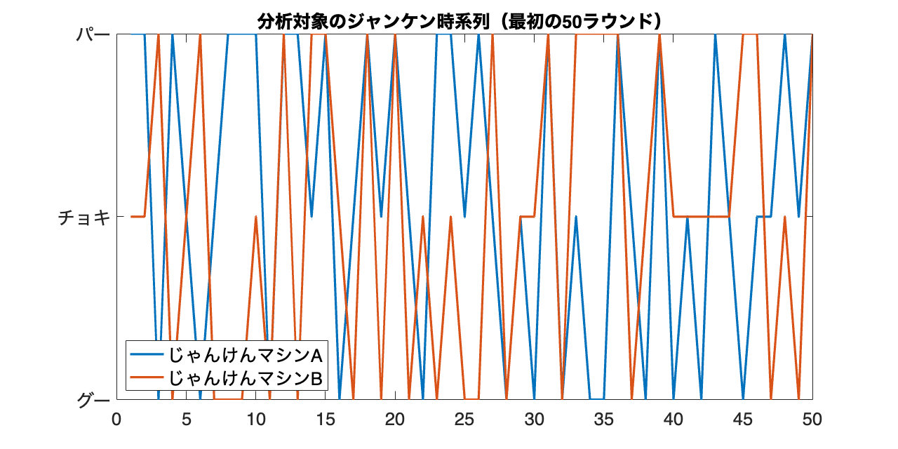
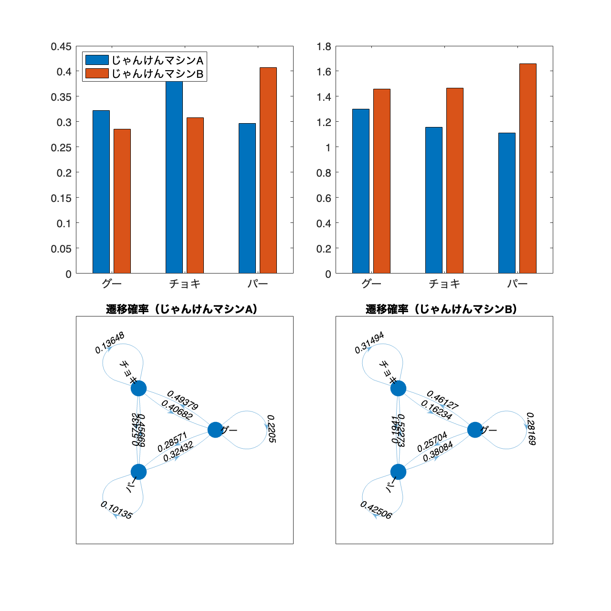
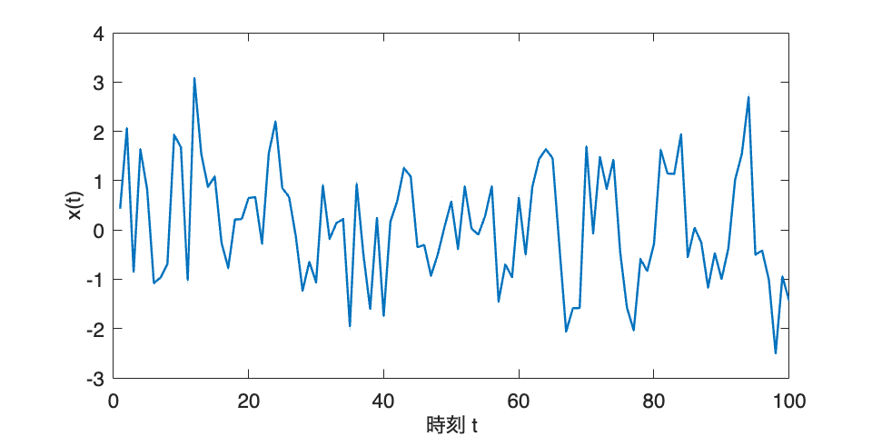
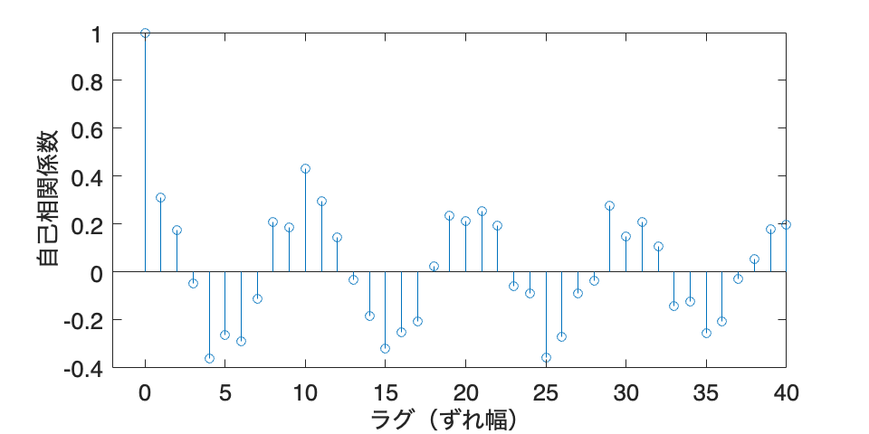
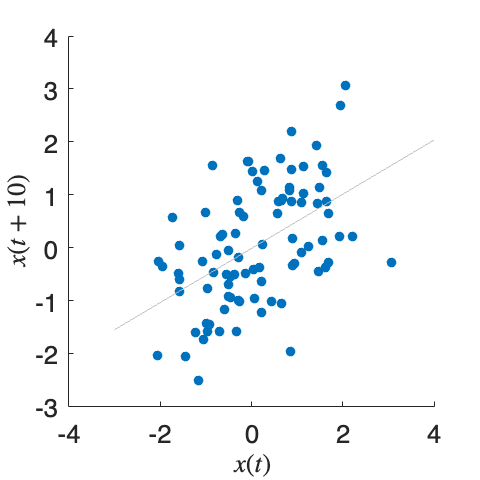

# <span style="color:rgb(213,80,0)">7.1 時間的なパターンをとらえる</span>
## 図 7.1.1 じゃんけんマシンの分析
```matlab
% シード値を固定
rng('default');

% じゃんけんの手を表す定数
ROCK = 1;
SCISSORS = 2;
PAPER = 3;

% じゃんけんマシンAの遷移確率
transition_prob_A = [
    0.2, 0.5, 0.3;
    0.4, 0.1, 0.5;
    0.3, 0.6, 0.1
];

% じゃんけんマシンBの遷移確率
transition_prob_B = [
    0.3, 0.4, 0.3;
    0.2, 0.3, 0.5;
    0.4, 0.2, 0.4
];

% データ生成（generate_data 関数はスクリプトの下部に定義）
data_A = generate_data(transition_prob_A, 1000);
data_B = generate_data(transition_prob_B, 1000);

% 最初の50回のじゃんけんの時系列を折れ線グラフで描画
figure(Position=[100,100,800,400]);
plot(1:50, data_A(1:50), LineWidth=2, DisplayName="じゃんけんマシンA")  % じゃんけんマシンAの時系列を描画
hold on;
plot(1:50, data_B(1:50), LineWidth=2, DisplayName="じゃんけんマシンB")  % じゃんけんマシンBの時系列を描画
title('分析対象のジャンケン時系列（最初の50ラウンド）');  % タイトルを設定

yticks([ROCK, SCISSORS, PAPER]);  % y軸の目盛りを設定
yticklabels(["グー","チョキ","パー"]);  % y軸の目盛りのラベルを設定
legend('show', 'Location', 'southwest');  % 凡例を表示
fontsize(16,'points')
print('../figures/7_1_1_janken_time_series','-dpng','-r300');  % 図の保存
```

<center></center>


```matlab

% じゃんけんマシンAとBの各手の連続回数の平均値を計算（calculate_run_mean 関数はスクリプトの下部に定義）
mean_run_A = calculate_run_mean(data_A);
mean_run_B = calculate_run_mean(data_B);

% 実際のデータから遷移確率を計算（calculate_empirical_transition_prob 関数はスクリプトの下部に定義）
transition_prob_emp_A = calculate_empirical_transition_prob(data_A);
transition_prob_emp_B = calculate_empirical_transition_prob(data_B);

% 描画（集団棒グラフとネットワークグラフを含む）
figure(Position=[100,100,800,800]);
tiledlayout(2,2,TileSpacing="compact");

% 出現頻度を描画
nexttile
run_A = [sum(data_A == ROCK) / 1000, sum(data_A == SCISSORS) / 1000, sum(data_A == PAPER) / 1000];
run_B = [sum(data_B == ROCK) / 1000, sum(data_B == SCISSORS) / 1000, sum(data_B == PAPER) / 1000];
% bar();  % じゃんけんマシンA, Bの出現頻度を描画
bar([run_A; run_B]')
xticklabels(["グー", "チョキ", "パー"]);  % x軸の目盛りのラベルを設定
legend('じゃんけんマシンA', 'じゃんけんマシンB','Location','northwest');  % 凡例を表示

% 各手の連続回数の平均値を描画
nexttile
%Connectivity of じゃんけんマシン A, B
bar([mean_run_A; mean_run_B]')
xticklabels(["グー", "チョキ", "パー"]);  % x軸の目盛りのラベルを設定

% 遷移確率のネットワークグラフを描画
nexttile
d1 = digraph(transition_prob_emp_A, ["グー", "チョキ", "パー"]);
h1 = plot(d1,Layout="circle",MarkerSize=20);
h1.EdgeLabel = d1.Edges.Weight;
h1.EdgeFontSize = 12;
h1.NodeFontSize = 12;
title('遷移確率（じゃんけんマシンA）')

nexttile
d2 = digraph(transition_prob_emp_B, ["グー", "チョキ", "パー"]);
h2 = plot(d2,Layout="circle",MarkerSize=20);
h2.EdgeLabel = d2.Edges.Weight;
h2.EdgeFontSize = 12;
h2.NodeFontSize = 12;
title('遷移確率（じゃんけんマシンB）');

fontsize(14,'points')
print('../figures/7_1_1_janken_transition_analysis.png','-dpng','-r300');  % 図の保存
```

<center></center>

## 図 7.1.2 自己相関で周期的なパターンを検出する
```matlab
% 変数定義と乱数生成
rng('default');  % シード値を固定
n = 100;  % データ数
x = linspace(0, 100, n);  % 0から100まで
y = sin(pi / 5 * x) + 0.8 * randn(size(x));  % 正弦波にノイズを加える

% 元の時系列データをプロット
figure(Position=[10 10 600 300]);
plot(y, LineWidth=1.5);
xlabel('時刻 t');
ylabel('x(t)');
fontsize(14,'points')
print('../figures/7_1_2_1_original_time_series','-dpng', '-r300');
```

<center></center>


```matlab

% 自己相関プロットを作成
figure(Position=[10 10 600 300]);

[c,lags] = xcorr(y,40,'normalized');
idx = lags >= 0; % 正のラグだけ表示
stem(lags(idx),c(idx))
xlabel('ラグ（ずれ幅）');
ylabel('自己相関係数');
fontsize(16,'points');
xlim([-2,40])
print('../figures/7_1_2_2_autocorr.png','-dpng', '-r300');
```

<center></center>


```matlab

% ラグ10のラグプロット
lag = 10;
x = y(1:end-lag);
x_lag10 = y(1+lag:end);

% 相関係数を計算
corr = corrcoef(x, x_lag10);
disp("Correlation Coefficient: " + num2str(corr(2), '%.2f'))
```

```TextOutput
Correlation Coefficient: 0.50
```

```matlab

% ラグプロットの作成
figure(Position=[10 10 300 300]);
scatter(x, x_lag10, 'filled');
xlabel(' !!!EQ_1!!! ', Interpreter='latex');
ylabel([' !!!EQ_2!!! '], Interpreter='latex');
lsline  % 近似直線描画
fontsize(16,'points')
print('../figures/7_1_2_3_lag_plot.png','-dpng', '-r300');
```

<center></center>

## 図 7.1.3 フーリエ変換で周波数の情報を取り出す

## 図 7.1.4 周波数の時間変化を見る

## 図 7.1.5 心電図データの分析

## 補助関数：図 7.1.1 じゃんけんマシンの分析
### データ生成関数
```matlab
function states = generate_data(transition_prob, n)
    ROCK = 1;
    SCISSORS = 2;
    PAPER = 3;

    states = zeros(n,1);
    states(1) = randi([ROCK, PAPER]);  % 初期状態をランダムに選択
    for idx = 2 : n
        current_state = states(idx - 1);  % 現在の状態
        next_state = randsample([ROCK, SCISSORS, PAPER], 1, true, transition_prob(current_state, :));  % 遷移確率に従って次の状態を選択
        states(idx) = next_state;  % 状態を追加
    end
end
```
### 各手の連続回数の平均値を計算する関数
```matlab
function mean_run = calculate_run_mean(data)
    ROCK = 1;
    SCISSORS = 2;
    PAPER = 3;

    run_count = ones(1, length(data));
    for idx = 2 : length(data)
        if data(idx) == data(idx - 1)  % 前回と同じ手が出たら
            run_count(idx) = run_count(idx - 1) + 1;  % 連続回数をカウントアップ
        end
    end
    mean_run = [mean(run_count(data == ROCK)), mean(run_count(data == SCISSORS)), mean(run_count(data == PAPER))];
end

```
### データから遷移確率を計算する関数
```matlab
function transition_prob_emp = calculate_empirical_transition_prob(data)
    counts = zeros(3);
    for idx = 1:length(data) - 1
        current_state = data(idx);  % 現在の状態
        next_state = data(idx + 1);  % 次の状態
        counts(current_state, next_state) = counts(current_state, next_state) + 1;  % 遷移回数をカウントアップ
    end
    transition_prob_emp = counts ./ sum(counts, 2);  % 遷移確率を計算
end
```
