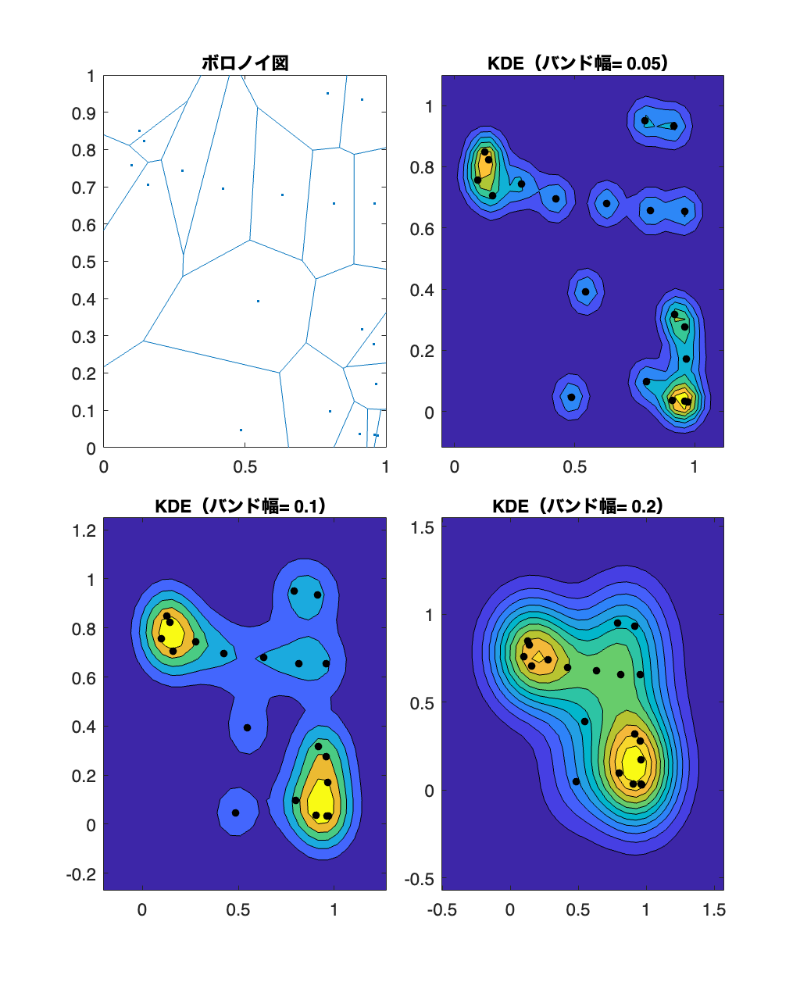
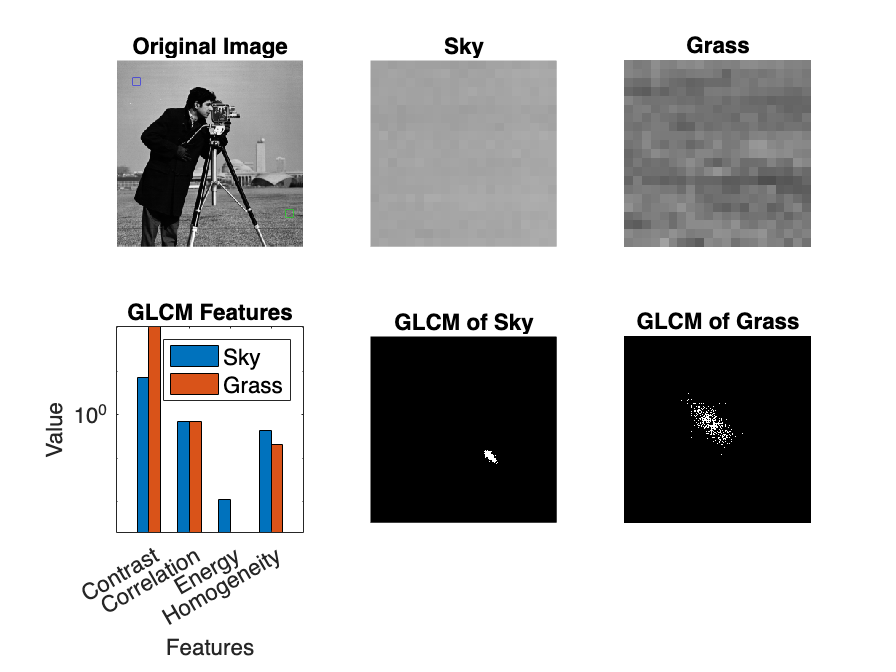

# <span style="color:rgb(213,80,0)">7.2 空間データのパターンをとらえる</span>
## 図 7.2.1 ボロノイ図による空間の分割

## 図 7.2.2 カーネル密度推定による空間の利用密度の定量化
```matlab
rng('default'); % シード値を固定
points = rand(20, 2); % ランダムな点を生成

% 関心領域から遠く離れた4点を追加
far_points = [-1, -1; 2, -1; 2, 2; -1, 2];

% 新しい点セットを作成
new_points = [points; far_points];

% カーネル密度推定のバンド幅を三種類設定
bandwidths = [0.05, 0.1, 0.2];
kde_pdf = struct();

for idx = 1:3 % バンド幅ごとに処理
    % デフォルトで 30x30 の 900 点での pdf が返されます
    % カーネル密度推定のインスタンスを生成
    [f,xi] = ksdensity(points,Bandwidth=bandwidths(idx),Function='pdf');

    % 2D に整形しとく
    kde_pdf(idx).X = reshape(xi(:,1),30,30);
    kde_pdf(idx).Y = reshape(xi(:,2),30,30);
    kde_pdf(idx).Z = reshape(f,30,30);
end

% 描画
figure(Units='normalized',Position=[0,0,0.5,1]);
tiledlayout(2,2,TileSpacing="compact")

nexttile
voronoi(points(:,1),points(:,2));
title('ボロノイ図')

for idx = 1:3
    nexttile
    contourf(kde_pdf(idx).X,kde_pdf(idx).Y,kde_pdf(idx).Z)
    hold on;
    scatter(points(:, 1), points(:, 2), 'k', 'filled');
    title(['KDE（バンド幅= ', num2str(bandwidths(idx)), '）']);
    hold off;
end
fontsize(14,'points')
print('../figures/7_2_2_KDE','-dpng','-r300')
```

<center></center>

## 図 7.2.3 グレイレベル共起行列を用いた分析
```matlab
PATCH_SIZE = 21;

% 書籍の写真とは若干異なるが、skimage の data.camera の代わりに
% ここでは MATLAB に用意されているカメラマン画像を読み込む
image = imread('cameraman.tif');

% 256x256
% 画像の一部を切り出し（grass）
grass_patch = image(200:200 + PATCH_SIZE - 1, 227:227 + PATCH_SIZE - 1);

% 画像の一部を切り出し（sky）
sky_patch = image(19:19 + PATCH_SIZE - 1, 17:17 + PATCH_SIZE - 1);

% GLCM/指標の計算
features = ["Contrast", "Correlation", "Energy", "Homogeneity"];
grayco_grass = graycomatrix(grass_patch,Offset=[0 1],Symmetric=true, NumLevels=256);
grass_features = graycoprops(grayco_grass, 'all')
```

```TextOutput
grass_features = 
       Contrast: 106.3643
    Correlation: 0.6984
         Energy: 0.0019
    Homogeneity: 0.2023
```

```matlab

grayco_sky = graycomatrix(sky_patch,Offset=[0 1],Symmetric=true, NumLevels=256);
sky_features = graycoprops(grayco_sky, 'all');

% 描画
figure;
tiledlayout(2,3,TileSpacing="compact")

% 元画像の表示
nexttile
imshow(image, []);
title('Original Image');
hold on;
plot(227 + PATCH_SIZE / 2, 200 + PATCH_SIZE / 2, 'gs');  % Grass
plot(17 + PATCH_SIZE / 2, 19 + PATCH_SIZE / 2, 'bs');   % Sky
hold off;

% 切り出した画像の表示（sky, grass）
nexttile
imshow(sky_patch);
title('Sky');

nexttile
imshow(grass_patch);
title('Grass');

% 棒グラフで指標を表示
nexttile
bar(categorical(features), [struct2array(sky_features)' struct2array(grass_features)'], 'BarWidth', 1);
yscale('log');
ylabel('Value');
xlabel('Features');
title('GLCM Features');
legend('Sky', 'Grass');

% GLCMの表示（sky）
nexttile
imshow(grayco_sky);
title('GLCM of Sky');

% GCMLの表示（grass）
nexttile
imshow(grayco_grass);
title('GLCM of Grass');

fontsize(14,'points')
% 画像の保存
print('../figures/7_2_3_glcm','-dpng', '-r300');
```

<center></center>

