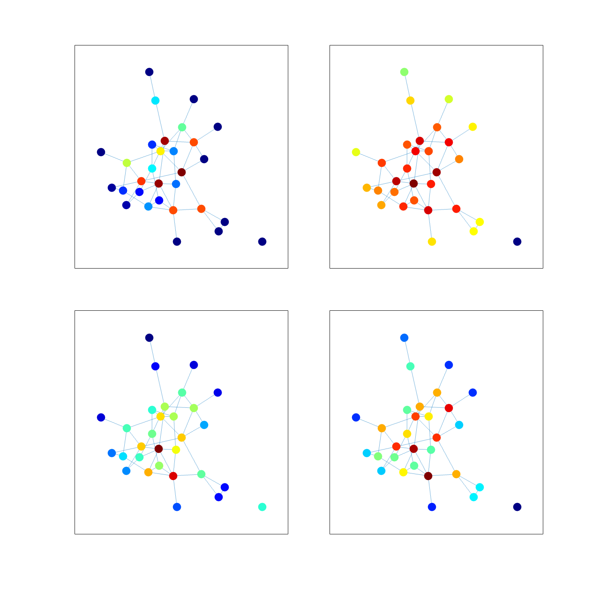

# <span style="color:rgb(213,80,0)">7.3 ネットワークのパターンをとらえる</span>
## 図 7.3.1 様々な中心性指標
```matlab
% 適当なネットワークを生成
rng('default')
A = rand(30) < 0.09;
G = graph(triu(A),'upper','omitselfloops');

% Betweenness Centralityを計算
betweenness_centrality = centrality(G, 'betweenness');

% Closeness Centralityを計算
closeness_centrality = centrality(G, 'closeness');

% Eigen Centralityを計算
eigen_centrality = centrality(G, 'eigenvector');

% Page Rankを計算
page_rank = centrality(G, 'pagerank');

% サブプロットを描画
fig = figure(Position=[100,100,1200,1200]);
tiledlayout(2,2,TileSpacing="compact");

% Betweenness Centrality
nexttile
plot(G,MarkerSize=10, NodeCData=betweenness_centrality, NodeLabel=[]);

% Closeness Centrality
nexttile
plot(G,MarkerSize=10, NodeCData=closeness_centrality, NodeLabel=[]);

% Eigen Centrality
nexttile
plot(G, MarkerSize=10, NodeCData=eigen_centrality, NodeLabel=[]);

% Page Rank
nexttile
plot(G, MarkerSize=10, NodeCData=page_rank, NodeLabel=[]);

colormap('jet')
print('../figures/7_3_1_network_centrality_measures', '-dpng', '-r300');  % 図を保存
```

<center></center>

## 図 7.3.2 様々なネットワーク指標の計算例

