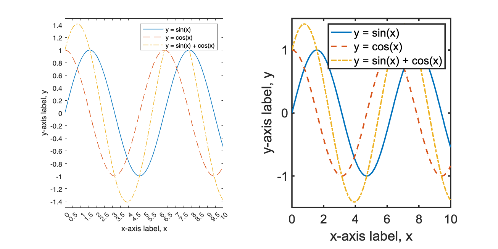
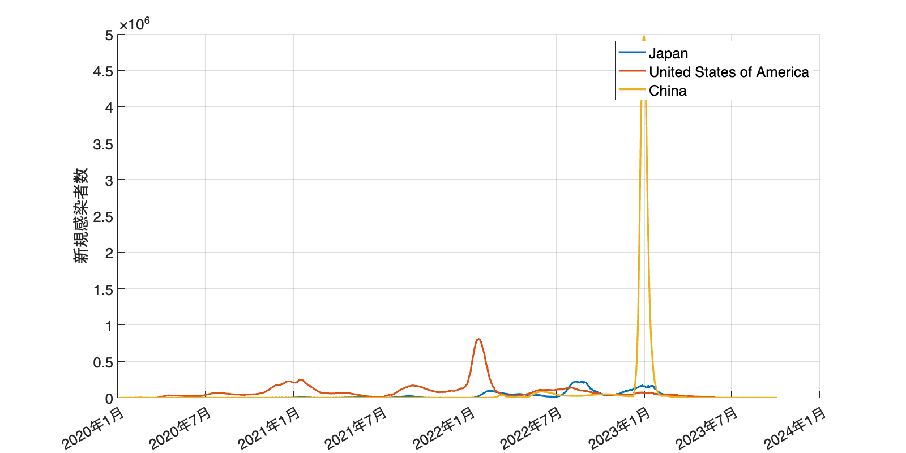
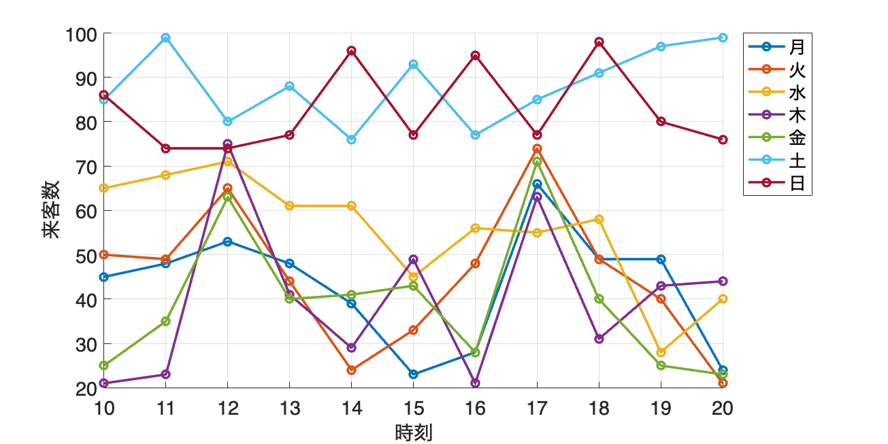
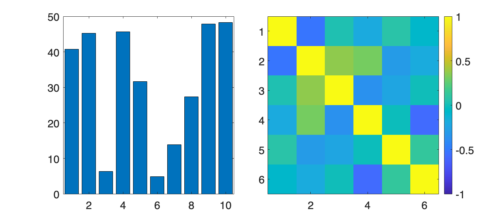
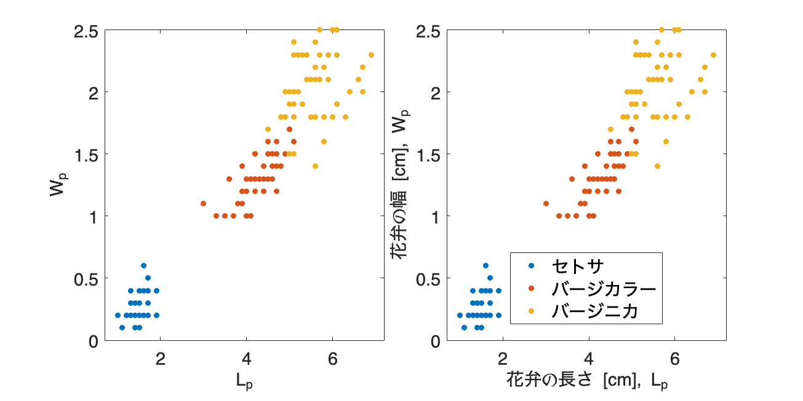
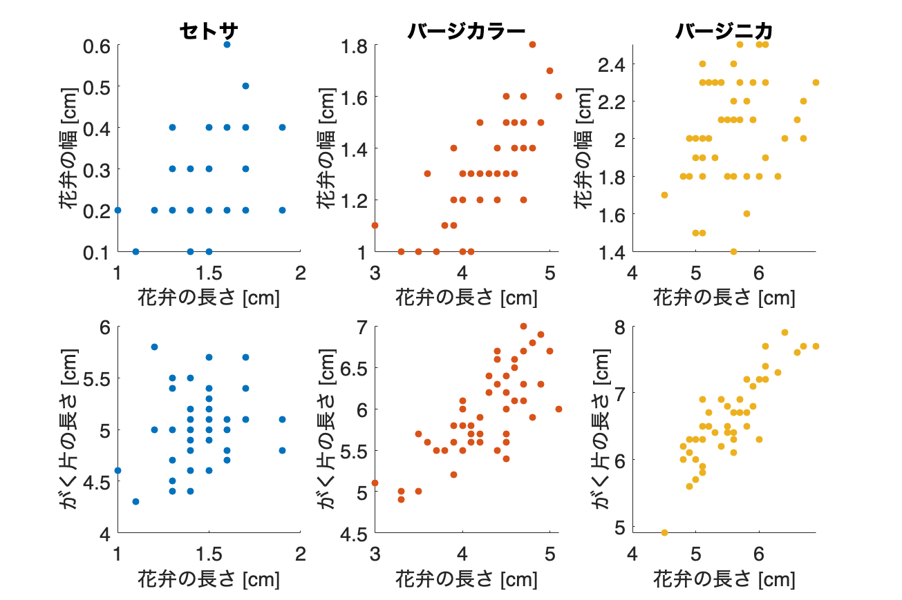

# <span style="color:rgb(213,80,0)">8.1 効果的な可視化のテクニック</span>
## 図 8.1.1 見づらい図と見やすい図
```matlab
% データの生成
x = linspace(0, 10, 100);
y1 = sin(x);
y2 = cos(x);
y3 = y1 + y2;

% 作成
figure(Position=[100,100, 1000, 500]);
tiledlayout('horizontal')

% 見づらい図
htt = nexttile;
plot(x, y1, LineWidth=0.8), hold on; % y = sin(x)
plot(x, y2, LineStyle='--', LineWidth=0.8); % y = cos(x)
plot(x, y3, LineStyle='-.', LineWidth=0.8); % y = sin(x) + cos(x)

ht1.FontName = 'Times New Roman';
ht1.LineWidth = 0.5; % 軸の線を細くする
ht1.FontSize = 8;
xticks(linspace(0, 10, 21));
yticks(linspace(-3, 3, 31));
xlabel('x-axis label, x'), ylabel('y-axis label, y');
legend('y = sin(x)','y = cos(x)','y = sin(x) + cos(x)');

% 見やすい図
ht2 = nexttile;

plot(x, y1, LineWidth=2), hold on; % y = sin(x)
plot(x, y2, LineStyle='--', LineWidth=2); % y = cos(x)
plot(x, y3, LineStyle='-.', LineWidth=2); % y = sin(x) + cos(x)

ht2.FontName = 'Arial';
ht2.LineWidth = 2; % 軸の線を太く
ht2.FontSize = 18;

xticks(linspace(0, 10, 6));
yticks(linspace(-3, 3, 7));
xlabel('x-axis label, x'), ylabel('y-axis label, y');
legend('y = sin(x)','y = cos(x)','y = sin(x) + cos(x)');
% 図の保存
print('../figures/8_1_1_visibility_example','-dpng','-r300');
```

<center></center>

## 図 8.1.2 グラフの縦横比と軸の範囲
```matlab
% データの定義
x = [0, 1, 2, 3, 4, 5, 6, 7, 8, 9, 10];
y1 = [11, 11.2, 11.5, 12, 12.2, 13, 14.2, 14.5, 15, 15.6, 16];
y2 = [11.1, 11.3, 11.4, 11.9, 12.1, 12.8, 14.0, 14.2, 14.7, 15.0, 15.5];

% グラフパターンと保存設定
patterns = [
    struct('figsize', [5, 3], 'ylim', [10.5, 16.5], 'filename', '1_scale_example'),
    struct('figsize', [5, 3], 'ylim', [0, 30], 'filename', '2_scale_example'),
    struct('figsize', [9, 3], 'ylim', [10.5, 16.5], 'filename', '3_scale_example'),
    struct('figsize', [3, 6], 'ylim', [10.5, 16.5], 'filename', '4_scale_example'),
    ];

for ii = 1:4
    pattern = patterns(ii);
    figure(Position=[10 10 pattern.figsize*100]); % 図の準備

    plot(x, y1, 'o-', 'DisplayName', 'y1');  % y1の折れ線グラフを描画
    hold on;  % グラフの重複表示を許可
    plot(x, y2, 'x-', 'DisplayName', 'y2');  % y2の折れ線グラフを描画

    xlabel('x');  % x軸ラベル
    ylabel('y');  % y軸ラベル
    ylim(pattern.ylim);  % y軸の範囲を設定
    legend;  % 凡例を表示
    fontsize(14,'points')

    % 図の保存
    print("../figures/8_1_2_"+ pattern.filename, '-dpng', '-r300');
end
```

<center></center>


<center></center>


<center></center>


<center></center>

## 図 8.1.3 片対数グラフを利用する
```matlab
% ファイル読み込み
% このデータはダミーデータです
file_path = fullfile("data","covid_data_dummy.csv")
```

```TextOutput
file_path = "data/covid_data_dummy.csv"
```

```matlab
data = readtable(file_path, TextType="string"); % 文字列は string 型で読み込む

% Country にはこの時点で３カ国しかないが・・
unique(data.Country)
```

```TextOutput
ans = 3x1 string    
"China"                 
"Japan"                 
"United States of Ame…  
```

```matlab
% 日本、アメリカ、中国のデータを抜き出す
selected_countries = ["Japan", "United States of America", "China"];
idx = ismember(data.Country, selected_countries);
filtered_data = data(idx, :);

% 日付をDatetime形式に変換
filtered_data.Date_reported = datetime(filtered_data.Date_reported);

% 14日の移動平均を計算
filtered_data = grouptransform(data,"Country",@(x) movmean(x,[13,0],'omitnan'),"New_cases");
% 以下の処理と同値
% for i = 1:numel(selected_countries)
%     country = selected_countries{i};
%     country_idx = strcmp(filtered_data.Country, country);
%     country_df = filtered_data(country_idx, :);
%     filtered_data.New_cases(country_idx) = movmean(country_df.New_cases, [13 0], 'omitnan');
% end

% 通常の縦軸
figure(Position=[10 10 1000 500]);
hold on;
for ii = 1:numel(selected_countries)
    country = selected_countries(ii);
    idx = filtered_data.Country == country;
    country_data = filtered_data(idx, :);
    plot(country_data.Date_reported, country_data.New_cases, ...
        LineWidth=2, DisplayName=country);
end
hold off;

% 凡例、グリッドを表示
legend;
grid on;

% フォントサイズを指定＋目盛ラベルの回転
fontsize(16,'points')
xtickangle(30);
ylabel('新規感染者数');

% 画像を保存
print('../figures/8_1_3_1_normal_axis_plot', '-dpng', '-r300');
```

<center></center>


```matlab

% 対数縦軸
figure(Position=[10 10 1000 500]);
hold on;
for ii = 1:numel(selected_countries)
    country = selected_countries(ii);
    idx = filtered_data.Country == country;
    country_data = filtered_data(idx, :);
    plot(country_data.Date_reported, country_data.New_cases, ...
        LineWidth=2, DisplayName=country);
    yscale('log')
end
hold off;

% 凡例、グリッドを表示
legend;
grid on;

% フォントサイズを指定+目盛ラベルの回転
fontsize(16,'points')
xtickangle(30);
ylabel('新規感染者数');

% 画像を保存
print('../figures/8_1_3_2_log_axis_plot', '-dpng', '-r300');
```

<center></center>

## 図 8.1.4 凡例を近くに置く
```matlab
rng('default'); % 乱数のシードを固定
% rng(0, 'twister'); % <= 同じ意味

% 月曜日から日曜日までの7日間
days_of_week = ["月", "火", "水", "木", "金", "土", "日"];

% 各時刻
hours_of_day = [10, 11, 12, 13, 14, 15, 16, 17, 18, 19, 20];

% データ作成
visitor_count = array2table(zeros(7, 11), ...
    VariableNames=string(hours_of_day), ...
    RowNames=days_of_week);

% 各日、各時刻の来客数をパターンに基づいて生成(関数は下部で定義)
for day = 1:numel(days_of_week)
    visitor_count{day, :} = generate_visitor_count_with_wednesday(days_of_week{day}, hours_of_day);
end

% 折れ線グラフを描画
figure(Position=[100, 100, 800, 400])
hold on
for day = 1:numel(days_of_week)
    plot(hours_of_day, visitor_count{day, :}, Marker='o', LineWidth=2)
end

xlabel('時刻')  % x軸ラベル
ylabel('来客数')  % y軸ラベル
xticks(hours_of_day)  % x軸の目盛を設定
fontsize(16,'points')
legend(visitor_count.Properties.RowNames, ...
    Location='NorthEastOutside')  % 凡例を表示
grid on  % グリッドを表示

print('../figures/8_1_4_1_legend_example_with_legend_box', '-dpng', '-r300')  % 図の保存
```

<center></center>


```matlab

% 折れ線グラフを描画
figure(Position=[100, 100, 800, 400])
hold on
for day = 1:numel(days_of_week)
    plot(hours_of_day, visitor_count{day, :}, Marker='o', LineWidth=2)
end

xlabel('時刻')  % x軸ラベル
ylabel('来客数')  % y軸ラベル
xticks(hours_of_day)  % x軸の目盛を設定
fontsize(16,'points')
grid on  % グリッドを表示

print('../figures/8_1_4_2_legend_example_without_legend_box', '-dpng', '-r300')  % 図の保存
```

<center></center>

## 図 8.1.5 色を抑えて強調
```matlab
% 乱数のシードを設定
rng('default'); % 乱数のシードを固定

% 月曜日から日曜日までの7日間
days_of_week = ["月", "火", "水", "木", "金", "土", "日"];

% 各時刻
hours_of_day = [10, 11, 12, 13, 14, 15, 16, 17, 18, 19, 20];

% データ作成
visitor_count = array2table(zeros(7, 11), ...
    VariableNames=string(hours_of_day), ...
    RowNames=days_of_week);

% 各日、各時刻の来客数をパターンに基づいて生成(関数は下部で定義)
for day = 1:numel(days_of_week)
    visitor_count{day, :} = generate_visitor_count_with_wednesday(days_of_week{day}, hours_of_day);
end

% 折れ線グラフを描画
figure(Position=[10, 10, 800, 400])
hold on
for day_idx = 1:7
    day = days_of_week(day_idx);
    linestyle = '-';
    color = 'black';
    if day=="水"
        color = 'red';
    elseif any(day==["土", "日"])
        linestyle = '--';
    end

    plot(hours_of_day, visitor_count{day, :}, ...
        DisplayName=day, Marker='o', LineWidth=2, ...
        LineStyle=linestyle, Color=color);
end
xlabel('時刻');
ylabel('来客数');
xticks(hours_of_day);
fontsize(16,'points')
grid on

% save figure
print('../figures/8_1_5_legend_highlight', '-dpng', '-r300')
print('../figures/8_1_5_legend_highlight', '-dsvg', '-r300')
```

<center></center>

## 図 8.1.6 図内に値を直接記入する
```matlab
% 乱数のシードを固定
rng('default'); 

% 10変数、各時系列の長さはL=20でランダムデータを生成（正の値のみ）
% 乱数は0から1の範囲で生成される
L = 20;
data = array2table(rand(L,6)*50, 'VariableNames', ["A", "B", "C", "D", "E", "F"]) % 変数名をA, B, C, ...とする
```
| |A|B|C|D|E|F|
|:--:|:--:|:--:|:--:|:--:|:--:|:--:|
|1|40.7362|32.7870|21.9372|37.5634|17.5830|8.1091|
|2|45.2896|1.7856|19.0779|12.7548|41.5414|39.7142|
|3|6.3493|42.4565|38.2758|25.2979|29.2632|15.5608|
|4|45.6688|46.6997|39.7600|34.9538|27.4862|26.4267|
|5|31.6180|33.9368|9.3436|44.5452|45.8597|8.2824|
|6|4.8770|37.8870|24.4882|47.9646|14.2920|30.0991|
|7|13.9249|37.1566|22.2793|27.3608|37.8600|13.1486|
|8|27.3441|19.6114|32.3157|6.9312|37.6865|32.7040|
|9|47.8753|32.7739|35.4682|7.4647|19.0223|34.4607|
|10|48.2444|8.5593|37.7343|12.8754|28.3911|37.4076|
|11|7.8807|35.3023|13.8013|42.0359|3.7927|22.5271|
|12|48.5296|1.5916|33.9851|12.7141|2.6975|4.1911|
|13|47.8583|13.8461|32.7549|40.7142|26.5399|11.4488|
|14|24.2688|2.3086|8.1306|12.1762|38.9584|45.6669|

```matlab

% 相関係数を計算
correlation_matrix = corrcoef(table2array(data));

% サブプロットを作成（1行、2列）
figure(Position=[100,100,1000,450])
tiledlayout('horizontal',TileSpacing='compact')

nexttile
% 棒グラフのサブプロット（1変数目（'A'）を使用）
bar(data.A) % 棒グラフを描画
xlim([0.50,10.5]); % x軸の範囲を設定 

nexttile
% ヒートマップのサブプロット
imagesc(correlation_matrix); % 画像で表示
colormap(parula)
colorbar;
clim([-1 1]); % カラースケールの範囲を指定

fontsize(16,'points')
print("../figures/8_1_6_1_heatmap_and_bar_without_values", '-dpng', '-r300') % 図の保存
```

<center></center>


```matlab

% 修正を加えた図を作成
figure(Position=[100,100,1000,450])
tiledlayout('horizontal',TileSpacing='compact')

% 棒グラフ（各棒の値を表示）
nexttile
bar(data.A) % 棒グラフを描画
xlim([0.50,10.5]); % x軸の範囲を設定

% 値表示を追加
for i=1:10
    a = data.A(i);
    text(i,a,num2str(a,'%.2f'),...
       HorizontalAlignment='center',... 
       VerticalAlignment='bottom')
end

nexttile
% ヒートマップ（相関係数の値を表示）
heatmap(correlation_matrix); % 画像で表示
colormap(parula)
colorbar;
clim([-1 1]);  % カラースケールの範囲を指定

fontsize(16,'points')
print("../figures/8_1_6_2_heatmap_and_bar_with_values", '-dpng', '-r300') % 図の保存
```

<center></center>

## 図 8.1.7 軸ラベルを説明的にする
```matlab
% irisデータセットをロードします
load fisheriris; % meas (150x4 double), species (150x1 cell) が読み込まれる
iris_dataset = array2table(meas, VariableNames=["sepal_length", "setal_width", "petal_length", "petal_width"]);
iris_dataset.species = string(species);

japanese_species_names = ["セトサ", "バージカラー", "バージニカ"];
english_species_names = ["setosa", "versicolor", "virginica"];
iris_dataset.species = replace(iris_dataset.species, english_species_names, japanese_species_names);

% 特徴名を変更
iris_dataset.Properties.VariableNames{'species'} = '種';

% サブプロットを作成
figure(Position=[100,100,1000,500])
tiledlayout('horizontal',TileSpacing='compact')

% 左側のサブプロット
nexttile
gscatter(iris_dataset.petal_length, iris_dataset.petal_width, iris_dataset.("種"));
xlabel('L_p');
ylabel('W_p');
legend off

% 右側のサブプロット
nexttile
gscatter(iris_dataset.petal_length, iris_dataset.petal_width, iris_dataset.("種"));
xlabel('花弁の長さ [cm], L_p');
ylabel('花弁の幅 [cm], W_p');
legend;

fontsize(16,'points')
% グラフを保存
print('../figures/8_1_7_label_intelligibility.png', '-dpng', '-r300');
print('../figures/8_1_7_label_intelligibility.svg', '-dsvg', '-r300');
```

<center></center>

## 図 8.1.8 パネルのレイアウトを考える
```matlab
% irisデータセットをロードします
load fisheriris; % meas (150x4 double), species (150x1 cell) が読み込まれる
iris_dataset = array2table(meas, VariableNames=["sepal_length", "setal_width", "petal_length", "petal_width"]);
iris_dataset.species = string(species);

% 日本語の種名を設定
japanese_species_names = ["セトサ", "バージカラー", "バージニカ"];
english_species_names = ["setosa", "versicolor", "virginica"];
iris_dataset.species = replace(iris_dataset.species, english_species_names, japanese_species_names);

% 特徴名を変更
iris_dataset.Properties.VariableNames{'species'} = '種';  % 列名を日本語に変更

% サブプロットを作成
figure(Position=[100,100,900,600]);
tiledlayout(2,3,TileSpacing="compact")

setosaData = iris_dataset(iris_dataset.("種") == 'セトサ', :);
versicolorData = iris_dataset(iris_dataset.("種") == 'バージカラー', :);
virginicaData = iris_dataset(iris_dataset.("種") == 'バージニカ', :);

nexttile  % セトサの散布図1
scatter(setosaData.petal_length, ...
    setosaData.petal_width, 'filled');
title('セトサ (花弁長 vs 花弁幅)');
xlabel('花弁の長さ [cm]');
ylabel('花弁の幅 [cm]');

nexttile  % セトサの散布図2
scatter(setosaData.sepal_length, ...
    setosaData.petal_length, 'filled');
title('セトサ (がく片長 vs 花弁長)');
xlabel('がく片の長さ [cm]');
ylabel('花弁の長さ [cm]');

nexttile  % バージカラーの散布図1
scatter(versicolorData.petal_length, ...
    versicolorData.petal_width, 'filled');
title('バージカラー (花弁長 vs 花弁幅)');
xlabel('花弁の長さ [cm]');
ylabel('花弁の幅 [cm]');

nexttile  % バージカラーの散布図2
scatter(versicolorData.sepal_length, ...
    versicolorData.petal_length, 'filled');
title('バージカラー (がく片長 vs 花弁長)');
xlabel('がく片の長さ [cm]');
ylabel('花弁の長さ [cm]');

nexttile  % バージニカの散布図1
scatter(virginicaData.petal_length, ...
    virginicaData.petal_width, 'filled');
title('バージニカ (花弁長 vs 花弁幅)');
xlabel('花弁の長さ [cm]');
ylabel('花弁の幅 [cm]');

nexttile % バージニカの散布図2
scatter(virginicaData.sepal_length, ...
    virginicaData.petal_length, 'filled');
title('バージニカ (がく片長 vs 花弁長)');
xlabel('がく片の長さ [cm]');
ylabel('花弁の長さ [cm]');

fontsize(16,'points')
print('-dpng', '-r300', '../figures/8_1_8_1_panel_layout_bad');  % 図の保存
```

<center></center>


```matlab

% tab10カラーマップから最初の3色を取得
colors = lines(10);
colors = colors(1:3, :);
% サブプロットを作成
figure(Position=[100,100,900,600]);
tiledlayout(2,3,TileSpacing="compact")

nexttile  % セトサの散布図
scatter(setosaData.petal_length, setosaData.petal_width, 30, colors(1, :), 'filled');
xlabel('花弁の長さ [cm]');
ylabel('花弁の幅 [cm]');
title('セトサ');

nexttile  % バージカラーの散布図
scatter(versicolorData.petal_length, versicolorData.petal_width, 30, colors(2, :), 'filled');
xlabel('花弁の長さ [cm]');
ylabel('花弁の幅 [cm]');
title('バージカラー');

nexttile  % バージニカの散布図
scatter(virginicaData.petal_length, virginicaData.petal_width, 30, colors(3, :), 'filled');
xlabel('花弁の長さ [cm]');
ylabel('花弁の幅 [cm]');
title('バージニカ');

nexttile  % セトサの散布図
scatter(setosaData.petal_length, setosaData.sepal_length, 30, colors(1, :), 'filled');
xlabel('花弁の長さ [cm]');
ylabel('がく片の長さ [cm]');

nexttile  % バージカラーの散布図
scatter(versicolorData.petal_length, versicolorData.sepal_length, 30, colors(2, :), 'filled');
xlabel('花弁の長さ [cm]');
ylabel('がく片の長さ [cm]');

nexttile  % バージニカの散布図
scatter(virginicaData.petal_length, virginicaData.sepal_length, 30, colors(3, :), 'filled');
xlabel('花弁の長さ [cm]');
ylabel('がく片の長さ [cm]');

fontsize(16,'points')
print('-dpng', '-r300', '../figures/8_1_8_2_panel_layout_good');  % 図の保存
```

<center></center>


パターンに基づいて来客数を生成する関数（水曜日の特別処理を含む）図 8.1.4 凡例を近くに置く

```matlab
function visitor_count = generate_visitor_count_with_wednesday(day, hours_of_day)

visitor_count = zeros(1,numel(hours_of_day));

for hour = 1:numel(hours_of_day)
    if day == "水"
        % 水曜日は12時と17時以外の時間に、普段の平日より1.5倍の来客
        if hours_of_day(hour) == 12 || hours_of_day(hour) == 17
            visitor_count(hour) = randi([50, 80]);
        else
            visitor_count(hour) = ceil(randi([20, 50]) * 1.4);
        end
    elseif any(day == ["土", "日"])
        % 休日は11:00 - 17:00 までまんべんなく多い
        if 11 <= hours_of_day(hour) || hours_of_day(hour) <= 17
            visitor_count(hour) = randi([70, 100]);
        else
            visitor_count(hour) = randi([30, 60]);
        end
    else
        % 平日は12時と17時が多い
        if hours_of_day(hour) == 12 || hours_of_day(hour) == 17
            visitor_count(hour) = randi([50, 80]);
        else
            visitor_count(hour) = randi([20, 50]);
        end
    end
end
end
```
