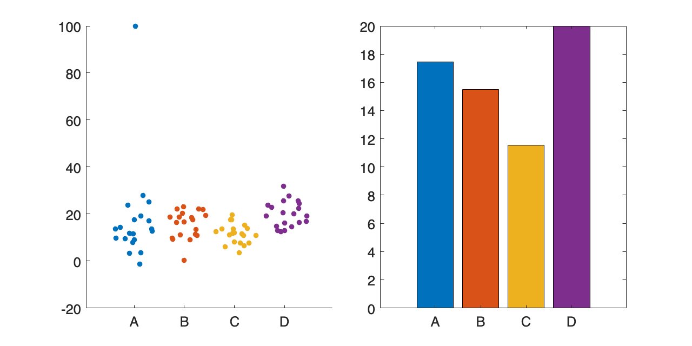

# <span style="color:rgb(213,80,0)">8.2 指標化から可視化の戦略を考える</span>
## 図 8.2.4 外れ値・異常値を指標化してしまうと・・・
```matlab
% 乱数のシードを固定
rng('default')

% サンプルサイズ
n = 20;

% 平均と分散
means = [10, 15, 12, 20];
stddevs = [5, 5, 5, 5];

% サンプリング
sample_A = normrnd(means(1), stddevs(1), [n-1, 1]);
sample_B = normrnd(means(2), stddevs(2), [n, 1]);
sample_C = normrnd(means(3), stddevs(3), [n, 1]);
sample_D = normrnd(means(4), stddevs(4), [n, 1]);

% サンプルAに外れ値を追加
sample_A = [sample_A; 100];

% データの整形
samples = [sample_A, sample_B, sample_C, sample_D];  % サンプルを結合
labels = [repmat("A", numel(sample_A), 1), ...
    repmat("B", numel(sample_B), 1), ...
    repmat("C", numel(sample_C), 1), ...
    repmat("D", numel(sample_D), 1)];  % ラベルを作成

% カラーマップ
colors = lines(4);

% スウォームプロット
figure(Position=[100 100 800 400])
tiledlayout('horizontal',TileSpacing='compact')

nexttile
swarmchart(categorical(labels),samples,'filled')

% 棒グラフ（平均値）
nexttile
sample_means = [mean(sample_A), mean(sample_B), mean(sample_C), mean(sample_D)];
b = bar(sample_means);
b.FaceColor = 'flat';
b.CData = colors;
xticklabels(["A","B","C","D"])

fontsize(16,'points')
% 図の保存
print('-dpng','-r300','8_2_4_index_including_outliers') 
```

<center></center>


