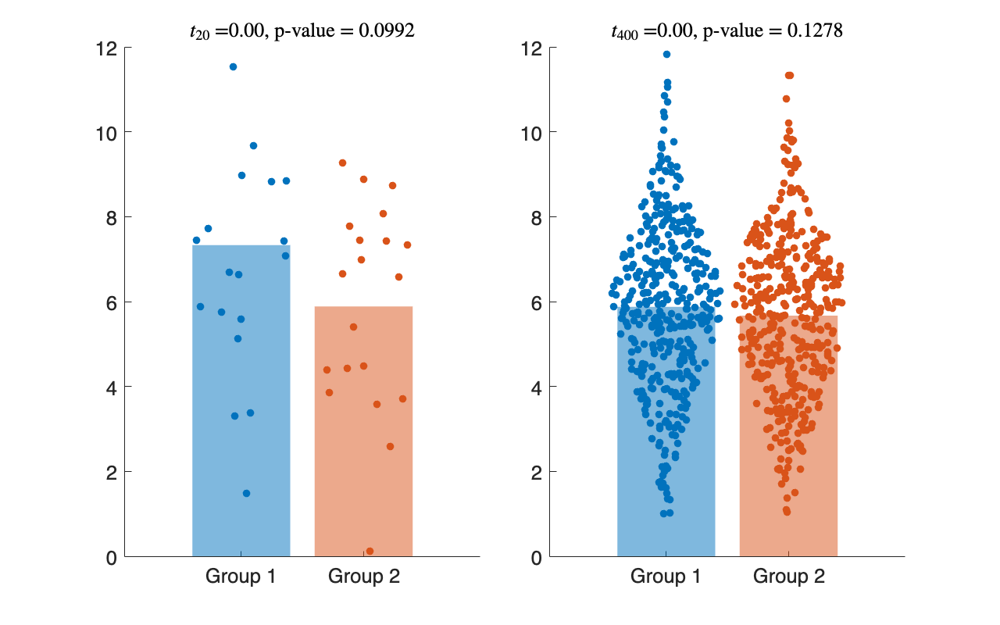

# <span style="color:rgb(213,80,0)">8.3 可視化されたデータの解釈学</span>
## 図 8.3.2 ばらつき度合いと特徴の強さ
```matlab
% データの生成
rng('default'); % seed

data1_sample1 = normrnd(6, 2, [20, 1]);
data1_sample2 = normrnd(6, 2, [20, 1]);
data2_sample1 = normrnd(6, 2, [400, 1]);
data2_sample2 = normrnd(5.75, 2, [400, 1]);

% T検定
[h1, p1] = ttest2(data1_sample1, data1_sample2);
[h2, p2] = ttest2(data2_sample1, data2_sample2);

mean(data1_sample1), mean(data1_sample2)
```

```TextOutput
ans = 7.3292
ans = 5.8851
```

```matlab
mean(data2_sample1), mean(data2_sample2)
```

```TextOutput
ans = 5.8751
ans = 5.6675
```

```matlab

% サブプロットの設定
figure(Position=[10, 10, 800, 500]);
colors = lines(2); % 2色確保
tiledlayout('horizontal',TileSpacing='compact')

nexttile % サブプロット1
data = [data1_sample1, data1_sample2];
group = [repmat("Group 1", length(data1_sample1), 1), repmat("Group 2", length(data1_sample2), 1)];

swarmchart(categorical(group), data, 'filled');
hold on;
hb1 = bar([mean(data1_sample1), mean(data1_sample2)]);
hb1.FaceColor = 'flat';
hb1.FaceAlpha = 0.5;
hb1.CData = colors;
hb1.EdgeColor = 'none';
hold off;

title([' !!!EQ_1!!!  =' num2str(h1, '%.2f') ', p-value = ' num2str(p1, '%.4f')], 'interpreter', 'latex');
ylim([0, 12])

nexttile % サブプロット2
data = [data2_sample1, data2_sample2];
group = [repmat("Group 1", length(data2_sample1), 1), repmat("Group 2", length(data2_sample2), 1)];

swarmchart(categorical(group), data, 'filled');
hold on;
hb2 = bar([mean(data2_sample1), mean(data2_sample2)]);
hb2.FaceColor = 'flat';
hb2.FaceAlpha = 0.5;
hb2.CData = colors;
hb2.EdgeColor = 'none';
hold off;

title([' !!!EQ_2!!!  =' num2str(h2, '%.2f') ', p-value = ' num2str(p2, '%.4f')], 'interpreter', 'latex');
ylim([0, 12])

fontsize(16,'points')
% プロットとして保存
print('../figures/8_3_2_significance_and_effect', '-dpng', '-r300');
```

<center></center>

